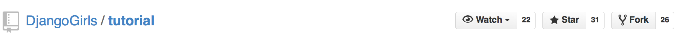
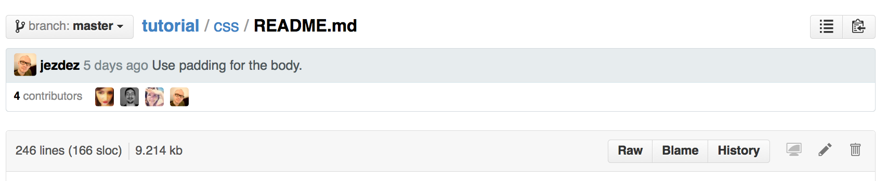
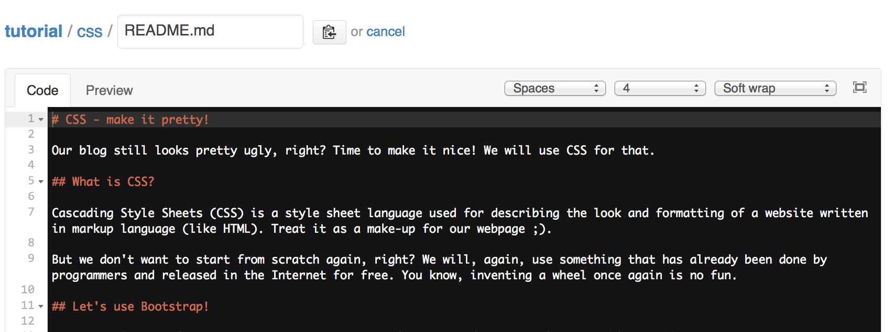
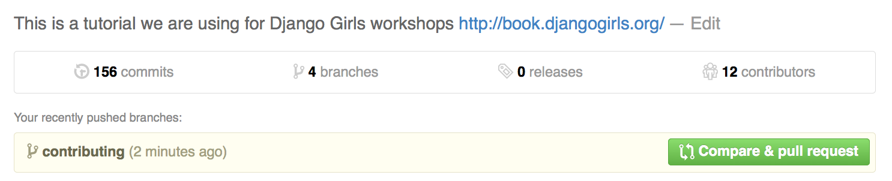

[](https://app.codeanywhere.com/#https://github.com/DjangoGirls/tutorial)

# Django Girls Tutorial

~ 🖥 Source Code 🖥 ~

**NOT** intended for reading here. To read go to: [📖 tutorial.djangogirls.org 📖](https://tutorial.djangogirls.org)

# Contribution QUICKSTART

1. Fork this repo [[fork](#fork-the-repository)]

> 2. **[Small changes](#simple-changes)**: you can now edit your fork on the github website, do this! Make a change, then [create a pull request](#making-a-pull-request)!

2. **[Big changes](#new-content-and-complex-changes)**: clone your fork locally.
3. [CLI](#cli-for-development) run `make dev` in repo.

```
$ make dev
...
Serving book on http://localhost:4000
```

Note: we have many changes under way we maybe working on your request already! Refer to existing [Pull requests](https://github.com/DjangoGirls/tutorial/pulls).

# How to contribute

The Django Girls Tutorial is licensed under a [*Creative Commons Attribution-ShareAlike 4.0*](https://creativecommons.org/licenses/by-sa/4.0/) license. Everyone is free to add, edit and correct the tutorial.

# Editing basics

The source code of the tutorial is [hosted on GitHub](https://github.com/DjangoGirls/tutorial). The GitHub [Fork & Pull workflow](https://help.github.com/articles/using-pull-requests) is used to accept and review changes.

The tutorial uses the [HonKit](https://github.com/honkit/honkit) project for publishing its documentation. [See more information about how HonKit works](https://honkit.netlify.app/).

The tutorial is written in [Markdown mark up language](https://help.github.com/articles/markdown-basics).

You can find any discussions about the contents of the tutorial on the [GitHub issue tracker](https://github.com/DjangoGirls/tutorial/issues).

[Crowdin](https://crowdin.com/project/django-girls-tutorial) platform is used to manage translations. If you want to join an existing translation team or launch a new translation, send an email to the [translation managers](mailto:translations@djangogirls.org) or contact [support team](mailto:hello@djangogirls.org).

# Getting started and prerequisites

For contributing to the tutorial the following is needed to get started:

* a [GitHub account](https://github.com)
* in the case of complex edits familiarity with [Git command line basics](https://help.github.com/articles/set-up-git) or familiarity with an app ([Windows](https://windows.github.com/), [Mac](https://mac.github.com/)) to push your edits made on your computer to GitHub.

## Fork the repository {#fork-the-repository}

First fork the [DjangoGirls/tutorial](https://github.com/DjangoGirls/tutorial) repository to your personal GitHub account:



## CLI for Development

This command line tool use `make` to create development environment. It is optional to use this tool. While building the document, it builds the document for every language. The build process can be limited to any one language using this tool and reduce build time considerably. Afterwards, the translation to other languages are done from crowdin localization process.

Usage instructions are available though `make help` command.

Try the command `make dev` to start development process.

# Editing chapter content

## Simple changes

For simple changes like typo corrections you can use the GitHub online editor:

* Open your local fork page on GitHub,
* go to *README.md* file in any chapter,
* press the *Edit* icon (pen)

and you can edit the chapter directly on github.com.



Markdown syntax is used to edit the individual pages of the tutorial.



Save your changes and create a pull request as explained below.

## New content and complex changes {#new-content-and-complex-changes}

For adding new chapters, writing longer snippets of text or adding images, you need to get a copy of the tutorial to your local computer.

Either use the GitHub app for your operating system (mentioned above) or `git` command line to get the repository locally. You get the repository address from the front page of your own GitHub repository fork:

    git clone git@github.com:yourgithubusername/tutorial.git

Move to the folder containing the project, to run the following commands.

    cd tutorial

Then, create a branch for your new changes to sit in. It helps to call the branch something related to the changes you are going to make.

    git checkout -b contributing

Install the project's requirements using [`npm`](https://docs.npmjs.com/cli/v8/configuring-npm/install).

    npm install

To preview and serve local files, with auto-reload capabilities, run HonKit using:

    npx honkit serve

The local server will be available at http://localhost:4000.
If auto-reload is slow, you can temporarily remove unwanted languages from `LANGS.md`, to speed up the process.

Then commit the changes using `git` and push the changes to your remote GitHub repository.

Example:

    $ git status
    On branch contributing
    Untracked files:
      (use "git add <file>..." to include in what will be committed)

        contributing_and_editing_this_book/images/gitbook.png

    $ git add contributing_and_editing_this_book/images/gitbook.png

    $ git commit -m "Added gitbook editor screenshot"
    [contributing fe36152] Added gitbook screenshot
     1 file changed, 0 insertions(+), 0 deletions(-)
     create mode 100644 contributing_and_editing_this_book/images/gitbook.png

    $ git push
    Counting objects: 11, done.
    Delta compression using up to 8 threads.
    Compressing objects: 100% (5/5), done.
    Writing objects: 100% (5/5), 266.37 KiB | 0 bytes/s, done.
    Total 5 (delta 1), reused 0 (delta 0)
    To git@github.com:miohtama/tutorial.git
       b37ca59..fe36152  contributing -> contributing

# Restructuring the tutorial {#restructuring-the-tutorial}
Restructuring the tutorial is a major change that takes time so we have created a separate branch for these changes. 

To make contributions that address issues 
[1777](https://github.com/DjangoGirls/tutorial/issues/1777) and [1792](https://github.com/DjangoGirls/tutorial/issues/1792), 
[fork](#fork-the-repository) the repository your repository.

Next you need to follow instructions for [cloning and setting up locally given in the section above](#new-content-and-complex-changes).

Please make use of ["semantic linefeeds"](https://rhodesmill.org/brandon/2012/one-sentence-per-line/) a.k.a. 
["semantic line breaks"](https://sembr.org/) for all paragraphs. 
Though most of the Django Girls tutorial wasn't originally written that way, placing source line breaks at semantically meaningful spots in the text (and especially between sentences) facilitates both, commenting on individual statements or thoughts in the text as part of the review process, as well as future editing and diff-ing.

As we restructure the tutorial, this would be a great change to introduce to the tutorial so please make sure the chapter you work on follow this pattern.

All pull requests for changes aimed at restructuring the tutorial which address the issues 
[1777](https://github.com/DjangoGirls/tutorial/issues/1777) and [1792](https://github.com/DjangoGirls/tutorial/issues/1792) 
should be made to the `restructure-tutorial`.

All other steps for creating a pull request are the same as those outlined in the section on [making a pull request below](#making-a-pull-request), just make sure you make the pull request against the `restructure-tutorial` branch.

# Making a pull request {#making-a-pull-request}
After you have finished your changes you need to [create a pull request](https://docs.github.com/en/pull-requests/collaborating-with-pull-requests/proposing-changes-to-your-work-with-pull-requests/creating-a-pull-request)  on GitHub. DjangoGirls will get notified about the pull request, review your changes, suggest any corrections if needed and then *pull* your changes to the master version.

In your own repository on GitHub press do *Compare & pull request*



Fill in the information *why* this change is being made. The reviewer can see the details of the actual change, so you don't need repeat the content of the change.

Then press *Create pull request*.

GitHub emails will notify you for the follow up process.

# Further information and help

GitHub has an excellent [documentation](https://help.github.com/). Check it out if you need help!

For further questions please [contact DjangoGirls](https://djangogirls.org/).
