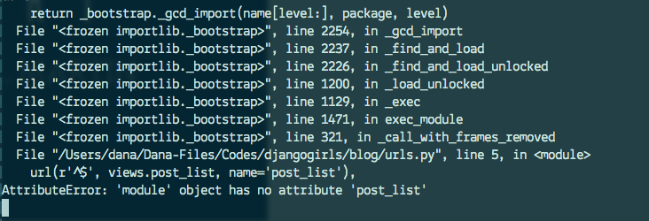

# روابط دجانغو

نحن على وشك بناء صفحتنا الأولى على الأنترنت: الصفحة الرئيسية لمدونتك! ولكن أولاً، دعونا نتعلم قليلاً عن "روابط مواقع جانغو".

## ما هو عنوان URL؟

ببساطة URL هو عنوان ويب. يمكنك أن ترى عنوان URL في كل مرة تقوم بزيارة موقع على شبكة الإنترنت--أنها مرئية في شريط العناوين في المتصفح الخاص بك. (نعم! `127.0.0.1:8000` هو عنوان URL! و `https://djangogirls.org` أيضا عنوان URL)


كل صفحة على شبكة الإنترنت تحتاج إلى عنوان URL الخاص بها. وبهذه الطريقة التطبيق الخاص بك يعلم ما يجب أن يظهر للمستخدم الذي يقوم بفتح عنوان URL هذا. في جانغو نستخدم ما يسمى `URLconf` (URL configuration). URLconf هو مجموعة من الأنماط التي ستحاول جانغو مطابقتها مع عنوان URL المطلوب للعثور على طريقة العرض الصحيح.

## كيف تعمل عناوين Url في جانغو؟

دعونا نفتح الملف `mysite/urls.py` في محرر التعليمات البرمجية الخاصة بك للاختيار ونرى ما يبدو عليه:

mysite/urls.py

```python
"""mysite URL Configuration

[...]
"""
from django.conf.urls import url
from django.contrib import admin

urlpatterns = [
    url(r'^admin/', admin.site.urls),
]
```

كما ترون، جانغو قد وضعت بالفعل شيء هنا بالنسبة لنا.

الخطوط بين علامات الاقتباس الثلاثي (`'' '` أو `"""`) تسمى docstrings – ييمكنك كتابتها في أعلى ملف أو فئة أو طريقة لوصف ما يفعله. هي لا تعمل عبر بايثون.

عنوان URL المشرف، الذي زرته في الفصل السابق، موجود هنا:

mysite/urls.py

```python
    url(r'^admin/', admin.site.urls),
```

هذا السطر يعني أن لكل عنوان URL الذي يبدأ ب `admin/`، سوف تجد جانغو مقابله *view*. في هذه الحالة نحن ، نضع الكثير من روابط المشرفين ، لذالك هي ليست مجموعة كلها في هذا الملف الصغير ، انها اكثر قابلية للقراءة وانضف.

## Regex

هل كنت تتساءل كيف تطابق جانغو عناوين Url للواجهات ؟ حسنا، هذا الجزء صعب. يستخدم جانغو `regex`، اختصار ل "التعبيرات العادية". Regex لديه الكثير (الكثير!) من القواعد التي تشكل نمط بحث. بما ان regexes موضوع متقدم، نحن لن تمر بالتفصيل على كيفية عمله.

إذا كنت لا تزال ترغب معرفة كيف قمنا بإنشاء الأنماط، هنا مثال للعملية – سوف نحتاج فقط مجموعة فرعية محدودة من القواعد للتعبير عن النمط الذي نتطلع اليه وهي:

* `^` في بداية النص
* `$` في نهاية النص
* `\d` لرقم
* `+` للإشارة إلى أن العنصر السابق ينبغي أن يتكرر مرة واحدة على الأقل
* `()` لالتقاط جزء من النمط

أي شيء آخر في تعريف عنوان URL سوف تؤخذ حرفيا.

الآن تخيل أن لديك موقع على شبكة الإنترنت بعنوان مثل `http://www.mysite.com/post/12345/`، حيث يكون `12345` هو عدد مشاركاتك.

كتابة آراء منفصلة لجميع أرقام المشاركات سيكون مزعج حقاً. مع التعابير العادية، يمكننا إنشاء الأنماط التي تتطابق مع عنوان URL واستخراج العدد لنا: `^ post/(\d+)/$`. دعونا نكسر هذا قطعة قطعة لمعرفة ما نقوم به هنا:

* **^post/** تخبر دجانغو عن اتخاذ أي شيء يحتوي على `post/` في بداية عنوان url (مباشرة بعد `^`)
* **(\d+)** يعني أنه سيكون هناك عدد (رقم واحد أو أكثر)، وأننا نريد الرقم الذي تم التقاطه واستخراجه
* **/** يخبر دجانغو أن حرف آخر `/` يجب أن يتبع
* **$** يشير إلى نهاية عنوان url الخاص بمعنى أن السلاسل التي تنتهي مع `/` سوف تتطابق مع هذا النمط

## عنوان URL جانغو الأول!

حان الوقت لإنشاء URL الأول لدينا! ونحن نريد 'http://127.0.0.1:8000/' لتكون الصفحة الرئيسية لمدونتنا وتعرض قائمة من المشاركات.

نريد أيضا الاحتفاظ بالملف `mysite/urls.py` نظيف، حيث أننا سوف نسترد عناوين Url من تطبيق `blog` لدينا إلى الملف الرئيسي `mysite/urls.py`.

امضي قدما ،واضع هذا السطر الذي سيسترد `blog.urls`.. لاحظ أننا نستخدم الدالة `include` هنا، لذا ستحتاج إلى إضافة هذا الاستيراد.

الآن يجب أن تبدو الملف `mysite/urls.py` الخاص بك مثل هذا:

mysite/urls.py

```python
from django.conf.urls import include
from django.conf.urls import url
from django.contrib import admin

urlpatterns = [
    url(r'^admin/', admin.site.urls),
    url(r'', include('blog.urls')),
]
```

جانغو سيقوم بإعادة توجيه كل شيء يأتي في 'http://127.0.0.1:8000/' إلى`blog.urls` والبحث عن مزيد من التعليمات هناك.

يتم كتابة التعبيرات العادية في بايثون دائماً مع `r` أمام السلسلة. هذا تلميح مفيد لبايثون أن السلسلة قد تحتوي على الأحرف الخاصة التي ليست معنية ببايثون نفسه، ولكن للتعبير العادي بدلاً من ذلك.

## روابط المدونة

قم بإنشاء ملف فارغ جديد يسمى `urls.py` في الدليل `blog`. حسنًا! أضف هذه الأسطر الأولى والثانية:

blog/urls.py

```python
from django.conf.urls import url
from . import views
```

نحن هنا نستورد وضائف دجانغو `url` وجميع `views` من تطبيق `blog` (ليس لدينا أي حتى الآن، ولكننا سوف نحصل على ذلك في دقيقة واحدة)

بعد ذلك، يمكننا أن نضيف لدينا نمط URL الأول:

blog/urls.py

```python
urlpatterns = [
    url(r'^$', views.post_list, name='post_list'),
]
```

كما ترون، نحن الآن تعيين طريقة `عرض` تسمى `post_list` `^ $` لعنوان URL. هذا التعبير العادي وسيطابق `^` (بداية) تليها `$` (نهاية) – لذلك سلسلة فارغة فقط سوف تتطابق. وهذا صحيح، لأن في URL جانغو resolvers، 'http://127.0.0.1:8000/' ليست جزءا من عنوان URL. سيعلم هذا النمط دجانغو أن `views.post_list` هو المكان المناسب للذهاب إليه إذا دخل شخص ما موقعك على الويب على العنوان "http://127.0.0.1:8000/".

الجزء الأخير، `name='post_list'`, هو اسم عنوان URL الذي سيتم استخدامه لتحديد طريقة العرض. وهذا يمكن أن يكون نفس اسم العرض ولكن أيضا يمكن أن يكون شيئا مختلفاً تماما. سنستخدم عناوين URLs المسماة لاحقا في المشروع، لذلك من المهم تسمية كل عنوان URL في التطبيق. يجب أن نحاول أيضا الحفاظ على أسماء عناوين URL فريدة وسهلة التذكر.

إذا حاولت زيارة http://127.0.0.1:8000/ الآن، ستجد نوعا من رسائل الخطأ "صفحة ويب غير متوفرة". وذلك لأن الخادم (تذكر كتابة `runserver`?) لم يعد قيد التشغيل. ألق نظرة على نافذة وحدة تحكم الخادم لمعرفة السبب.



تعرض وحدة التحكم الخاصة بك خطأ، ولكن لا تقلق - إنها مفيدة حقا: إنها تخبرك بوجود **no attribute 'post_list'**. هذا هو اسم *view* الذي تحاول جانغو العثور عليه واستخدامه، ولكن لم نقم بإنشاءه بعد. في هذه المرحلة، لن يعمل `/admin/` أيضا. لا تقلق – سوف نصل إلى هناك.

> إعرف المزيد حول URLconfs من خلال قراءة الوثائق الرسمية: https://docs.djangoproject.com/en/1.11/topics/http/urls/