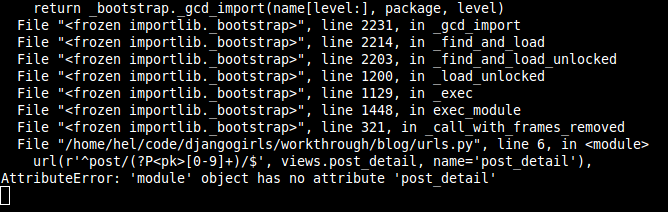
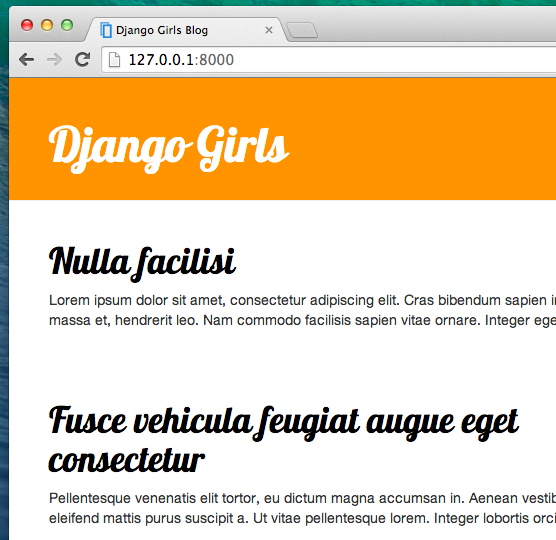

# توسيع التطبيق الخاص بك

لقد أنجزنا فعلا جميع الخطوات المختلفة اللازمة لإنشاء موقعنا على الإنترنت: نحن نعرف كيفية كتابة نموذج، url وطريقة العرض والقالب. نحن نعلم أيضا كيفية جعل موقع الويب الخاص بنا جميلا.

حان الوقت للتدريب!

أول شيء نحتاجه في مدونتنا هو، على الأرجح، صفحة لعرض مشاركة واحدة، أليس كذلك؟

لدينا بالفعل نموذج `Post` ، حتى لا تحتاج إلى إضافة أي شيء إلى `models.py`.

## إنشاء رابط نموذج لتفاصيل المشاركة

سوف نبدأ بإضافة رابط داخل الملف `blog/templates/blog/post_list.html`. حتى الآن ينبغي له ان يبدو هكذا:blog/templates/blog/post_list.html

```html



    
        <div class="post">
            <div class="date">
                {{ post.published_date }}
            </div>
            <h1><a href="">{{ post.title }}</a></h1>
            <p>{{ post.text|linebreaksbr }}</p>
        </div>
    

```

 نريد الحصول على رابط من عنوان المشاركة في قائمة المشاركات إلى صفحة تفاصيل المشاركة. دعونا نغيير `<h1><a href="">{{ post.title }}</a></h1>` بحيث يرتبط بصفحة تفاصيل المشاركة :

blog/templates/blog/post_list.html

```html
<h1><a href="">{{ post.title }}</a></h1>
```

 حان الوقت لشرح ``. كما قد تضن، فإن `` يعني أننا نستخدم علامات قالب جانغو. هذه المرة سوف نستخدم واحد واحد منهم والذي سيقوم بإنشاء عنوان URL لنا!

`post_detail` يعني أن جانغو سيتوقع عنوان URL في `blog/urls.py` ب name=post_detail

وماذا عن `pk=post.pk`؟ `pk` هو اختصار للمفتاح الأساسي، وهو اسم فريد لكل سجل في قاعدة البيانات. ونظرا لأننا لم نحدد مفتاحا أساسيا في نموذج `Post`، فإن دجانغو ينشئ واحدا لنا (بشكل افتراضي، وهو رقم يزيد بمقدار واحد لكل سجل، أي 1 و 2 و 3) ويضيفه كحقل يدعى`pk` إلى كل من مشاركاتنا. نصل إلى المفتاح الأساسي من خلال كتابة `post.pk`,، بنفس الطريقة التي نصل بها إلى الحقول الأخرى (`title`, `author`, etc.) في `Post`!

الآن عندما ننتقل إلى http://127.0.0.1:8000/ سيكون لدينا خطأ (كما هو متوقع، نظرا لأنه لا يوجد لدينا عنوان URL أو *view* ل `post_detail`). وسوف تبدو كما يلي:


## إنشاء عنوان URL لتفاصيل المشاركة

لنقم بإنشاء عنوان URL في `urls.py` من اجل `post_detail` *view*!

نريد عرض تفاصيل المشاركة الأولى على هذا العنوان **URL**: http://127.0.0.1:8000/post/1/

دعونا ننشئ عنوان URL في ملف `blog/urls.py` لتوجيه دجانغو إلى *view* باسم `post_detail`,، سيتم عرض إحدى المشاركات بأكملها. أضف السطر `url(r'^post/(?P<pk>\d+)/$', views.post_detail, name='post_detail'),` إلى الملف `blog/urls.py`. الآن يجب أن يبدو الملف الخاص بك مثل هذا:

blog/urls.py

```python
from django.conf.urls import url
from . import views

urlpatterns = [
    url(r'^$', views.post_list, name='post_list'),
    url(r'^post/(?P<pk>\d+)/$', views.post_detail, name='post_detail'),
]
```

هذا الجزء `^post/(?P<pk>\d+)/$` يبدو مخيفا، ولكن لا تقلق – سوف نشرح لك:

- أنه يبدأ ب `^` مرة أخرى – "البداية".
- `post/` يعني فقط أنه بعد البداية، يجب أن يحتوي عنوان URL على كلمة **post** و **/**. حتى الان جيد جدا.
- `(?P<pk>\d+)` -هذا الجزء أصعب. وهذا يعني أن جانغو سوف تأخذ كل ما تضعه هنا وتنقله إلى عرض كمتغير يسمى `pk`. (لاحظ أن هذا يطابق الاسم الذي قدمناه لمتغير المفتاح الأساسي مرة أخرى في `blog/templates/blog/post_list.html`!) `\d` يخبرنا أيضا أنه يمكن أن يكون فقط رقم، وليس حرف ( كل شيء بين 0 و 9). `+` يعني أن هناك حاجة إلى رقم واحد أو أكثر هناك. شيء مثل `http://127.0.0.1:8000/post//` غير صالح، ولكن `http://127.0.0.1:8000/post/1234567890/` هو جيد تماما!
- `/` – وبعدها نحتاج **/** مرة اخرى.
- `$` – "نهاية"!

هذا يعني إذا قمت بإدخال `http://127.0.0.1:8000/post/5/` في المتصفح، جانغو ستفهم انك تبحث عن *view* تسمى `post_detail` ونقل معلومة أن `pk` تساوي `5` إلى ذالك *view*.

حسنا، لقد أضفنا نمط عنوان URL جديد إلى `blog/urls.py`! دعونا نقم بتحديث الصفحة http://127.0.0.1:8000/ بوم! توقف الخادم عن العمل مرة أخرى. ألقي نظرة على وحدة التحكم – كما هو متوقع، هناك خطأ آخر!



هل تذكر ما الخطوة التالية؟ بطبيعة الحال: إضافة طريقة عرض!

## إضافة مشاركة لعرض التفاصيل

هذه المرة لدينا *view* تعطي معلمة إضافية، `pk`. *view* تحتاج الى القبض عليه ، اليس كذالك؟ لذا فإننا سوف نحدد وظيفتنا ك `def post_detail(request, pk):`. لاحظ أننا بحاجة إلى استخدام نفس الاسم بالضبط الذي حددناه في عناوين urls (`pk`). حذف هذا المتغير غير صحيح وسوف ينتج خطأ!

الآن، نريد الحصول على مشاركة مدونة واحدة فقط. لإجراء ذلك، يمكننا استخدام مجموعة طلبات بحث، كما يلي:

blog/views.py

```python
Post.objects.get(pk=pk)
```

ولكن توجد مشكلة في التعليمات البرمجية هذه. إذا لم يكن هناك `Post` بعينها `primary key` (`pk`) سيكون لدينا خطأ سوبر قبيح!


نحن لا نريد ذلك! ولكن، بطبيعة الحال، جانغو تأتي بشيء أنها ستعالج ذلك لنا:: `get_object_or_404`. في حالة عدم وجود `Post` مع `pk`,، سيعرض صفحة أجمل بكثير، صفحة `Page Not Found 404`.


والخبر السار هو أنه يمكنك فعلا إنشاء صفحة `Page not found` الخاصة بك وجعلها جميلة كما تريد. لكنها ليست مهمة الأن ، لذالك سوف نتخطاها.

طيب، حان الوقت لإضافة *view* لملف `views.py` لدينا!

في `blog/urls.py` أنشأنا قاعدة عنوانURL اسمها `post_detail` تشير إلى ملف شخصي يسمى `views.post_detail`. وهذا يعني أن جانغو تتوقع عرض دالة تسمى `post_detail` داخل `blog/views.py`.

ينبغي أن نفتح `blog/views.py` وإضافة التعليمة البرمجية التالية بالقرب `from` من الخطوط الأخرى:

blog/views.py

```python
from django.shortcuts import render, get_object_or_404
```

وفي نهاية الملف سوف نقوم بإضافة *view*:

blog/views.py

```python
def post_detail(request, pk):
    post = get_object_or_404(Post, pk=pk)
    return render(request, 'blog/post_detail.html', {'post': post})
```

نعم. لقد حان الوقت لتحديث الصفحة: http://127.0.0.1:8000/



إنه كان مجديًا! ولكن ماذا يحدث عندما تقوم بالنقر فوق رابط في عنوان احدى المشاركات على المدونة؟


أوه لا! خطأ آخر! ولكن نحن نعلم بالفعل كيفية التعامل معه، اليس كذالك؟ نحن بحاجة لإضافة قالب!

## إنشاء قالب لتفاصيل المشاركة

سننشئ ملفا في `blog/templates/blog` يسمى `post_detail.html`.

ستبدو كالشكل التالي:

blog/templates/blog/post_detail.html

```html



    <div class="post">
        
            <div class="date">
                {{ post.published_date }}
            </div>
        
        <h1>{{ post.title }}</h1>
        <p>{{ post.text|linebreaksbr }}</p>
    </div>

```

مرة أخرى نحن نوسع `base.html`. في الكتلة `content` نريد عرض تاريخ نشر المشاركة (إذا كان موجودا) والعنوان والنص. ولكن يجب أن نناقش بعض الأمور الهامة، اليس كذالك؟

إذا...  ` ... ` هو علامة قالب يمكن أن نستخدمها عندما نريد أن تحقق شيئا. (تذكر `إذا... ايضا. ` من فصل **Introduction to Python** ؟) في هذا السيناريو، نريد التحقق مما إذا كان `published_date` غير فارغ. 

حسنا، يمكننا تحديث الصفحة ومعرفة ما إذا كان `TemplateDoesNotExist` قد انتهى الآن.


ياي! إنه يعمل!

## شيء اخر: أنشر الوقت!

سيكون من الجيد معرفة ما إذا كان موقع الويب الخاص بك لا يزال يعمل على PythonAnywhere، أليس كذلك؟ دعونا نحاول النشر مرة أخرى.

command-line

    $ git status
    $ git add --all .
    $ git status
    $ git commit -m "Added view and template for detailed blog post as well as CSS for the site."
    $ git push
    

وبعد ذلك، في وحدة [PythonAnywhere Bash console](https://www.pythonanywhere.com/consoles/):

command-line

    $ cd my-first-blog
    $ git pull
    [...]
    

وأخيرا، انتقل إلى علامة التبويب [Web tab](https://www.pythonanywhere.com/web_app_setup/) واضغط على **Reload**.

هذا ينبغي ان يكون كل شيء! مبروك:)