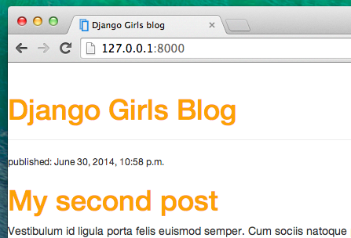
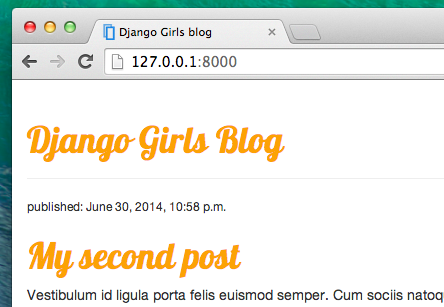
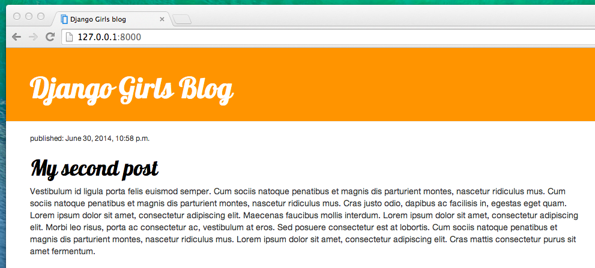

# CSS - направи го красиво!

Блогът ни все още изглежда доста грозен, нали? Време е да го направите хубав! За това ще използваме CSS.

## Какво е CSS?

Cascading Style Sheets (CSS) е език, използван за описание на външния вид и форматирането на уебсайт, написан на език за маркиране (като HTML). Отнасяйте се към него като грим за вашата уеб страница. ;)

Но не искаме отново да започнем от нулата, нали? Още веднъж ще използваме нещо, което програмистите пуснаха в интернет безплатно. Преосмислянето на колелото не е забавно.

## Нека използваме Bootstrap!

Bootstrap е една от най-популярните фреймуорки за HTML и CSS за разработване на красиви уебсайтове: https://getbootstrap.com/

Той е написан от програмисти, които са работили за Twitter. Сега тя е разработена от доброволци от цял свят!

## Инсталирайте Bootstrap

За да инсталирате Bootstrap, отворете вашия файл `.html` в редактора на кода и го добавете в секцията `<head>`:

blog/templates/blog/post_list.html

```html
<link rel="stylesheet" href="//maxcdn.bootstrapcdn.com/bootstrap/3.2.0/css/bootstrap.min.css">
<link rel="stylesheet" href="//maxcdn.bootstrapcdn.com/bootstrap/3.2.0/css/bootstrap-theme.min.css">
```

Това не добавя никакви файлове към вашия проект. Той просто сочи файлове, които съществуват в Интернет. Затова продължете напред, отворете уебсайта си и актуализирайте страницата. Ето го!


Вече изглежда по-хубав!

## Статични файлове в Django

Накрая ще разгледаме по-подробно тези неща, които наричахме **статични файлове**. Статичните файлове са всички ваши CSS и изображения. Съдържанието им не зависи от контекста на заявката и ще бъде едно и също за всеки потребител.

### Къде да сложа статични файлове за Django

Django вече знае къде да намери статичните файлове за вграденото приложение "admin". Сега трябва да добавим статични файлове за нашето собствено приложение, `blog`.

Правим това, като създаваме папка, наречена `static` в блог приложението:

    djangogirls
    ├── blog
    │   ├── migrations
    │   ├── static
    │   └── templates
    └── mysite
    

Django автоматично ще открива всички папки, наречени 'static', в която и да е от папките на вашите приложения. Тогава той ще може да използва тяхното съдържание като статични файлове.

## Вашият първи CSS файл!

Нека сега създадем CSS файл, за да добавим свой собствен стил към вашата уеб страница. Създайте нова директория, наречена `css` във вашата `static` директория. След това създайте нов файл, наречен `blog.css` вътре в тази директория `css`. Готови?

    djangogirls
    └─── blog
         └─── static
              └─── css
                   └─── blog.css
    

Време е да напишете малко CSS! Отворете файла `blog/static/css/blog.css` във вашия редактор на код.

Тук няма да навлизаме твърде дълбоко в персонализирането и научаването на CSS. Има препоръка за безплатен CSS курс в края на тази страница, ако искате да научите повече.

Но нека направим поне малко. Може би бихме могли да променим цвета на заглавията си? За да разберат цветовете, компютрите използват специални кодове. Тези кодове започват с `#`, последвани от 6 букви (A–F) и цифри (0–9). Например кодът за синьо е `#0000FF`. Можете да намерите цветовите кодове за много от цветовете тук: http://www.colorpicker.com/. Можете също така да използвате [предварително определени цветове](http://www.w3schools.com/colors/colors_names.asp), като ` red ` и ` green `.

Във вашия `blog/static/css/blog.css` файл трябва да добавите следния код:

blog/static/css/blog.css

```css
h1 a, h2 a {
    color: #C25100;
}

```

`h1 a` е CSS селектор. Това означава, че прилагаме стиловете си към всеки `a` елемент вътре в елемент `h1`; селекторът `h2 a` прави същото за елементи `h2`. Така че, когато имаме нещо като `<h1><a href="">връзка</a></h1>`, ще се прилага стилът `h1 a`. В този случай ние му казваме да промени цвета си на `#C25100`, което е тъмно оранжево. Или можете да поставите свой собствен цвят тук, но се уверете, че той има добър контраст на бял фон!

Във CSS файл определяме стилове за елементи в HTML файла. Първият начин да идентифицираме елементите е с името на елемента. Може да ги запомните като тагове от секцията HTML. Неща като `a`, `h1` и `body` са примери за имена на елементи. Ние също така идентифицираме елементи по атрибут `class` или атрибут `id`. Class и id са имена, които сами давате на елемента. Класовете определят групи от елементи, а идентификаторите сочат конкретни елементи. Например, можете да идентифицирате следния маркер, като използвате името на тага `a`, класа `external_link` или id `link_to_wiki_page`:

```html
<a href="https://en.wikipedia.org/wiki/Django" class="external_link" id="link_to_wiki_page">
```

Можете да прочетете повече за [CSS селектори в w3schools](http://www.w3schools.com/cssref/css_selectors.asp).

Трябва също така да кажем на нашия HTML шаблон, че добавихме някои CSS. Отворете файла `blog/templates/blog/post_list.html` в редактора на кода и добавете този ред в самото начало:

blog/templates/blog/post_list.html

```html

```

Тук просто зареждаме статични файлове. :) Между таговете `<head>` и `</head>`, след връзките към CSS файловете на Bootstrap, добавете този ред:

blog/templates/blog/post_list.html

```html
<link rel="stylesheet" href="">
```

Браузърът чете файловете в реда, в който са зададени, така че трябва да се уверим, че това е на правилното място. В противен случай кодът в нашия файл може да бъде редактиран от кода във файловете на Bootstrap. Току-що казахме на нашия шаблон къде се намира нашият CSS файл.

Вашият файл сега трябва да изглежда така:

blog/templates/blog/post_list.html

```html

<html>
    <head>
        <title>Django Girls blog</title>
        <link rel="stylesheet" href="//maxcdn.bootstrapcdn.com/bootstrap/3.2.0/css/bootstrap.min.css">
        <link rel="stylesheet" href="//maxcdn.bootstrapcdn.com/bootstrap/3.2.0/css/bootstrap-theme.min.css">
        <link rel="stylesheet" href="">
    </head>
    <body>
        <div>
            <h1><a href="/">Django Girls Blog</a></h1>
        </div>

        
            <div>
                <p>published: {{ post.published_date }}</p>
                <h2><a href="">{{ post.title }}</a></h2>
                <p>{{ post.text|linebreaksbr }}</p>
            </div>
        
    </body>
</html>
```

ОК, запазете файла и актуализирайте сайта!



Добра работа! Може би също бихме искали да дадем на нашия уебсайт малко въздух и да увеличим полето от лявата страна? Нека опитаме това!

blog/static/css/blog.css

```css
body {
    padding-left: 15px;
}
```

Добавете това към вашия CSS, запишете файла и вижте как работи!


Може би можем да персонализираме шрифта в заглавието ни? Поставете това във вашия `<head>` в `blog/templates/blog/post_list.html` файл:

blog/templates/blog/post_list.html

```html
<link href="//fonts.googleapis.com/css?family=Lobster&subset=latin,latin-ext" rel="stylesheet" type="text/css">
```

Както и преди, проверете поръчката и поставете преди връзката към `blog/static/css/blog.css`. Този ред ще импортира шрифт, наречен *Lobster* от Google Fonts (https://www.google.com/fonts).

Намерете блока за деклариране `h1 a` (кодът между скобите `{` и `}`) в CSS файла `blog/static/css/blog.css`. Сега добавете ред `font-family: 'Lobster';` между скобите и актуализирайте страницата:

blog/static/css/blog.css

```css
h1 a, h2 a {
    color: #C25100;
    font-family: 'Lobster';
}
```



Страхотно!

Както бе споменато по-горе, CSS има концепция за класове. Те ви позволяват да назовете част от HTML кода и да приложите стилове само към тази част, без да засягате други части. Това може да бъде супер полезно! Може би имате два divs (участъка), които правят нещо различно (като заглавието и публикацията ви). Един клас може да ви помогне да ги направите да изглеждат различно.

Продължете и дайте име на някои части от HTML кода. Добавете клас, наречен `page-header`, към вашия `div`, който съдържа заглавието ви, като този:

blog/templates/blog/post_list.html

```html
<div class="page-header">
    <h1><a href="/">Django Girls Blog</a></h1>
</div>
```

И сега добавете клас `post` към вашия `div` съдържащ публикация в блог.

blog/templates/blog/post_list.html

```html
<div class="post">
    <p>published: {{ post.published_date }}</p>
    <h2><a href="">{{ post.title }}</a></h2>
    <p>{{ post.text|linebreaksbr }}</p>
</div>
```

Сега ще добавим декларационни блокове към различни селектори. Селектори, започващи с `. `, се отнасят за класове. Има много страхотни уроци и обяснения за CSS в мрежата, които могат да ви помогнат да разберете следния код. Засега го копирайте и поставете във вашия `blog/static/css/blog.css` файл:

blog/static/css/blog.css

```css
.page-header {
    background-color: #C25100;
    margin-top: 0;
    padding: 20px 20px 20px 40px;
}

.page-header h1, .page-header h1 a, .page-header h1 a:visited, .page-header h1 a:active {
    color: #ffffff;
    font-size: 36pt;
    text-decoration: none;
}

.content {
    margin-left: 40px;
}

h1, h2, h3, h4 {
    font-family: 'Lobster', cursive;
}

.date {
    color: #828282;
}

.save {
    float: right;
}

.post-form textarea, .post-form input {
    width: 100%;
}

.top-menu, .top-menu:hover, .top-menu:visited {
    color: #ffffff;
    float: right;
    font-size: 26pt;
    margin-right: 20px;
}

.post {
    margin-bottom: 70px;
}

.post h2 a, .post h2 a:visited {
    color: #000000;
}
```

След това заобиколете HTML кода, който показва публикациите с декларации за класове. Заменете това:

blog/templates/blog/post_list.html

```html

    <div class="post">
        <p>published: {{ post.published_date }}</p>
        <h2><a href="">{{ post.title }}</a></h2>
        <p>{{ post.text|linebreaksbr }}</p>
    </div>

```

в `blog/templates/blog/post_list.html` с това:

blog/templates/blog/post_list.html

```html
<div class="content container">
    <div class="row">
        <div class="col-md-8">
            
                <div class="post">
                    <div class="date">
                        <p>published: {{ post.published_date }}</p>
                    </div>
                    <h2><a href="">{{ post.title }}</a></h2>
                    <p>{{ post.text|linebreaksbr }}</p>
                </div>
            
        </div>
    </div>
</div>
```

Запазете тези файлове и актуализирайте уебсайта си.



Ура! Изглежда страхотно, нали? Вижте кода, който току-що поставихме, за да намерите местата, където добавихме класове в HTML и ги използвахме в CSS. Къде бихте направили промяната, ако искате датата да е тюркоазена?

Не се страхувайте да се поинтересувате с този CSS малко и се опитайте да промените някои неща. Играта с CSS може да ви помогне да разберете какво правят различните неща. Ако счупите нещо, не се притеснявайте - винаги можете да го отмените!

Наистина препоръчваме да вземете безплатните онлайн курсове "Basic HTML & HTML5" и "Basic CSS" на [freeCodeCamp](https://learn.freecodecamp.org/). Те могат да ви помогнат да научите всичко за правенето на уебсайтовете ви по-красиви с HTML и CSS.

Готови ли сте за следващата глава?! :)