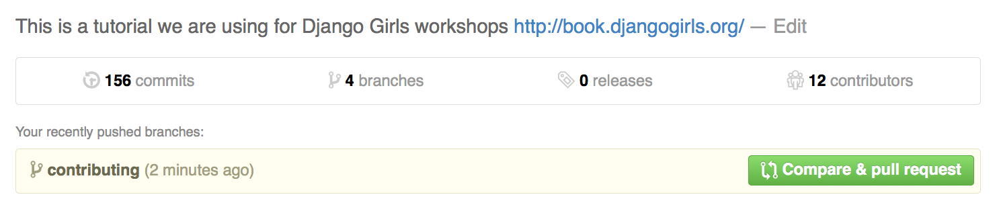

# How to contribute

Django Girls Tutorial is licensed under *Creative Commons Attribution-ShareAlike 4.0* license. Everyone is free to add, edit and correct the tutorial.

# Editing basics

The source code of the tutorial is [hosted on Github](). The tutorial uses [GitBook](https://www.gitbook.io/) service for the publishing the documentation. Github [Fork & Pull workflow](https://help.github.com/articles/using-pull-requests) is used to accept and review changes.

The tutorial is written in [Markdown mark up language](https://help.github.com/articles/markdown-basics).

You can find any discussion about the content of the tutorial on [Github issue tracker](https://github.com/DjangoGirls/tutorial/issues).

# Getting started and prerequisites

For contributing the tutorial the following is needed to get started.

* You have a [Github account](https://github.com)
* For complex changes you need to be familiar with [Git command line basics](https://help.github.com/articles/set-up-git) or you are using an app ([Windows](https://windows.github.com/), [Mac](https://mac.github.com/)) to push your edits on a local computer to Github

## Fork the repository

First fork [DjangoGirls/tutorial](https://github.com/DjangoGirls/tutorial) project into your personal Github repository:

# Editing chapter content

## Simple changes

For a simple changes like typo corrections you can use Github online editor.

* Open your local fork page on Github
* Go to *README.md* file in any chapter
* Press *Edit* icon (pen) and you can edit the chapter in Github's online editor

Now you can edit the page in Markdown syntax.

Save changes and make a pull request as explained below.

## New content and complex changes

For adding new chapters, writing longer snippets of text or adding images you need to get the copy of the tutorial to your local computer.

Either use Github app (above) or `git` command line to get the repository locally. You get the repository address from the front page of your own Github repository fork:

    git clone git@github.com:yourgithubusername/tutorial.git

Download [Gitbook Editor](http://help.gitbook.io/editor/README.html) app to your computer.

Then you can open the tutorial in Gitbook Editor (*File* > *Open book*).

Make any changes in the tutorial using the editor.

Then commin the changes using `git` and push the changes to your remote Github repository.

Example:

    $ git status
    On branch contributing
    Untracked files:
      (use "git add <file>..." to include in what will be committed)

        contributing_and_editing_this_book/images/gitbook.png

    $ git add contributing_and_editing_this_book/images/gitbook.png

    $ git commit -m "Added gitbook editor screenshot"
    [contributing fe36152] Added gitbook screenshot
     1 file changed, 0 insertions(+), 0 deletions(-)
     create mode 100644 contributing_and_editing_this_book/images/gitbook.png

    $ git push
    Counting objects: 11, done.
    Delta compression using up to 8 threads.
    Compressing objects: 100% (5/5), done.
    Writing objects: 100% (5/5), 266.37 KiB | 0 bytes/s, done.
    Total 5 (delta 1), reused 0 (delta 0)
    To git@github.com:miohtama/tutorial.git
       b37ca59..fe36152  contributing -> contributing

# Making a pull request

After you have finished your changes you need to create [a pull request](https://help.github.com/articles/using-pull-requests)  on Github. DjangoGirls will get notified about the pull request, review your changes, suggest any corrections if needed and then *pull* your changes to the master version.

In your own repository on Github press do *Compare & pull request*

Fill in the information *why* this change is being made. The reviewer can see the details of actual change, so you don't need repeat the content of the change.

Then press *Create pull request*.

Github emails will notify you for the follow up process.

# Further information and help

For any questions please [contact DjangoGirls](http://djangogirls.org/).

