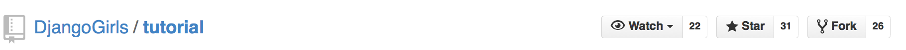
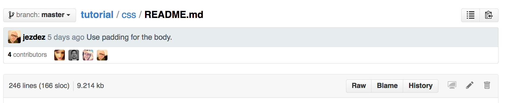

# Contributing and editing

Django Girls Tutorial is licensed under *Creative Commons Attribution-ShareAlike 4.0* license. Everyone is free to add, edit and correct the tutorial.

# Editing basics

The source code of the tutorial is [hosted on Github](). The tutorial uses [GitBook](https://www.gitbook.io/) service for the publishing the documentation. Github [Fork & Pull pull request workflow](https://help.github.com/articles/using-pull-requests) is used to accept and review changes.

The tutorial is written in [Markdown mark up language](https://help.github.com/articles/markdown-basics).

# Making an update

Below is outline how you can get a change to the book. This assumes

* You have a [Github account](https://github.com)
* You are familiar with [Git command line command basics](https://help.github.com/articles/set-up-git) or you are using an app ([Windows](https://windows.github.com/), [Mac](https://mac.github.com/)) to push your edits on a local computer to Github

## Fork the repository

First fork [DjangoGirls/tutorial](https://github.com/DjangoGirls/tutorial) project into your personal Github repository:

# Editing chapter content

## Simple changes

For a simple changes like typo corrections you can use Github online editor.

* Open your local fork on Github
* Go to *README.md* file in any chapter
* Press *Edit* icon (pen) and you can edit the chapter in Github's online editor

* Now you can edit the page in Markdown syntax

## New content and complex changes

# Making a pull request

After you have completed your changes you need to create *a pull request*. DjangoGirls will get notified about the pull request, review your changes, suggest any corrections if needed and then *pull* your changes to the master version.

In your own repository do *Compare and gi*

