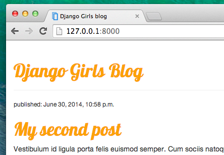
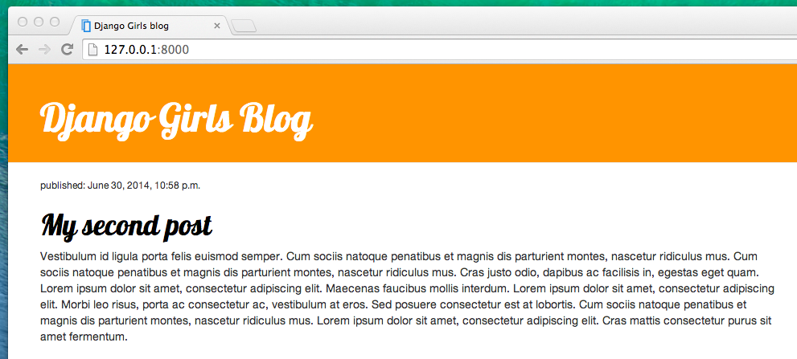

# CSS - make it pretty!

Our blog still looks pretty ugly, right? Time to make it nice! We will use CSS for that.

## What is CSS?

Cascading Style Sheets (CSS) is a style sheet language used for describing the look and formatting of a website written in markup language (like HTML).

But we don't want to start from scratch again, right? We will, again, use something that has already been done by programmers and released in the Internet for free. You know, inventing a wheel once again is no fun.

## Let's use Bootstrap!

Bootstrap is the most popular HTML and CSS framework for developing beautiful websites: http://getbootstrap.com/

It was written by programmers who worked for Twitter and is now developed by volunteers from all over the world.

## Install Boostrap

To install Bootstrap, you need to add this to your `head`:

    <link rel="stylesheet" href="//maxcdn.bootstrapcdn.com/bootstrap/3.2.0/css/bootstrap.min.css">
    <link rel="stylesheet" href="//maxcdn.bootstrapcdn.com/bootstrap/3.2.0/css/bootstrap-theme.min.css">
    

Then just go ahead, open your website and refresh page. Here it is!

Looking nicer already!

## Static files in Django

Another thing you will learn about today is called __static files__. Static files are all your CSS and images -- files that are not dynamic, so their content don't depend on request context and will be the same for every user.

CSS is a static file, so in order to customize CSS, we need to first configure static files in Django. You'll only do it once and for all. Let's start:

### Configure static files in Django

First, we need to create a folder to store our static files in. Go ahead and create folder called `static` inside your `mysite` folder.

Now we need to tell Django how it can find it. Open up the `mysite/mysite/settings.py` file, scroll to the bottom of it and add the following lines:

    STATICFILES_DIRS = (
        os.path.join(BASE_DIR, "static"),
    )

This way Django will know where your static files are.

That's it! Time to see if it works :)

## Your first CSS file!

First things first: let's create a CSS file now. Create a new folder called `css` inside your `static` folder. Then create a new file called `blog.css` inside this `css` directory. Ready?

Time to write some CSS! Open up the `mysite/static/css/blog.css` file in your code editor.

We won't be going too deep into customizing and learning about CSS here, because it's pretty easy and you can learn it on your own after this workshop. We really recommend doing this [Codeacademy HTML & CSS course](http://www.codecademy.com/tracks/web) to learn everything you need to know about making your websites more pretty with CSS.

But let's do at least a little. Maybe we could change the color of our header? To understand colors, computer use special codes. They start with `#` and are followed by 6 letters and numbers. You can find color codes for example here: http://www.colorpicker.com/

In your `mysite/static/css/blog.css` file you should add following code:

    h1 a {
        color: #FCA205;
    }

`a` inside of `h1` is the tag we're applying our styles to, and we're telling it to change color to `#FCA205`. Of course, you can put your own color here!

Then, we need to also tell our HTML template that we added some CSS. Open the `mysite/blog/templates/blog/post_list.html` file and add this line at the very beginning of it:

    

We're just loading static files here :) Then, in the `<head>` section, add this line:

    <link rel="stylesheet" href="">

We just told our template where our CSS file is located. Ok, save the file and refresh the site!

Nice work! Maybe we would also like to give our website a little air and increase the margin on the left side? Let's try this!

    body {
        margin-left: 15px;
    }

Add this to your CSS, save the file and see how it works!

Maybe we can customize the font in our header? Paste this into your `<head>` in `mysite/blog/templates/blog/post_list.html` file:

    <link href="http://fonts.googleapis.com/css?family=Lobster&subset=latin,latin-ext" rel="stylesheet" type="text/css">

This line will import a font called Lobster from Google Fonts.

Now add this line in `mysite/static/css/blog.css`:

    h1 a {
        color: #FCA205;
        font-family: 'Lobster';
    }

Great!

CSS has a concept of classes, which basically allows us to name a part of our HTML code and apply styles only to this part, not affecting others. It's super helpful if you have two divs, but they're doing something very different (like your header and your post), so you don't want them to look the same.

Go ahead and name some parts of the HTML code. Add a class called `page-header` to your `div` that contains header, like this:

    

        <h1><a href="">Django Girls Blog</a></h1>
    

And now add a class `post` to your `div` containing blogposts.

    

        <small>published: {{ post.published_date }}</small>
        <h1><a href="">{{ post.title }}</a></h1>
        
{{ post.text }}

    

All right. We have only one day, so we need to speed things up a little! We can't explain you every little detail about CSS. For now just copy and paste following code into your `mysite/static/css/blog.css` file:

    .page-header {
        background-color: #ff9400;
        margin-top: 0;
        padding: 20px 20px 20px 40px;
    }

    .page-header h1, .page-header h1 a, .page-header h1 a:visited, .page-header h1 a:active {
        color: #ffffff;
        font-size: 36pt;
        text-decoration: none;
    }

    .content {
        margin-left: 40px;
    }

    h1, h2, h3, h4 {
        font-family: 'Lobster', cursive;
    }

    .date {
        float: right;
        color: #828282;
    }

    .save {
        float: right;
    }

    .post-form textarea, .post-form input {
        width: 100%;
    }

    .top-menu, .top-menu:hover, .top-menu:visited {
        color: #ffffff;
        float: right;
        font-size: 26pt;
        margin-right: 20px;
    }

    .post {
        margin-bottom: 70px;
    }

    .post h1 a, .post h1 a:visited {
        color: #000000;
    }

Then also replace this:

    
        

            <small>published: {{ post.published_date }}</small>
            <h1><a href="">{{ post.title }}</a></h1>
            
{{ post.text }}

        

    

in the `<body>` of your `mysite/blog/templates/blog/post_list.html` with this:

    

        

            

                
                    

                        <small>published: {{ post.published_date }}</small>
                        <h1><a href="">{{ post.title }}</a></h1>
                        
{{ post.text }}

                    

                
            

        

    

Save those files and refresh your website.

Wohoo! Looks awesome, right? The code we just pasted is not really so hard to understand and you should be able to understand most of it just by reading it.

Don't be afraid to tinker with this CSS a little bit and try to change some things. If you break something, don't worry, you can always undo this!

Anyway, we really recommend taking this free online [Codeacademy HTML & CSS course](http://www.codecademy.com/tracks/web) as a post-workshop homework to learn everything you need to know about making your websites more pretty with CSS.

Ready for next chapter?! :)

