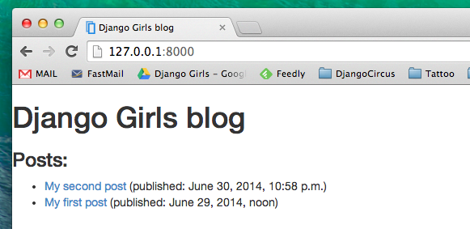
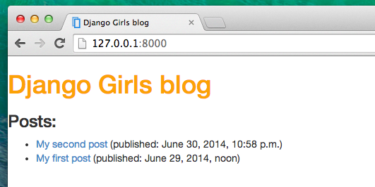
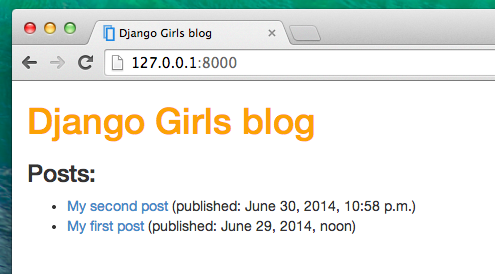

# CSS - make it pretty!

Our blog looks still pretty ugly, right? Time to make it nice! We will use CSS for that.

## What is CSS?

Cascading Style Sheets (CSS) is a style sheet language used for describing the look and formatting of a website written in markup language (like HTML).

But we don't want to start from scratch again, right? We will, again, use something that has already been done by programmers and released in the Internet for free. You know, inventing a wheel once again is no fun.

## Let's use Bootstrap!

Bootstrap is the most popular HTML and CSS framework for developing beautiful websites: http://getbootstrap.com/

It was written by programmers who worked for Twitter and is now developed by volunteers from all over the world.

## Install Boostrap

To install Bootstrap, you need to add this to your `head`:

    <link rel="stylesheet" href="//maxcdn.bootstrapcdn.com/bootstrap/3.2.0/css/bootstrap.min.css">
    <link rel="stylesheet" href="//maxcdn.bootstrapcdn.com/bootstrap/3.2.0/css/bootstrap-theme.min.css">
    

Then just go ahead, open your website and refresh page. Here it is!

Looking nicer already!

## Static files in Django

Another thing you will learn about today is called __static files__. Static files are all your CSS and images -- files that are not dynamic, so their content don't depend on request context and will be the same for every user.

CSS is a static file, so in order to customize CSS, we need to first configure static files in Django. You'll only do it once for all. Let's start:

### Configure static files in Django

First, we need to create a folder to store our static files in. Go ahead and create folder called `static` inside your `mysite` folder.

Now we need to tell Django how it can find it. Open up a `mysite/mysite/settings.py` file, scroll to the bottom of it and add following lines:

    STATICFILES_DIRS = (
        os.path.join(BASE_DIR, "static"),
    )

This way Django will now where your static files are.

That's it! Time to see if it works :)

## Your first CSS file!

First things first: let's now create a CSS file. Create a new folder called `css` inside your `static` folder. Then create a new file called `blog.css` inside this `css` directory. Ready?

Time to write some CSS! Open up your `blog.css` file in code editor.

We won't be going to deep into customizing and learning about CSS here, because it's pretty easy and you can learn it on your own after this workshop. We really recommend doing this [Codeacademy HTML & CSS course](http://www.codecademy.com/tracks/web) to learn everything you need to know about making your websites more pretty with CSS.

But let's do at least a little. Maybe we could change the color of our header? To understand colors, computer use special codes. They start with `#` and are followed by 6 letters and numbers. You can find color codes for example here: http://www.colorpicker.com/

In your `blog.css` file you should add following code:

    h1 {
        color: #FCA205;
    }

`h1` is the tag we're applying our styles to, and we're telling it to change color to `#FCA205`. Of course, you can put your own color here!

Then, we need to also tell our HTML template that we added some CSS. Open `post_list.html` file and add this file on the very begining of it:

    

We're just loading static files here :) Then, in the `<head>` section, add this line:

    <link rel="stylesheet" href="">

We just told our template where our CSS file is located. Ok, save a file and refresh the site!

Nice work! Maybe we would also like to give our website a little air and increase the margin on the left side? Let's try this!

    body {
        margin-left: 15px;
    }

Add this to your CSS, save a file and see how it works!

We have only one day, so we need to speed things up a little! Go to the next chapter to learn about extending your templates.

