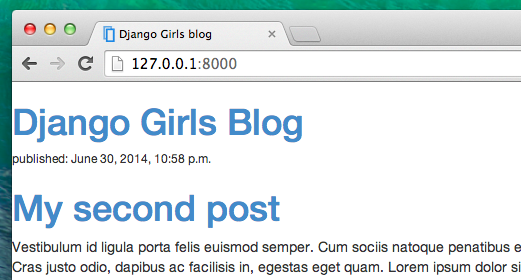

# CSS - make it pretty!

Our blog still looks pretty ugly, right? Time to make it nice! We will use CSS for that.

## What is CSS?

Cascading Style Sheets (CSS) is a language used for describing the look and formatting of a website written in markup language (like HTML). Treat it as make-up for our webpage ;).

But we don't want to start from scratch again, right? We will, once more, use something that has already been done by programmers and released on the Internet for free. You know, reinventing the wheel is no fun.

## Let's use Bootstrap!

Bootstrap is one of the most popular HTML and CSS frameworks for developing beautiful websites: http://getbootstrap.com/

It was written by programmers who worked for Twitter and is now developed by volunteers from all over the world.

## Install Boostrap

To install Bootstrap, you need to add this to your `<head>` in your `.html` file (`blog/templates/blog/post_list.html`):

    <link rel="stylesheet" href="//maxcdn.bootstrapcdn.com/bootstrap/3.2.0/css/bootstrap.min.css">
    <link rel="stylesheet" href="//maxcdn.bootstrapcdn.com/bootstrap/3.2.0/css/bootstrap-theme.min.css">
    

This doesn't add any files to your project. It just points to files that exist on the internet.
Just go ahead, open your website and refresh the page. Here it is!

Looking nicer already!

## Static files in Django

Another thing you will learn about today is called __static files__. Static files are all your CSS and images -- files that are not dynamic, so their content doesn't depend on request context and will be the same for every user.

CSS is a static file, so in order to customize CSS, we need to first configure static files in Django. You'll only need to do it once. Let's start:

### Configure static files in Django

First, we need to create a directory to store our static files in. Go ahead and create a directory called `static` inside your `djangogirls` directory.

    djangogirls
    ├─── static
    └─── manage.py

Open up the `mysite/settings.py` file, scroll to the bottom of it and add the following lines:

    STATICFILES_DIRS = (
        os.path.join(BASE_DIR, "static"),
    )

This way Django will know where to find your static files.

## Your first CSS file!

Let's create a CSS file now, to add your own style to your web-page. Create a new directory called `css` inside your `static` directory. Then create a new file called `blog.css` inside this `css` directory. Ready?

    static
    └─── css
            blog.css

Time to write some CSS! Open up the `static/css/blog.css` file in your code editor.

We won't be going too deep into customizing and learning about CSS here, because it's pretty easy and you can learn it on your own after this workshop. We really recommend doing this [Codeacademy HTML & CSS course](http://www.codecademy.com/tracks/web) to learn everything you need to know about making your websites more pretty with CSS.

But let's do at least a little. Maybe we could change the color of our header? To understand colors, computers use special codes. They start with `#` and are followed by 6 letters (A-F) and numbers (0-9). You can find color codes for example here: http://www.colorpicker.com/. You may also use [predefined colors](http://www.w3schools.com/cssref/css_colornames.asp), such as `red` and `green`.

In your `static/css/blog.css` file you should add the following code:

    h1 a {
        color: #FCA205;
    }

`h1 a` is a CSS Selector. This means we're applying our styles to any `a` element inside of an `h1` element (e.g. when we have in code something like: `<h1><a href="">link</a></h1>`).  In this case, we're telling it to change its color to `#FCA205`, which is orange. Of course, you can put your own color here!

In a CSS file we determine styles for elements in the HTML file. The elements are identified by the element name (i.e. `a`, `h1`, `body`), the attribute `class` or the attribute `id`. Class and id are names you give the element by yourself. Classes define groups of elements, and ids point to specific elements. For example, the following tag may be identified by CSS using the tag name `a`, the class `external_link`, or the id `link_to_wiki_page`:

    <a href="http://en.wikipedia.org/wiki/Django" class="external_link" id="link_to_wiki_page">

Read about [CSS Selectors in w3schools](http://www.w3schools.com/cssref/css_selectors.asp).

Then, we need to also tell our HTML template that we added some CSS. Open the `blog/templates/blog/post_list.html` file and add this line at the very beginning of it:

    

We're just loading static files here :). Then, between the `<head>` and `</head>`, after the links to the Bootstrap CSS files (the browser reads the files in the order they're given, so code in our file may override code in Bootstrap files), add this line:

    <link rel="stylesheet" href="">

We just told our template where our CSS file is located.

Your file should now look like this:

    
    <html>
        <head>
            <title>Django Girls blog</title>
            <link rel="stylesheet" href="//maxcdn.bootstrapcdn.com/bootstrap/3.2.0/css/bootstrap.min.css">
            <link rel="stylesheet" href="//maxcdn.bootstrapcdn.com/bootstrap/3.2.0/css/bootstrap-theme.min.css">
            
            <link rel="stylesheet" href="">
        </head>
        <body>
            

                <h1><a href="/">Django Girls Blog</a></h1>
            

            
                

                    
published: {{ post.published_date }}

                    <h1><a href="">{{ post.title }}</a></h1>
                    
{{ post.text|linebreaks }}

                

            
        </body>
    </html>

OK, save the file and refresh the site!

Nice work! Maybe we would also like to give our website a little air and increase the margin on the left side? Let's try this!

    body {
        padding-left: 15px;
    }

Add this to your CSS, save the file and see how it works!

Maybe we can customize the font in our header? Paste this into your `<head>` in `blog/templates/blog/post_list.html` file:

    <link href="http://fonts.googleapis.com/css?family=Lobster&subset=latin,latin-ext" rel="stylesheet" type="text/css">

This line will import a font called *Lobster* from Google Fonts (https://www.google.com/fonts).

Now add the line `font-family: 'Lobster';` in the CSS file `static/css/blog.css` inside the `h1 a` declaration block (the code between the braces `{` and `}`)  and refresh the page:

    h1 a {
        color: #FCA205;
        font-family: 'Lobster';
    }

Great!

As mentioned above, CSS has a concept of classes, which basically allows you to name a part of the HTML code and apply styles only to this part, not affecting others. It's super helpful if you have two divs, but they're doing something very different (like your header and your post), so you don't want them to look the same.

Go ahead and name some parts of the HTML code. Add a class called `page-header` to your `div` that contains your header, like this:

    

        <h1><a href="/">Django Girls Blog</a></h1>
    

And now add a class `post` to your `div` containing a blog post.

    

        
published: {{ post.published_date }}

        <h1><a href="">{{ post.title }}</a></h1>
        
{{ post.text|linebreaks }}

    

We will now add declaration blocks to different selectors. Selectors starting with `.` relate to classes. There are many great tutorials and explanations about CSS on the Web to help you understand the following code. For now, just copy and paste it into your `mysite/static/css/blog.css` file:

    .page-header {
        background-color: #ff9400;
        margin-top: 0;
        padding: 20px 20px 20px 40px;
    }

    .page-header h1, .page-header h1 a, .page-header h1 a:visited, .page-header h1 a:active {
        color: #ffffff;
        font-size: 36pt;
        text-decoration: none;
    }

    .content {
        margin-left: 40px;
    }

    h1, h2, h3, h4 {
        font-family: 'Lobster', cursive;
    }

    .date {
        float: right;
        color: #828282;
    }

    .save {
        float: right;
    }

    .post-form textarea, .post-form input {
        width: 100%;
    }

    .top-menu, .top-menu:hover, .top-menu:visited {
        color: #ffffff;
        float: right;
        font-size: 26pt;
        margin-right: 20px;
    }

    .post {
        margin-bottom: 70px;
    }

    .post h1 a, .post h1 a:visited {
        color: #000000;
    }

Then surround the HTML code which displays the posts with declarations of classes. Replace this:

    
        

            
published: {{ post.published_date }}

            <h1><a href="">{{ post.title }}</a></h1>
            
{{ post.text|linebreaks }}

        

    

in the `blog/templates/blog/post_list.html` with this:

    

        

            

                
                    

                        
published: {{ post.published_date }}

                        <h1><a href="">{{ post.title }}</a></h1>
                        
{{ post.text|linebreaks }}

                    

                
            

        

    

Save those files and refresh your website.

Woohoo! Looks awesome, right? The code we just pasted is not really so hard to understand and you should be able to understand most of it just by reading it.

Don't be afraid to tinker with this CSS a little bit and try to change some things. If you break something, don't worry, you can always undo it!

Anyway, we really recommend taking this free online [Codeacademy HTML & CSS course](http://www.codecademy.com/tracks/web) as some post-workshop homework to learn everything you need to know about making your websites prettier with CSS.

Ready for the next chapter?! :)

