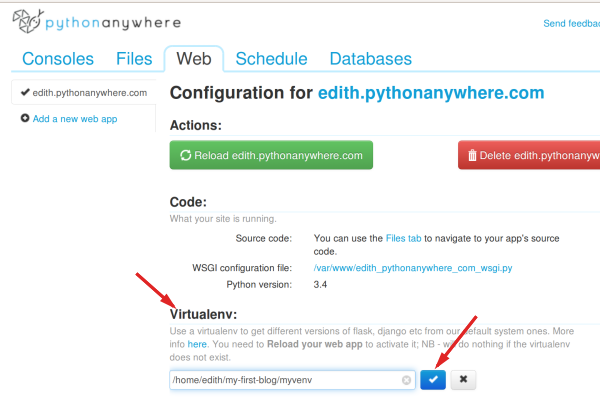

# Veröffentlichen!

> **Hinweis:** Durch das folgende Kapitel muss man sich manchmal durchbeißen. Bleib dran und gib nicht auf; die Website zu veröffentlichen ist ein sehr wichtiger Schritt. Dieses Kapitel ist in der Mitte des Tutorials platziert, damit dir dein Mentor mit dem etwas anspruchsvolleren Vorgang der Veröffentlichung deiner Website helfen kann. Den Rest des Tutorials kannst du dann auch alleine beenden, sollte die Zeit nicht ausreichen.

Bis jetzt lief die Website nur auf deinem Computer, jetzt wollen wir sie veröffentlichen! Auf Englisch sagt man dazu deploy. Deployen bedeutet, dass du deine Anwendung im Internet veröffentlichst, so dass endlich jeder darauf zugreifen kann :).

Wie du schon gelernt hast, muss eine Webseite auf einem Server liegen. Es sind eine Menge Server-Anbieter im Internet verfügbar. Wir werden einen verwenden, der einen relativ einfachen Veröffentlichungsprozess (deployment process) hat: [PythonAnywhere](http://pythonanywhere.com/). PythonAnywhere ist kostenlos für kleine Anwendungen, die nicht von vielen Besuchern aufgerufen werden. Also erstmal genau das Richtige für dich.

Als weiteren externen Dienst werden wir [GitHub](http://www.github.com) nutzen, einen "Code Hosting"-Dienst. Es gibt noch andere solcher Dienste, aber die meisten Programmierer haben heute ein Konto bei GitHub, und du gleich auch!

GitHub wird unsere Basis für die Übertragung unseres Code von und nach PythonAnywhere sein.


# Git

Git ist ein "Versionsverwaltungssystem", das von vielen Programmierern benutzt wird. Diese Software kann Änderungen an Dateien über die Zeit verfolgen, so dass du bestimmte Versionen im Nachhinein wieder aufrufen kannst. Ein bisschen wie die "Track Changes" Funktion in Microsoft Word, aber viel leistungsfähiger.

## Git installieren

> **Hinweis:** Falls du die Installationsschritte bereits durchgeführt hast, kannst du mit dem nächsten Abschnitt fortfahren und anfangen, dein Git-Repository zu erstellen.



## Unser Git-Repository

Git verwaltet die Veränderungen an einer Sammlung von Dateien in einem sogenannten Repository (oder kurz "Repo"). Wir legen eins für unser Projekt an. Öffne deine Konsole und gibt folgende Kommandos im `djangogirls`-Verzeichnis ein:

> **Hinweis:** Überprüfe dein aktuelles Arbeitsverzeichnis mit dem Befehl `pwd` (OSX/Linux) oder `cd` (Windows) bevor du das Repository initialisierst. Du musst dich im `djangogirls`-Verzeichnis befinden, bevor du fortfährst.

```
$ git init 
Initialized empty Git repository in ~/djangogirls/.git/ 
$ git config --global user.name "Dein Name" 
$ git config --global user.email du@beispiel.com
```

Die Initialisierung eines Git-Repository müssen wir nur einmal pro Projekt machen (und du musst nicht noch einmal Deinen Benutzernamen und E-Mail-Adresse eingeben).

Git wird die Änderungen an all den Dateien und Ordnern in diesem Verzeichnis aufzeichnen. Wir wollen aber, dass einige Dateien ignoriert werden. Dazu legen wir eine Datei `.gitignore` im Basisverzeichnis des Repos an. Öffne deinen Editor und erstelle eine neue Datei mit dem folgenden Inhalt:

```
*.pyc
__pycache__
myvenv
db.sqlite3
.DS_Store
```

Speichere die Datei mit dem Namen `.gitignore` im "djangogirls"-Verzeichnis.

> **Hinweis:** Der Punkt vor dem Dateinamen ist wichtig! Wenn du Schwierigkeiten beim Erstellen hast (z.B. lassen Macs im Finder keine Dateien mit Punkt am Anfang erzeugen, Punkt-Dateien sind auf Linux und OS X "versteckte Dateien"), dann verwende die "Speichern unter"-Funktion im Editor, das sollte immer funktionieren.

Es ist hilfreich den Befehl `git status` vor `git add` auszuführen oder immer dann, wenn du dir unsicher bist, was geändert wurde. Das schützt vor manchen Überraschungen, wie z. B. das falsche Hinzufügen oder Übertragen von Dateien. Das `git status`-Kommando gibt Informationen über unbeobachtete/veränderte/hinzugefügte Dateien, den Verzweigungsstatus und einiges mehr wieder. Die Ausgabe sollte so oder so ähnlich sein:

```
$ git status 
On branch master 

Initial commit 

Untracked files:
    (use "git add <file>..." to include in what will be committed) 

        .gitignore
        blog/
        manage.py
        mysite/ 

nothing added to commit but untracked files present (use "git add" to track)
```

Nun speichern wir unsere Änderungen durch folgende Eingabe in der Konsole:

```
$ git add -A .
$ git commit -m "Meine Django Girls App, erster Commit"
 [...]
 13 files changed, 200 insertions(+)
 create mode 100644 .gitignore
 [...]
 create mode 100644 mysite/wsgi.py
```

## Den Code auf GitHub veröffentlichen

Öffne [GitHub.com](https://www.github.com) und registriere dich für ein neues, kostenloses Benutzerkonto. (Wenn du das bereits in deiner Vorbereitung auf den Workshop getan hast, dann ist das großartig!)

Erstelle dann ein neues Repository und gib ihm den Namen "my-first-blog". Lass das Kontrollkästchen "initialise with a README" deaktiviert, die Einstellung der Option .gitignore frei (das haben wir schon von Hand gemacht) und lass die Lizenz auf "None".


> **Achtung:** Der Name `my-first-blog` ist wichtig -- du kannst auch einen anderen wählen, aber er wird im Folgenden noch sehr oft vorkommen und du wirst immer daran denken müssen, ihn in den Anweisungen entsprechend anzupassen. Lass es besser erst mal bei `my-first-blog`.

Auf der nächsten Seite wird dir die Clone-URL des Repos angezeigt. Nimm die HTTPS-Variante, kopiere sie und füge sie in der Konsole ein:


Nun müssen wir das Git-Repository auf deinem Computer mit dem auf GitHub verbinden.

Gib Folgendes in deine Konsole ein (Ersetze dabei `<your-github-username>` durch deinen Benutzernamen, den du bei der Erstellung deines GitHub-Kontos benutzt hast, aber ohne die eckigen Klammern.):

```
$ git remote add origin https://github.com/<your-github-username>/my-first-blog.git
$ git push -u origin master
``` 

Gibt deinen GitHub-Benutzernamen und dein Passwort ein und du solltest etwas Ähnliches wie das hier sehen:

```
Username for 'https://github.com': hjwp
Password for 'https://hjwp@github.com':
Counting objects: 6, done.
Writing objects: 100% (6/6), 200 bytes | 0 bytes/s, done.
Total 3 (delta 0), reused 0 (delta 0)
To https://github.com/hjwp/my-first-blog.git
 * [new branch]      master -> master
Branch master set up to track remote branch master from origin.
```

<!--TODO: maybe do ssh keys installs in install party, and point ppl who dont have it to an extention -->

Dein Code ist jetzt auf GitHub. Schau gleich mal nach! Dort ist dein Code du in guter Gesellschaft - [Django](https://github.com/django/django), das [Django Girls Tutorial](https://github.com/DjangoGirls/tutorial) und viele andere großartige Open Source Software-Projekte haben ihren Code auf GitHub :)

# Deinen Blog auf PythonAnywhere einrichten

> **Hinweis:** Es ist möglich, dass du bereits ein PythonAnywhere Konto angelegt hast. Wenn ja, dann brauchst du das nicht noch einmal zu tun.



## Den Code nach PythonAnywhere übertragen

Sobald du dich für PythonAnywhere angemeldet hast, wirst du zu deinem Dashboard bzw. deiner "Konsole" weitergeleitet. Wähle die Option zum Starten einer "Bash", das ist die PythonAnywhere-Version einer Konsole, genau wie die auf deinem Computer.

> **Hinweis:** PythonAnywhere basiert auf Linux. Wenn du Windows benutzt, dann sieht die Konsole etwas anders aus als die Konsole auf deinem Computer.

Lass uns den Code von GitHub auf PythonAnywhere übertragen, indem wir einen "Klon" unseres Repositorys erzeugen. Tippe das Folgende in die Konsole auf PythonAnywhere (vergiss nicht deinen GitHub-Benutzernamen an Stelle von `<your-github-username>` zu benutzen):

```
$ git clone https://github.com/<your-github-username>/my-first-blog.git
```

Dies wird eine Kopie deines Codes auf PythonAnywhere übertragen. Überprüfe es, indem du eingibst `tree my-first-blog`:

```
$ tree my-first-blog
my-first-blog/
├── blog
│   ├── __init__.py
│   ├── admin.py
│   ├── migrations
│   │   ├── 0001_initial.py
│   │   └── __init__.py
│   ├── models.py
│   ├── tests.py
│   └── views.py
├── manage.py
└── mysite
    ├── __init__.py
    ├── settings.py
    ├── urls.py
    └── wsgi.py
```

### Erstelle ein virtualenv auf PythonAnywhere

Genauso wie du auf deinem eigenen Computer ein virtualenv erstellt hast, kannst du auch eins auf PythonAnywhere erstellen. Schreibe Folgendes in die Bash:

```
$ cd my-first-blog

$ virtualenv --python=python3.5 myvenv
Running virtualenv with interpreter /usr/bin/python3.5
[...]
Installing setuptools, pip...done.

$ source myvenv/bin/activate

(myvenv) $  pip install django~=1.10.0
Collecting django
[...]
Successfully installed django-1.10.4
```

> **Hinweis:** Der Schritt `pip install` kann ein paar Minuten dauern. Hab etwas Geduld! Aber, wenn es länger als 5 Minuten dauern sollte, dann ist etwas falsch gelaufen. Frag am besten deinen Coach.

<!--TODO: think about using requirements.txt instead of pip install.-->

<!-- ### Statische Dateien einsammeln

Hast du dich gefragt, was die "whitenoise" Sache war? Es ist ein Werkzeug, um so genannte "statische Dateien" zu betreuen. Statische Dateien, wie z. B. HTML oder CSS Dateien, sind Daten, welche sich nicht regelmäßig verändern oder Programmcode ausführen. Sie funktionieren anders auf Servern als auf unseren eigenen Computern und wir brauchen ein Werkzeug wie "whitenoise", um sie zu betreuen.

Wir werden später im Tutorial ein wenig mehr über statische Dateien erfahren, wenn wir das CSS für unsere Seite bearbeiten.

Für`s Erste müssen wir nur ein extra Kommando auf dem Server ausführen, genannt `collectstatic`. Es befiehlt Django, alle statischen Dateien, die es auf dem Server braucht, einzusammeln. Im Moment sind dies hauptsächlich Dateien, welche die Admin Site hübsch aussehen lassen.

```
(mvenv) $ python manage.py collectstatic

You have requested to collect static files at the destination
location as specified in your settings:

    /home/edith/my-first-blog/static
    
This will overwrite existing files!
Are you sure you want to do this?

Type 'yes' to continue, or 'no' to cancel: yes
```

Tippe "yes" ein und es verschwindet! Liebst du es nicht auch, Computer dazu zu bringen, Seiten über Seiten von undurchdringbaren Text auszugeben? Ich mache immer kleine Geräusche, um das zu begleiten. Brp, brp brp...

```
Copying '/home/edith/my-first-blog/mvenv/lib/python3.4/site-packages/django/contrib/admin/static/admin/js/actions.min.js'
Copying '/home/edith/my-first-blog/mvenv/lib/python3.4/site-packages/django/contrib/admin/static/admin/js/inlines.min.js'
[...]
Copying '/home/edith/my-first-blog/mvenv/lib/python3.4/site-packages/django/contrib/admin/static/admin/css/changelists.css'
Copying '/home/edith/my-first-blog/mvenv/lib/python3.4/site-packages/django/contrib/admin/static/admin/css/base.css'
62 static files copied to '/home/edith/my-first-blog/static'.
``` -->

### Erstellen einer Datenbank auf PythonAnywhere

Hier ist ein weiterer Unterschied zwischen deinem Computer und einem Server: unterschiedliche Datenbanken werden benutzt. Dadurch können sich Benutzerkonten und Posts auf dem Server und auf deinem Computer unterscheiden.

Wir initialisieren die Datenbank auf dem Server genauso, wie wir es auf deinen Computer mit `migrate` und `createsuperuser` gemacht haben:

```
(mvenv) $ python manage.py migrate 
Operations to perform: 
[...]
    Applying sessions.0001_initial... OK 


(mvenv) $ python manage.py createsuperuser
```

## Veröffentlichen unseres Blogs als Web-App

Jetzt ist unser Code auf PythonAnywhere, unser virtualenv ist bereit, die statischen Dateien sind gesammelt und die Datenbank ist initialisiert. Wir sind bereit es als Web-App zu veröffentlichen!

Gehe zurück zum PythonAnywhere Dashboard, indem du auf das Logo klickst und klicke anschließend auf den **Web** Menüpunkt. Dort wählst du **Add a new web app** aus.

Nach der Bestätigung deines Domainnamens wählst du **manual configuration** (NB *nicht* die "Django"-Option) im Dialogfeld aus. Entscheide dich als Nächstes für **Python 3.5** und klicke "Next", um den Assistenten zu beenden.

> **Hinweis:** Versichere dich, dass du die Option "Manual configuration" ausgewählt hast und nicht "Django". Wir sind einfach zu cool für das Standard PythonAnywhere Django Setup :-)

### Angeben des Virtualenv

Du wirst auf den PythonAnywhere-Konfigurationsschirm für deine Web-App weitergeleitet. Dorthin musst du immer gehen, wenn du Änderungen an deiner App auf dem Server vornehmen willst.



In der "Virtualenv"-Sektion, klicke auf den roten Text, welcher sagt: "Enter the path to a virtualenv" und gieb ein: `/home/<your-username>/my-first-blog/myvenv/`. Klicke auf die blaue Box mit dem Häkchen, um den Pfad zu speichern, bevor es weitergeht.

> **Hinweis:** Ersetze deinen eigenen Benutzernamen soweit erforderlich. Falls du einen Fehler machst, wird dir PythonAnywhere eine kleine Warnung anzeigen.

### Konfigurieren der WSGI-Datei

Django funktioniert durch Verwendung des "WSGI Protokolls", ein Standard für Python-Webseiten, der von PythonAnywhere unterstützt wird. Um PythonAnywhere so zu konfigurieren, dass es unseren Django-Blog erkennt, editieren wir eine WSGI-Konfigurationsdatei.

Klicke auf den "WSGI configuration file"-Link (in der "Code"-Sektion im oberen Teil der Seite -- es sollte ungefähr so benannt sein `/var/www/<your-username>_pythonanywhere_com_wsgi.py`) und du wirst zu einem Editor geführt.

Lösche alle Inhalte und ersetze sie durch:

```python
import os
import sys

path = os.path.expanduser('~/my-first-blog')
if path not in sys.path:
    sys.path.append(path)

os.environ['DJANGO_SETTINGS_MODULE'] = 'mysite.settings'

from django.core.wsgi import get_wsgi_application
from django.contrib.staticfiles.handlers import StaticFilesHandler
application = StaticFilesHandler(get_wsgi_application())
```

> **Hinweis:** Vergiss nicht deinen Benutzernamen an der Stelle `<your-username>` einzusetzen

Die Aufgabe dieser Datei ist es, PythonAnywhere zu sagen, wo unsere Web-App lebt und wie der Django Einstellungsdateiname ist. Es richtet außerdem das "whitenoise" Werkzeug für statische Dateien ein.

Klicke auf **Save** und gehe dann zu dem **Web**-Tab zurück.

Wir sind fertig! Drücke auf den großen, grünen **Reload**-Knopf und du kannst dir deine Applikation anschauen. Du findest einen Link zu ihr oben auf der Seite.

## Debugging Tipps

Falls du beim Versuch deine Seite zu besuchen, einen Fehler siehst, ist der erste Ort, an dem man nach Debugging-Infos schauen sollte, dein **error log**. Einen Link dazu findest du auf dem PythonAnywhere [Web tab](https://www.pythonanywhere.com/web_app_setup/). Schau nach, ob Fehlermeldungen enthalten sind; die neuesten findest du unten. Häufige Probleme sind:

*   Einen der Schritte vergessen, die wir in der Konsole erledigt haben: das virtualenv kreieren, es aktivieren, Django darin installieren, collectstatic auszuführen, die Datenbank zu migrieren.

*   Einen Fehler in dem virutalenv-Pfad auf dem Web-Tab machen -- falls es ein Problem gibt, wird dann dort normalerweise eine kleine rote Fehlermeldung erscheinen.

*   Einen Fehler in der WSGI-Konfigurationsdatei machen -- ist der Pfad zu deinem my-first-blog Ordner richtig?

*   Hast du die selbe Pythonversion für dein virtualenv gewählt wie für deine Web-App? Beide sollten 3.4 sein.

*   Es gibt einige [general debugging tips on the PythonAnywhere wiki](https://www.pythonanywhere.com/wiki/DebuggingImportError).

Und denk dran, dein Coach ist da, um dir zu helfen!


# Du bist live!

Die Standardseite für deine Site sollte "Welcome to Django" anzeigen, genauso wie auf deinem lokalen Computer. Versuch `/admin/` am Ende der URL hinzuzufügen und du gelangst zur Adminseite. Melde dich mit deinen Benutzernamen und Passwort an. Wie du siehst, kannst du neue Posts auf dem Server hinzufügen.

Klopf dir *kräftig* auf die Schulter! Das Deployment ist eines der kompliziertesten Dinge der Web-Entwicklung und es dauert oftmals mehrere Tage, bis alles läuft. Aber du hast deine Site jetzt live, im echten Internet, einfach so!
