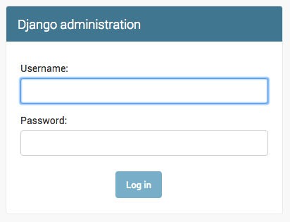

# Django Administration

Zum Hinzufügen, Bearbeiten und Löschen von Blogposts benutzen wir den Django Admin, das eingebaute Administrations-Backend von Django.

Öffne die Datei `blog/admin.py` und ersetze den Inhalt wie folgt:

```python
from django.contrib import admin
from .models import Post

admin.site.register(Post)
```

Wie du siehst, importieren wir hier das Model "Post", das wir im vorigen Kapitel erstellt haben. Damit unser Model auf der Admin-Seite sichtbar wird, müssen wir es mit `admin.site.register(Post)` registrieren.

Okay, wir sehen uns nun unser Post-Model an. Denk daran, `python manage.py runserver` in die Konsole einzugeben, um den Webserver zu starten. Öffne dann deinen Browser und gib die Adresse http://127.0.0.1:8000/admin/ ein. Du solltest nun eine Login-Seite wie diese sehen:



Um dich einzuloggen, musst du einen *superuser* erzeugen - einen Benutzer, welcher Kontrolle über alles auf der Site hat. Geh zurück zu der Kommandozeile und tippe `python manage.py createsuperuser`, und drücke Enter. Wenn gefordert, gibst du deinen Benutzernamen (Kleinbuchstaben, keine Leerzeichen), E-Mail-Adresse und Passwort ein. Keine Sorge, dass du das Passwort nicht siehst, das du gerade eingibst - das soll so sein. Tipp es einfach ein und drücke `Enter` um fortzufahren. Du solltest nun Folgendes sehen (wobei Username und Email deine sein sollten):

```
(myvenv) ~/djangogirls$ python manage.py createsuperuser
Username: admin
Email address: admin@admin.com
Password:
Password (again):
Superuser created successfully.
```

Geh nochmal in deinen Browser und log dich mit den Daten des Superusers ein, den du gerade erstellt hast. Du solltest nun das Django Admin Dashboard sehen.


Gehe zu Posts und experimentiere ein wenig damit. Füge 5 oder 6 Blogposts hinzu. Mach dir keine Sorgen wegen des Inhalts - du kannst einfach etwas Text aus diesem Tutorial kopieren und einfügen, um Zeit zu sparen :-).

Achte darauf, dass bei wenigstens zwei oder drei Posts (aber nicht bei allen) das Veröffentlichungsdatum (publish date) eingetragen ist. Das werden wir später noch brauchen.


Wenn du mehr über Django Admin wissen willst, solltest du dir die Django Dokumentation ansehen: https://docs.djangoproject.com/en/1.8/ref/contrib/admin/

Jetzt ist wahrscheinlich ein guter Moment, um dir einen Kaffee (oder Tee) zu gönnen und neue Kraft tanken. Du hast dein erstes Django-Model erstellt - du hast dir eine kleine Pause verdient!
