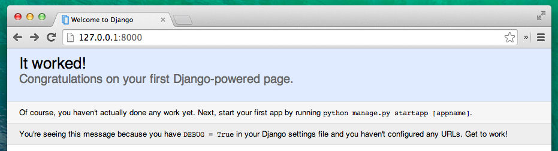

# Dein erstes Django-Projekt!

> Teile dieses Kapitels basieren auf den Tutorials der Geek Girls Carrots (http://django.carrots.pl/).
> 
> Teile dieses Kapitels basieren auf dem [django-marcador Tutorial](http://django-marcador.keimlink.de/) lizenziert unter Creative Commons Attribution-ShareAlike 4.0 International License. Für das "django-marcador Tutorial" liegt das Urheberrecht bei Markus Zapke-Gründemann et al.


Wir werden einen einfachen Blog erstellen!

Der erste Schritt ist, ein neues Django-Projekt zu starten. Im Grunde bedeutet das, dass wir einige Skripte ausführen werden, die Django zur Verfügung stellt, um ein Skelett eines Django-Projekts für uns zu erzeugen. Das Projekt beinhaltet einen Haufen von Verzeichnissen und Dateien, die wir später verwenden werden.

Die Namen einiger Dateien und Verzeichnisse sind sehr wichtig für Django. Die Dateien, die erstellt werden, solltest du nicht umbenennen. Sie an eine andere Stelle zu verschieben, ist auch keine gute Idee. Django muss zwingend eine gewisse Struktur erhalten, um wichtige Dinge wiederzufinden.

> Denk daran, alles in der "Virtualenv"-Umgebung auszuführen. Wenn du kein Präfix `(Myvenv)` in deiner Konsole siehst, musst du deine Virtualenv-Umgebung aktivieren. Wie das gemacht wird, erklären wir im Kapitel **Django-Installation**, im Abschnitt **Arbeiten mit Virtualenv**. Gib `myvenv\Scripts\activate` in Windows oder `source myvenv/bin/activate` in Mac OS / Linux ein, um die Umgebung zu aktivieren.

In deiner MacOS- oder Linux-Konsole solltest du den folgenden Befehl ausführen; **vergiss nicht, den Punkt `.` am Ende** einzufügen:

```
(myvenv) ~/djangogirls$ django-admin startproject mysite .
```

Unter Windows; **vergiss nicht, den Punkt `.` am Ende** einzufügen:

```
(myvenv) C:\Users\Name\djangogirls> django-admin.py startproject mysite .
```

> Der Punkt `.` ist sehr wichtig, weil er dem Skript mitteilt, dass Django in deinem aktuellen Verzeichnis installiert werden soll. (der Punkt `.` ist eine Schnellreferenz dafür)
> 
> **Hinweis:** Wenn du die oben angegebenen Kommandos eingibst, denk dran, tippe nur das ein, was mit `django-admin` oder `django-admin.py` anfängt. `(myvenv) ~/djangogirls$` und `(myvenv) C:\Users\Name\djangogirls>` sind nur Teile von dem, was dir in der Eingabeaufforderung angezeigt wird, wenn die Konsole auf deine Eingabe wartet.

`django-admin.py` ist ein Skript, welches Verzeichnisse und Dateien für dich erstellt. Du solltest jetzt eine Verzeichnisstruktur haben, die folgendermaßen aussieht:

```
djangogirls
├───manage.py
└───mysite
        settings.py
        urls.py
        wsgi.py
        __init__.py
```

`manage.py` ist ein Script, das das Management deines Projektes unterstützt. Mit dem Script bist du unter anderem in der Lage, den Webserver auf deinem Rechner zu starten, ohne etwas Weiteres installieren zu müssen.

Die Datei `settings.py` beinhaltet die Konfiguration deiner Website.

Erinnerst du dich, als wir über den Postboten gesprochen haben, der überlegt, wohin er den Brief liefern soll? Die `urls.py` Datei beinhaltet eine Liste von Patterns (Mustern), die vom `urlresolver` benutzt werden.

Lass uns kurz die anderen Dateien vergessen - wir werden sie nicht verändern. Denk aber dran, sie nicht versehentlich zu löschen!

## Einstellungen anpassen

Wir werden die Einstellungen in `mysite/settings.py` anpassen. Öffne dazu den zuvor installierten Editor.

Es wäre schön, wenn die richtige Zeit auf deiner Webseite eingestellt ist. Gehe zu der [wikipedia timezones list](http://en.wikipedia.org/wiki/List_of_tz_database_time_zones) und kopiere deine zutreffende Zeitzone (time zone, TZ). (z.B. `Europe/Berlin`)

Finde in der settings.py die Zeile, welche `TIME_ZONE` enthält und ändere sie zu deiner Zeitzone:

```python
TIME_ZONE = 'Europe/Berlin'
```

Ändere "Europe/Berlin", wenn zutreffend.

Des Weiteren brauchen wir einen Dateipfad für sogenannte "statische" Dateien (static files). Wir werden später im Tutorial genauer klären, was wir darunter verstehen. Gehe ganz ans Ende der Datei und füge unter `STATIC_URL` einen neuen Eintrag `STATIC_ROOT` ein.

```python
STATIC_URL = '/static/'
STATIC_ROOT = os.path.join(BASE_DIR, 'static')
```

## Eine Datenbank erstellen

Es gibt viele verschiedene Datenbanksysteme, in denen wir Daten für unsere Website speichern können. Wir werden das Standard-System `sqlite3` nutzen..

Das sollte schon in der `mysite/settings.py`-Datei eingestellt sein:

```python
DATABASES = {
    'default': {
        'ENGINE': 'django.db.backends.sqlite3',
        'NAME': os.path.join(BASE_DIR, 'db.sqlite3'),
    }
}
```

Um eine Datenbank für unseren Blog zu erstellen, müssen wir folgenden Befehl in der Konsole ausführen (Dazu müssen wir in dem `djangogirls`-Verzeichnis sein, in dem sich auch die `manage.py`-Datei befindet). Wenn alles glatt läuft, sollte das so aussehen:

```
(myvenv) ~/djangogirls$ python manage.py migrate
Operations to perform:
  Apply all migrations: auth, admin, contenttypes, sessions
Running migrations:
  Rendering model states... DONE
  Applying contenttypes.0001_initial... OK
  Applying auth.0001_initial... OK
  Applying admin.0001_initial... OK
  Applying admin.0002_logentry_remove_auto_add... OK
  Applying contenttypes.0002_remove_content_type_name... OK
  Applying auth.0002_alter_permission_name_max_length... OK
  Applying auth.0003_alter_user_email_max_length... OK
  Applying auth.0004_alter_user_username_opts... OK
  Applying auth.0005_alter_user_last_login_null... OK
  Applying auth.0006_require_contenttypes_0002... OK
  Applying auth.0007_alter_validators_add_error_messages... OK
  Applying sessions.0001_initial... OK
```

Und wir sind fertig! Zeit, unseren Webserver zu starten, um zu sehen, ob unsere Website funktioniert!

Kontrolliere, dass du in dem Verzeichniss bist, in dem die `manage.py`-Datei liegt (das `djangogirls`-Verzeichnis). Wir starten den Webserver, indem wir in der Konsole `python manage.py runserver` ausführen:

```
(myvenv) ~/djangogirls$ python manage.py runserver
```

Wenn du Windows benutzt und dies mit dem `UnicodeDecodeError` fehlschläft, verwende diesen Befehl:

```
(myvenv) ~/djangogirls$ python manage.py runserver 0:8000
```

Jetzt wollen wir schauen, ob unsere Website funktioniert: Öffne deinen Browser (Firefox, Chrome, Safari, Edge oder was du sonst nutzt) und gib folgende Adresse ein:

```
http://127.0.0.1:8000/
```

Der Webserver wird deine Eingabeaufforderung übernehmen, bis du ihn wieder stoppst. Um weiterhin Kommandos einzugeben, während er läuft, öffne eine neue Konsole und aktiviere dein Virtualenv. Um den Webserver zu stoppen, wechsel zurück in das Fenster, in dem er läuft und drücke STRG+C - Steuerung und C gleichzeitig (in Windows kann es sein, dass du STRG und Pause drücken musst).

Glückwunsch! Du hast gerade deine erste Website erstellt und sie auf deinem Webserver laufen! Ist das nicht toll?



Bereit für den nächsten Schritt? Es wird Zeit, ein paar Inhalte hinzuzufügen!
