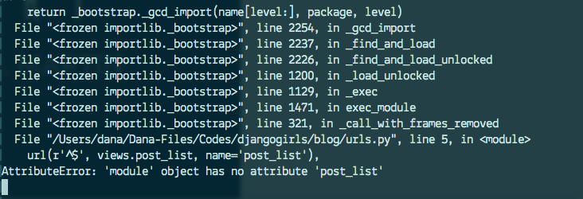

# Django URLs

Wir sind dabei, unsere erste Website zu erstellen --eine Homepage für unseren Blog! Aber zunächst lernen wir etwas über Django URLs.

## Was ist eine URL?

Eine URL ist einfach eine Web-Adresse. Jedes Mal, wenn du eine Website besuchst, kannst du eine URL sehen - sie ist in der Adressleiste des Browsers sichtbar (ja! `127.0.0.1:8000` ist eine URL! Und `https://djangogirls.com` ist auch eine URL!).


Jede Seite im Internet braucht ihre eigene URL. Dadurch weiß deine Applikation, was sie dem Nutzer, der eine URL öffnet, zeigen soll. In Django verwenden wir eine sogenannte `URLconf` (URL- Konfiguration). URLconf ist eine Ansammlung von Mustern, die Django mit der empfangenen URL abgleicht, um die richtige View zu finden, das heißt, um letztlich die richtige Seite für den Nutzer anzuzeigen.

## Wie funktionieren URLs in Django?

Öffne die `mysite/urls.py`-Datei in deinem Code-Editor nach Wahl und schaue dir an, wie sie aussieht:

```python
"""mysite URL Configuration

[...]
"""
from django.conf.urls import url
from django.contrib import admin

urlpatterns = [
    url(r'^admin/', admin.site.urls),
]
```

Wie du siehst, hat Django hier schon etwas für uns eingefügt.

Zeilen, die mit `#` anfangen sind Kommentare - das bedeutet, dass diese Zeilen von Python nicht ausgeführt werden. Praktisch, oder?

Die admin-URL, die du im vorangegangenen Kapitel bereits besucht hast, ist schon da:

```python
url(r'^admin/', admin.site.urls),
```

Für jede URL, die mit `admin/` beginnt, wird Django die entsprechende View finden. Hier wurden einige admin-URLs eingefügt, dadurch wird nicht alles in eine Datei gepackt --es bleibt lesbarer und sauberer.

## Regex

Du fragst dich, WIE Django die richtige View zu einer URL findet? Nun, das ist ein bisschen komplizierter. Django benutzt `regex` kurz für "regular expressions" (reguläre Ausdrücke). Regex besteht aus vielen Regeln (wirklich vielen!), aus denen ein Suchschema aufgebaut ist. Da Regexes ein fortgeschrittenes Thema sind, werden wir jetzt nicht im Detail darauf eingehen, wie sie genau funktionieren.

Wenn du trotzdem immer noch verstehen willst, wie wir die Muster erstellt haben, folgt hier ein kleines Beispiel. Wir brauchen nur eine eingeschränkte Menge der vorhandenen Regeln, um das Muster, nach dem wir suchen, auszudrücken, nämlich:

* `^` für den Anfang eines Textes
* `$` für das Ende eines Textes
* `\d` für eine Nummer
* `+` um anzuzeigen, dass das vorhergehende Element mind. 1 mal wiederholt werden soll
* `()` um Teile des Musters zu erfassen

Alles andere in der URL-Definition wird wörtlich genommen.

Jetzt stell dir vor, du hast eine Website mit der Adresse: `http://www.mysite.com/post/12345/` wobei `12345` die Nummer deines Posts ist.

Eigene Views für jeden einzelnen Post zu schreiben, wäre ziemlich nervig. Mit regulären Asudrücken können wir ein Muster erstellen, welches auf die URL passt und die Nummer extrahieren wird: `^post/(\d+)/$`. Lass es uns in kleine Häppchen aufteilen, um zu verstehen, was wir hier genau tun:

* **^post/** veranlasst Django, alles in Betracht zu ziehen, das `post/` am Anfang der URL hat (gleich nach `^`)
* **(\d+)** steht für eine Zahl (eine oder mehrere Ziffern) und wir wollen diese Zahl erfassen und auswerten
* **/** sagt Django, dass ein weiteres `/` Zeichen folgen soll
* **$** steht für das Ende der URL mit der Bedeutung, dass nur Zeichenfolgen, die auf `/` enden, dem Muster entsprechen

## Deine erste Django URL!

Es wird Zeit, deine erste URL zu erstellen! Wir wollen, dass 'http://127.0.0.1:8000/' die Homepage unseres Blogs wird und eine Liste unserer Posts zeigt.

Wir wollen auch, dass die `mysite/urls.py`-Datei sauber bleibt. Deshalb importieren wir die URLs unserer Blog-Applikation in die `mysite/urls.py`-Hauptdatei.

Fang damit an, die auskommentierten Zeilen (Zeilen mit `#`) zu löschen und füge die Zeile hinzu, die unsere `blog.urls` in die Haupt-URL importieren wird (`''`).

Deine `mysite/urls.py`-Datei sollte jetzt so aussehen:

```python
from django.conf.urls import include, url
from django.contrib import admin

urlpatterns = [
    url(r'^admin/', admin.site.urls),
    url(r'', include('blog.urls')),
]
```

Django wird nun alle Aufrufe von 'http://127.0.0.1:8000/' auf `blog.urls` umleiten und dort nach weiteren Anweisungen schauen.

Beim Schreiben von regulären Ausdrücken in Python benutzt man immer das `r` vor der Zeichenfolge. Dies ist ein hilfreicher Hinweis an Python, dass die Zeichenfolge unter Umständen spezielle Zeichen enthalten kann, welche nicht für Python an sich gedacht sind, sondern für die regulären Ausdrücke.

## blog.urls

Erstelle eine neue, leere Datei `blog/urls.py`. Alles klar! Füge nun diese beiden Zeilen hinzu:

```python
from django.conf.urls import url
from . import views
```

Hier importieren wir erstmal nur die Methoden von Django und alles aus den `views` unserer `blog` Applikation (wir haben noch keine, aber dazu kommen wir gleich!).

Danach können wir unser erstes URL-Pattern hinzufügen:

```python
urlpatterns = [
    url(r'^$', views.post_list, name='post_list'),
]
```

Hier haben wir nun einen `view` mit dem Namen `post_list` zur `^$`-URL hinzugefügt. Dieser reguläre Ausdruck passt auf einen Anfang `^` gefolgt von einem Ende `$` - das heißt, nur eine leere Zeichenfolge kann dieses Muster erfüllen. Und das ist auch richtig so! Denn die Django URL-Auflösung erkennt 'http://127.0.0.1:8000/' nicht als Teil der URL an. Wenn jemand deine Website mit der Adresse 'http://127.0.0.1:8000/' aufruft, passt dieses Muster (leere Zeichenkette) und Django weiß so, dass `views.post_list` das gewünschte Ziel ist.

Der letzte Teil `name='post_list'` ist der Name der URL, die genutzt wird, die View zu identifizieren. Dieser kann identisch mit dem Namen der View sein, kann aber auch etwas total Anderes sein. Wir werden später die benannten URLs in dem Projekt benutzen, daher ist es wichtig, jede URL in der App zu benennen. Wir sollten außerdem versuchen, solche Namen für URLs zu wählen, die einzigartig und einfach zu merken sind.

Alles klar? Öffne http://127.0.0.1:8000/ in deinem Browser, um das Ergebnis zu sehen.



Dort steht nicht mehr "It works"? Keine Sorge, es ist nur eine Fehlerseite. Nichts, wovor man Angst haben muss! Diese Seiten sind eigentlich sehr hilfreich:

Dort steht, es gibt **no attribute 'post_list'**. Erinnert dich *post_list* an etwas? So haben wir unsere View genannt! Das heißt, dass alles bereits an Ort und Stelle ist, aber wir haben bislang einfach noch keine *View* erzeugt. Keine Sorge, das machen wir gleich.

> Wenn du mehr über Django URLconfs lernen willst, dann öffne die offizielle Dokumentation: https://docs.djangoproject.com/en/1.8/topics/http/urls/
