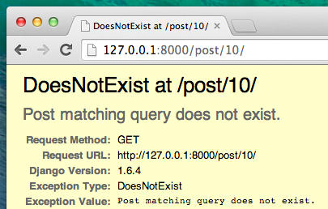
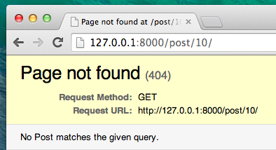
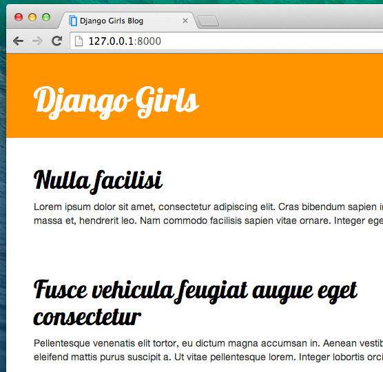

# Erweitere deine Anwendung

Wir haben nun all die notwendigen Schritte abgeschlossen, um eine Website zu erstellen: Wir wissen, wie wir ein Model, eine URL, eine View und ein Template erstellen. Wir wissen auch, wie wir unsere Webseite verschönern können.

Zeit zum Üben!

Das erste, was unser Blog gebrauchen könnte, ist eine Seite auf der ein Blogpost dargestellt werden kann, oder?

Wir haben bereits ein `Post`-Model, deshalb brauchen wir dieses nicht mehr zur `models.py` hinzufügen.

## Erstelle eine Template-Verknüpfung

Wir beginnen damit, einen Link in der `blog/templates/blog/post_list.html`-Datei zu erstellen. Bis jetzt sieht sie so aus:

```html



    
        <div class="post">
            <div class="date">
                {{ post.published_date }}
            </div>
            <h1><a href="">{{ post.title }}</a></h1>
            <p>{{ post.text|linebreaksbr }}</p>
        </div>
    

```

Wir wollen einen Link von einem Post-Titel in der Post-Liste zu einer Post-Detailseite haben. Ändern wir `<h1><a href="">{{ post.title }}</a></h1>`, so dass es zu der Detailseite verlinkt:

```html
<h1><a href="">{{ post.title }}</a></h1>
```

Es ist an der Zeit, das mysteriöse `` zu erklären. Wie du dir wahrscheinlich schon denkst, bedeutet ``, dass wir Django Template Tags verwenden. Dieses Mal verwenden wir eines, dass eine URL für uns erzeugen wird! 

`blog.views.post_detail` ist der Pfad zu einer `post_detail`-View, die wir erstellen wollen. Beachte bitte: `blog` ist der Name unserer App (das Verzeichnis `blog`), `views` kommt aus der `views.py`-Datei und der letzte Teil - `post_detail` - ist der Name der View.

Wenn wir jetzt auf http://127.0.0.1:8000/ gehen, bekommen wir einen Fehler (so wie erwartet, da wir ja noch keine URL oder View für `post_detail` haben). Er wird folgendermaßen aussehen:


## Erstelle eine URL

Lass uns eine URL in `urls.py` für unsere `post_detail`-View erstellen!

Wir wollen, dass Details unseres ersten Blogposts unter dieser URL angezeigt werden: http://127.0.0.1:8000/post/1/

Lass uns eine URL in der Datei `blog/urls.py` anlegen, um Django auf die *View* hinzuweisen, genannt `post_detail`, welche einen ganzen Blogpost anzeigen wird. Füge die Zeile `url(r'^post/(?P<pk>[0-9]+)/$', views.post_detail, name='post_detail')` zu der Datei `blog/urls.py` hinzu. Die Datei sollte so aussehen:

```python
from django.conf.urls import url
from . import views

urlpatterns = [
    url(r'^$', views.post_list, name='post_list'),
    url(r'^post/(?P<pk>\d+)/$', views.post_detail, name='post_detail'),
]
```

Dieser Teil `^post/(?P<pk>[0-9]+)/$` sieht beängstigend aus, aber hab keine Angst - wir erklären es dir: - es beginnt mit `^` --"Der Anfang" -`post/` bedeutet lediglich, die URL sollte nach dem Anfang das Wort **post** und **/** enthalten. So weit, so gut. `(?P<pk>[0-9]+)` - dieser Teil ist schwieriger. Er bedeutet, dass Django alles, was hier steht, in einer Variable namens `pk` zu einem View transferiert. `[0-9]` sagt uns, dass hier nur eine Zahl, kein Buchstabe, stehen darf (also alles zwischen 0 und 9). `+`bedeutet, dass hier mindestens eine (oder mehrere) Ziffer(n) stehen müssen. Also so etwas wie `http://127.0.0.1:8000/post//` geht nicht, aber `http://127.0.0.1:8000/post/1234567890/` ist genau richtig! Dann folgt ein `/` - wir brauchen also wieder einen **/** und `$` - "Ende"!

Also wenn du `http://127.0.0.1:8000/post/5/` in deinen Browser eingibst, wird Django verstehen, dass du nach einer *View* suchst, die `post_detail` heißt und wird der *View* übergeben, dass die Variable `pk` gleich `5` lautet.

`pk` ist eine Abkürzung für `primary key`. Diese Bezeichnung wird oft in Django-Projekten benutzt. Du kannst deine Variable aber nennen, wie du willst (denk aber daran: Kleinbuchstaben und `_` anstelle von Leerzeichen). Zum Beispiel anstelle von `(?P<pk>[0-9]+)` können wir die Variable `post_id` nehmen, dieser Teil würde also `(?P<post_id>[0-9]+)` lauten.

Ok, wir haben ein neues URL-Muster zu der Datei `blog/urls.py` hinzugefügt! Lass uns die Seite http://127.0.0.1:8000/ aktualisieren. Boom! Erneut ein Fehler! Wie erwartet!


Erinnerst du dich, was der nächste Schritt ist? Natürlich: eine View hinzufügen!

## Füge eine View hinzu

Dieses Mal bekommt unsere *View* den extra Parameter `pk`. Unsere *View* muss diesen abfangen, richtig? Also definieren wir unsere Funktion mit `def post_detail(request, pk)`. Beachte, dass wir genau den gleichen Variablennamen benutzen müssen, wie in den URLs festgelegt (`pk`). Eine fehlerhafte Variable führt zu einem Fehler!

Jetzt benötigen wir also genau einen bestimmten Blogpost. Diesen finden wir, indem wir ein Queryset folgendermaßen schreiben:

```python
Post.objects.get(pk=pk)
```

Aber bei diesem Code gibt es ein Problem. Wenn es kein `Post`-Objekt mit diesem `primary key` (`pk`) gibt, bekommen wir einen schlimmen Fehler!



Das wollen wir nicht! Natürlich stellt uns Django etwas zur Verfügung, um dieses Problem zu umgehen: `get_object_or_404`. Wenn es kein `Post`-Objekt mit einem gegebenen `pk` gibt, wird eine schöne Seite angezeigt (die sogenannte `Page Not Found 404` Seite).



Die gute Neuigkeit ist, dass du auch deine eigene `Page not found`-Seite ("Seite nicht gefunden"-Seite) erstellen und diese so hübsch gestalten kannst, wie du willst. Aber da das gerade nicht so wichtig ist, überspringen wir das erst einmal.

Okay, es wird Zeit, die *View* zu unserer `views.py`-Datei hinzuzufügen!

Wir öffnen `blog/views.py` und fügen folgenden Code zu den anderen "from"-Zeilen hinzu:

```python
from django.shortcuts import render, get_object_or_404
```

Am Ende der Datei fügen wir unsere *View* hinzu:

```python
def post_detail(request, pk):
    post = get_object_or_404(Post, pk=pk)
    return render(request, 'blog/post_detail.html', {'post': post})
```

Super. Lass uns nun http://127.0.0.1:8000/ aktualisieren.



Es hat funktioniert! Aber was passiert, wenn du auf den Link im Blog-Titel klickst?


Oh nein! Ein anderer Fehler! Aber wir wissen ja schon, wie wir mit diesem umgehen, oder? Wir müssen ein Template hinzufügen!

## Erzeuge ein Template

Wir erstellen eine Datei in `blog/templates/blog` mit dem Namen `post_detail.html`.

Das sieht dann so aus:

```html



    <div class="post">
        
            <div class="date">
                {{ post.published_date }}
            </div>
        
        <h1>{{ post.title }}</h1>
        <p>{{ post.text|linebreaksbr }}</p>
    </div>

```

Wir erweitern wieder `base.html`. Im `content`-Block wollen wir das Publikationsdatum eines Posts (published_date), falls es existiert, anzeigen und auch den Titel und den Text. Aber wir müssen noch ein paar wichtige Dinge klären, oder?

` ... ` ist ein Template-Tag, das wir nutzen können, um etwas zu überprüfen (erinnerst du dich: `if ...else ..</1> aus dem Kapitel <strong>Einführung in Python</strong>? In diesem Szenario wollen wir prüfen, ob ein <code>published_date` eines Blogposts leer ist. 

Okay, wir aktualisieren die Seite und sehen, dass `Page not found` nun weg ist.


Yeah! Es funktioniert!

## Eins noch: Zeit für das Deployment!

Es wäre schön zu sehen, ob deine Website noch auf PythonAnywhere funktioniert, richtig? Lass sie uns erneut bereitstellen.

```
$ git status
$ git add --all .
$ git status
$ git commit -m "Added view and template for detailed blog post as well as CSS for the site."
$ git push
```

* Dann führe Folgendes in der [PythonAnywhere Bash-Konsole](https://www.pythonanywhere.com/consoles/) aus:

```
$ cd my-first-blog 
$ source myvenv/bin/activate 
(myvenv)$ git pull 
[...] 
(myvenv)$ python manage.py collectstatic 
[...]
```

* Springe nun noch schnell auf den [Web-Tab](https://www.pythonanywhere.com/web_app_setup/) und klicke auf **Reload**.

Und das war's! Glückwunsch :)
