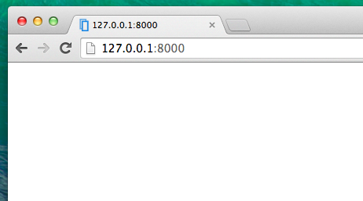

# Introduction to HTML

Vielleicht fragst du dich, was ein Template (Vorlage) ist?

A template is a file that we can re-use to present different information in a consistent format – for example, you could use a template to help you write a letter, because although each letter might contain a different message and be addressed to a different person, they will share the same format.

A Django template's format is described in a language called HTML (that's the HTML we mentioned in the first chapter, **How the Internet works**).

## Was ist HTML?

HTML is a simple code that is interpreted by your web browser – such as Chrome, Firefox or Safari – to display a web page for the user.

HTML bedeutet "HyperText Markup Language". Als **HyperText** wird Text bezeichnet, der über markierte Textstellen, den "Hyperlinks" (die umgangssprachlichen "Links") auf andere (meist ebenfalls in HTML geschriebene) Seiten verweist. **Markup** bedeutet, dass wir ein Dokument nehmen und mit Code versehen, um einem Empfänger mitzuteilen (in diesem Fall dem Browser), wie diese Seite interpretiert werden muss. HTML-Code besteht aus **Tags**, wovon jeder mit `<` beginnt und mit `>` endet. These tags represent markup **elements**.

## Dein erstes Template!

Ein Template zu erstellen, heißt, eine entsprechende Datei dafür zu erstellen. Alles ist eine Datei, wie du vielleicht schon bemerkt hast.

Templates werden im Verzeichnis `blog/templates/blog` gespeichert. Als Erstes erzeugen wir das Verzeichnis `templates` in deinem Blog-Verzeichnis. Im Template-Verzeichnis selbst erstellen wir ein weiteres Verzeichnis `blog`:

    blog
    └───templates
        └───blog
    

(You might wonder why we need two directories both called `blog` – as you will discover later, this is simply a useful naming convention that makes life easier when things start to get more complicated.)

Als nächstes erstellen wir eine Datei `post_list.html` (erst mal ohne Inhalt) innerhalb des Verzeichnisses `blog/templates/blog`.

Kontrolliere deine überarbeitete Webseite unter: http://127.0.0.1:8000

> If you still have an error `TemplateDoesNotExist`, try to restart your server. Go into command line, stop the server by pressing Ctrl+C (Control and C keys together) and start it again by running a `python manage.py runserver` command.



Der Fehler sollte weg sein! Toll :) Deine Webseite ist allerdings noch leer, weil dein Template leer ist. Das müssen wir ändern.

Füge folgenden Text in deine Template-Datei ein:

blog/templates/blog/post_list.html

```html
<html>
    <p>Hi there!</p>
    <p>It works!</p>
</html>
```

So how does your website look now? Visit it to find out: http://127.0.0.1:8000/


It worked! Nice work there :)

* The most basic tag, `<html>`, is always the beginning of any web page and `</html>` is always the end. Zwischen den beiden Tags `<html>` und `</html>` steht der gesamte Inhalt der Webseite
* `<p>` ist der Tag für ein Absatz-Element (paragraph), `</p>` beendet einen Absatz

## Head and body

Each HTML page is also divided into two elements: **head** and **body**.

* Das Element **head** speichert im "Kopf" der Seite Informationen über die Seite, die dir nicht angezeigt werden.

* Das Element **body** enthält den "Körper" - also den dargestellten Inhalt der Seite.

We use `<head>` to tell the browser about the configuration of the page, and `<body>` to tell it what's actually on the page.

For example, you can put a web page title element inside the `<head>`, like this:

blog/templates/blog/post_list.html

```html
<html>
    <head>
        <title>Ola's blog</title>
    </head>
    <body>
        <p>Hi there!</p>
        <p>It works!</p>
    </body>
</html>
```

Save the file and refresh your page.


Notice how the browser has understood that "Ola's blog" is the title of your page? It has interpreted `<title>Ola's blog</title>` and placed the text in the title bar of your browser (it will also be used for bookmarks and so on).

Probably you have also noticed that each opening tag is matched by a *closing tag*, with a `/`, and that elements are *nested* (i.e. you can't close a particular tag until all the ones that were inside it have been closed too).

It's like putting things into boxes. You have one big box, `<html></html>`; inside it there is `<body></body>`, and that contains still smaller boxes: `<p></p>`.

You need to follow these rules of *closing* tags, and of *nesting* elements – if you don't, the browser may not be able to interpret them properly and your page will display incorrectly.

## Dein Template anpassen

You can now have a little fun and try to customize your template! Here are a few useful tags for that:

* `<h1>A heading</h1>` for your most important heading
* `<h2>Unter-Überschrift</h2>` die nächst tiefere Überschiftenebene
* `<h3>A sub-sub-heading</h3>` …and so on, up to `<h6>`
* `<p>A paragraph of text</p>`
* `<em>text</em>` emphasizes your text
* `<strong>text</strong>` strongly emphasizes your text
* `<br />` goes to another line (you can't put anything inside br)
* `<a href="https://djangogirls.org">link</a>` creates a link
* `<ul><li>first item</li><li>second item</li></ul>` makes a list, just like this one!
* `<div></div>` defines a section of the page

Here's an example of a full template, copy and paste it into `blog/templates/blog/post_list.html`:

blog/templates/blog/post_list.html

```html
<html>
    <head>
        <title>Django Girls blog</title>
    </head>
    <body>
        <div>
            <h1><a href="">Django Girls Blog</a></h1>
        </div>

        <div>
            <p>published: 14.06.2014, 12:14</p>
            <h2><a href="">My first post</a></h2>
            <p>Aenean eu leo quam. Pellentesque ornare sem lacinia quam venenatis vestibulum. Donec id elit non mi porta gravida at eget metus. Fusce dapibus, tellus ac cursus commodo, tortor mauris condimentum nibh, ut fermentum massa justo sit amet risus.</p>
        </div>

        <div>
            <p>published: 14.06.2014, 12:14</p>
            <h2><a href="">My second post</a></h2>
            <p>Aenean eu leo quam. Pellentesque ornare sem lacinia quam venenatis vestibulum. Donec id elit non mi porta gravida at eget metus. Fusce dapibus, tellus ac cursus commodo, tortor mauris condimentum nibh, ut f.</p>
        </div>
    </body>
</html>
```

We've created three `div` sections here.

* The first `div` element contains the title of our blog – it's a heading and a link
* Zwei weitere `div` Elemente beinhalten unsere Blogposts und ein Publikationsdatum, `h2` mit dem Titel des Posts und zwei `p` (paragraph) Tags mit Text, eines für das Datum und eines für den Blogpost.

It gives us this effect:


Yaaay! But so far, our template only ever displays exactly **the same information** – whereas earlier we were talking about templates as allowing us to display **different** information in the **same format**.

What we really want to do is display real posts added in our Django admin – and that's where we're going next.

## Noch eine Sache: Deployment!

It'd be good to see all this out and live on the Internet, right? Let's do another PythonAnywhere deploy:

### Committe und pushe deinen Code auf GitHub

First off, let's see what files have changed since we last deployed (run these commands locally, not on PythonAnywhere):

command-line

    $ git status
    

Make sure you're in the `djangogirls` directory and let's tell `git` to include all the changes within this directory:

command-line

    $ git add --all .
    

> **Note** `--all` means that `git` will also recognize if you've deleted files (by default, it only recognizes new/modified files). Denk auch daran (Kapitel 3), dass `.` das aktuelle Verzeichnis meint.

Before we upload all the files, let's check what `git` will be uploading (all the files that `git` will upload should now appear in green):

command-line

    $ git status
    

We're almost there, now it's time to tell it to save this change in its history. We're going to give it a "commit message" where we describe what we've changed. You can type anything you'd like at this stage, but it's helpful to type something descriptive so that you can remember what you've done in the future.

command-line

    $ git commit -m "HTML der Site geändert."
    

> **Beachte:** Du musst Anführungszeichen um den Commit-Kommentar setzen.

Once we've done that, we upload (push) our changes up to GitHub:

command-line

    $ git push
    

### Hol dir den neuen Code auf PythonAnywhere und aktualisiere deinen Browser

* Open up the [PythonAnywhere consoles page](https://www.pythonanywhere.com/consoles/) and go to your **Bash console** (or start a new one). Then, run:

command-line

    $ cd ~/my-first-blog
    $ git pull
    [...]
    

And watch your code get downloaded. If you want to check that it's arrived, you can hop over to the **Files tab** and view your code on PythonAnywhere.

* Spring anschließend rüber zum [Web Tab](https://www.pythonanywhere.com/web_app_setup/) und klick auf **Neu laden** in deinem Browser.

Your update should be live! Go ahead and refresh your website in the browser. Changes should be visible. :)