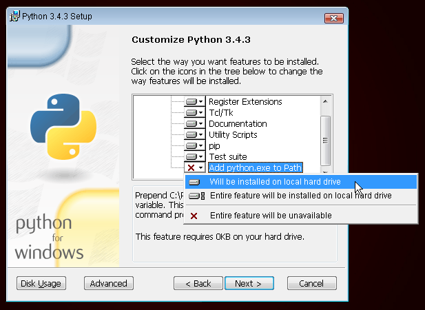

> Für Leserinnen zuhause: Dieses Kapitel wird auch im Video [Installing Python & Code Editor](https://www.youtube.com/watch?v=pVTaqzKZCdA) behandelt.
> 
> Dieses Kapital basiert auf einem Tutorial der Geek Girls Carrots (https://github.com/ggcarrots/django-carrots).

Django ist in Python geschrieben. Wir brauchen Python für alles in Django. Fangen wir mit der Installation an! Wir möchten, dass du Python 3 installierst. Solltest du also bereits eine ältere Version installiert haben, musst du diese aktualisieren. Wenn du schon Version 3.4 oder höher besitzt, ist das in Ordnung.

Bitte installiere ein gewöhnliches Python wie folgt, selbst falls auf deinem Computer bereits Anaconda installiert ist.

<!--sec data-title="Install Python: Windows" data-id="python_windows" data-collapse=true ces-->

Bitte schau zuerst auf der "Systemtyp"-Zeile der Systeminformationsseite nach, ob auf deinem Computer eine 32-Bit-Version oder eine 64-Bit-Version von Windows läuft. Um diese Seite zu finden, versuche eine der folgenden Methoden:

* Drücke die Windows-Taste und die Pause/Break-Taste zur selben Zeit
* Öffne dein Control Panel über das Windows Menü und navigiere dann zu System & Sicherheit, dann System
* Drücke die Windows-Taste und navigiere dann zu Einstellungen > System > Über

Du kannst Python für Windows von der Webseite https://www.python.org/downloads/windows/ herunterladen. Klicke auf den "Latest Python 3 Release - Python x.x.x" Link. Wenn du eine **64-bit**-Version von Windows benutzt, lade die Datei **Windows x86-64 executable installer** herunter. Andernfalls lade den **Windows x86 executable installer** herunter. Führe den Installer nach dem Download (per Doppelklick) aus und folge den Anweisungen des Installationsprogramms.

Auf eine Sache solltest du achten: Während der Installation wird ein Setup-Fenster auftauchen. Stell sicher, dass du die Checkbox mit "Add Python 3.6 to PATH" oder "Add Python to your environment variables" aktiviert hast und klicke dann auf "Install Now" wie hier gezeigt (es kann bei dir etwas anders aussehen, wenn du eine andere Version installierst):

Wenn die Installation abgeschlossen ist, siehst du vielleicht ein Dialogfeld mit einem Link, wo du mehr über Python oder über die Version lernen kannst. Schließe es oder brich den Dialog ab -- du wirst darüber mehr in diesem Tutorial lernen!

Hinweis: Falls du eine ältere Version von Windows verwendest (7, Vista oder älter) und die Installation von Python 3.6.x mit einer Fehlermeldung fehlschlägt, kannst du Folgendes versuchen:

1. Installiere alle Windows-Updates und versuche erneut, Python zu installieren; oder
2. Installiere eine [ältere Version von Python](https://www.python.org/downloads/windows/), z. B. [3.4.6](https://www.python.org/downloads/release/python-346/).

Wenn du eine ältere Version von Python installierst, kann es sein, dass die Installationsanzeige etwas anders aussieht als oben gezeigt. Stell sicher, dass du nach unten scrollst bis du "Add python.exe to Path" siehst, klicke den Button und wähle "Will be installed on local hard drive":

<!--endsec-->

<!--sec data-title="Install Python: OS X" data-id="python_OSX"
data-collapse=true ces-->

> **Hinweis** Bevor du Python auf Mac OS X installierst, musst du sicherstellen, dass deine Mac-Einstellungen es erlauben, Pakete zu installieren, die nicht aus dem App Store stammen. Geh auf Systemeinstellungen (im Ordner "Programme"), klicke auf "Sicherheit", und dann auf die Registerkarte "Allgemein". Wenn "Apps-Download erlauben von:" auf "Mac App Store" gestellt ist, ändere die Einstellung auf "Mac App Store und verifizierte Entwickler".

Auf der Website https://www.python.org/downloads/release/python-361/ findest du den passenden Python-Installer:

* Lade die Datei *Mac OS X 64-bit/32-bit installer* herunter,
* Doppelklicke auf *python-3.6.1-macosx10.6.pkg*, um die Installation zu starten.

<!--endsec-->

<!--sec data-title="Install Python: Linux" data-id="python_linux"
data-collapse=true ces-->

Es ist ziemlich wahrscheinlich, dass du Python schon automatisch installiert hast. Um herauszufinden, ob das so ist (und wenn ja, welche Version du hast), öffne eine Konsole und gib das folgende Kommando ein:

command-line

    $ python3 --version
    Python 3.6.1
    

Wenn du eine andere 'Mikroversion' von Python installiert hast, z.B. 3.6.0, dann musst du die Version nicht aktualisieren. Wenn du Python noch nicht installiert hast oder wenn du eine andere Python-Version willst, prüfe zuerst mit folgendem Befehl, welche Linux-Distribution du benutzt:

command-line

    $ grep '^NAME=' /etc/os-release
    

Folge danach je nach Ergebnis einer der unterhalb dieses Abschnitts folgenden Installationsanweisungen.

<!--endsec-->

<!--sec data-title="Install Python: Debian or Ubuntu" data-id="python_debian" data-collapse=true ces-->

Gib diesen Befehl in die Konsole ein:

command-line

    $ sudo apt install python3
    

<!--endsec-->

<!--sec data-title="Install Python: Fedora" data-id="python_fedora"
data-collapse=true ces-->

Gib diesen Befehl in die Konsole ein:

command-line

    $ sudo dnf install python3
    

Auf älteren Fedora-Versionen kann es sein, dass du eine Fehlermeldung bekommst, dass das Kommando `dnf` nicht gefunden wird. Falls das passiert, musst du stattdessen `yum` verwenden.

<!--endsec-->

<!--sec data-title="Install Python: openSUSE" data-id="python_openSUSE"
data-collapse=true ces-->

Gib diesen Befehl in die Konsole ein:

command-line

    $ sudo zypper install python3
    

<!--endsec-->

Prüfe, ob die Installation erfolgreich war, indem du ein Kommandozeilenfenster öffnest und den `python3`-Befehl ausführst:

command-line

    $ python3 --version
    Python 3.6.1
    

Die angezeigte Version kann bei dir eine andere sein als 3.6.1 -- sie sollte aber der entsprechen, die du installiert hast.

**Hinweis:** Wenn du unter Windows eine Fehlermeldung bekommst, dass `python3` nicht gefunden wurde, versuche es mit `python` (ohne die `3`) und prüfe, ob es dennoch eine Version von Python 3.4.0 oder höher ist. Wenn auch das nicht funktioniert, kannst du ein neues Kommandozeilenfenster öffnen und es dort erneut versuchen; dies geschieht, wenn du ein Kommandozeilenfenster verwendet, das schon vor der Python-Installation geöffnet war.

* * *

Wenn es Unklarheiten gibt oder wenn etwas schief ging und du nicht weiter weißt, frage bitte deinen Coach! Manchmal laufen die Dinge einfach nicht so glatt und dann ist es besser, jemanden mit mehr Erfahrung um Hilfe zu bitten.