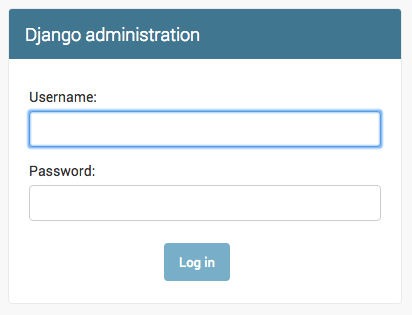

# Django admin

To add, edit and delete posts we've just modeled, we will use Django admin.

Let's open the `blog/admin.py` file and replace its content with this:

    from django.contrib import admin
    from .models import Post

    admin.site.register(Post)

As you can see, we import (include) the Post model defined in the previous chapter. To make our model visible on the admin page, we need to register the model with `admin.site.register(Post)`.

OK, time to look at our Post model. Remember to run `python manage.py runserver` in the console to run the web server. Go to the browser and type the address:

    http://127.0.0.1:8000/admin/

You will see a login page like this:

In order to log in you need to create a *superuser* - a user which has control over everything on the site. Go back to you command-line and type `python manage.py createsuperuser`, press enter and type your username (lowercase, no spaces), email address and password when you're asked for them. The output should look like this (where username and email should be your own ones):

    (myvenv) ~/djangogirls$ python manage.py createsuperuser
    Username: admin
    Email address: admin@admin.com
    Password:
    Password (again):
    Superuser created successfully.

Return to your browser and log in with the superuser's credentials you chose, you should see the Django admin dashboard.

Go to Posts and experiment a little bit with it. Add five or six blog posts. Don't worry about the content - you can simply copy-paste some text from this tutorial as your posts' content to save time :).

Make sure that at least two or three posts (but not all) have the publish date set. It will be helpful later.

If you want to know more about Django admin, you should check Django's documentation: https://docs.djangoproject.com/en/1.7/ref/contrib/admin/

It is probably a good moment to grab a coffee (or tea) and eat something sweet. You created your first Django model - you deserve a little treat!

