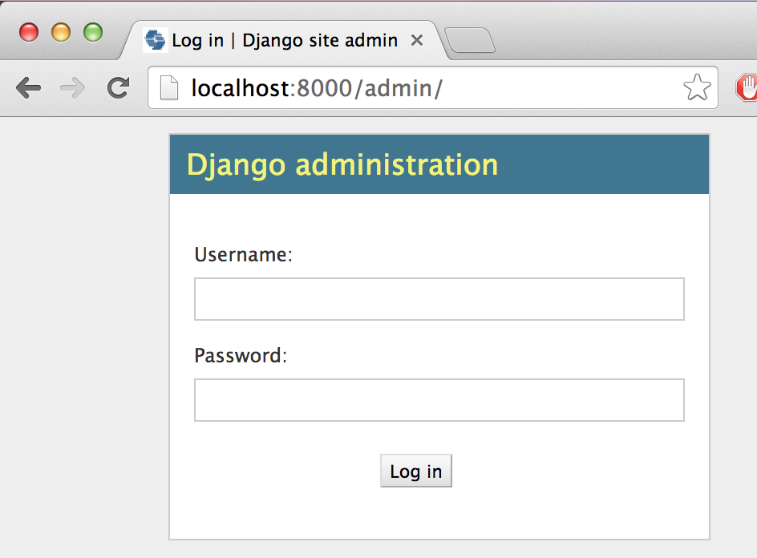
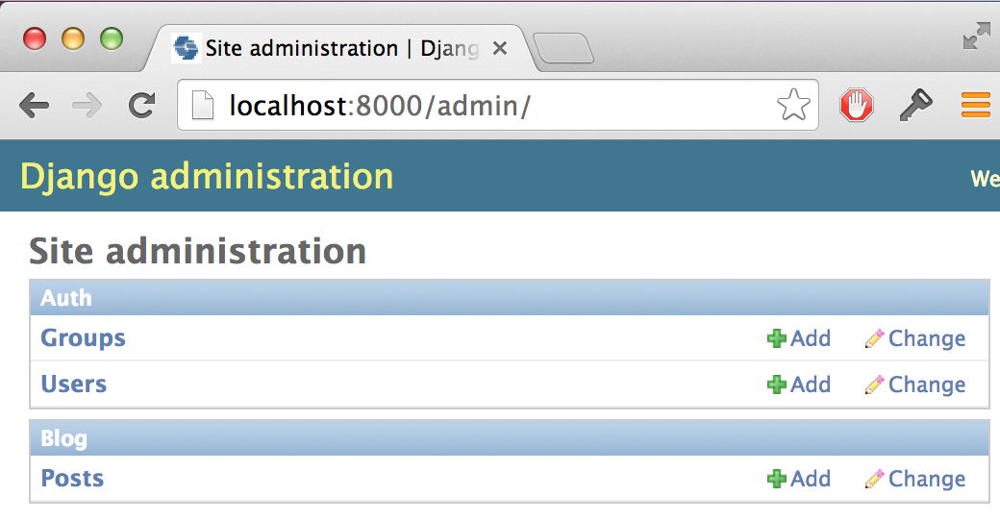
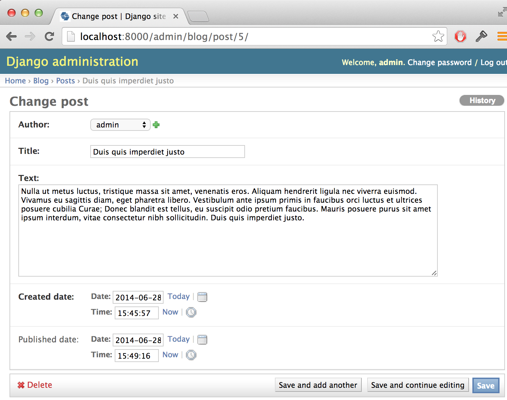

# Django admin

To add, edit and delete posts we have just modeled, we will use the Django admin.

Let's open `blog/admin.py` file and replace its content with this:

    from django.contrib import admin
    from .models import Post

    admin.site.register(Post)

As you can see, we import (include) the Post model defined in the previous chapter.

Ok, time to look at our Post model. Go to the browser and type an address:

    http://localhost:8000/admin/

You will see a login page like this:

You should use the username and password you chose when you were creating a database (in "Starting Django project" chapter). After login in, you should see the Django admin dashboard.

Go to Post and experiment a little bit with it. Add five or six blog posts. Don't worry about the content - you can simple copy-paste some text from this tutorial as your posts content to save time :).

Make sure that at least two or three (but not all) have publish date set. It will be helpful later.

If you want to know more about the Django admin, you should check Django's documentation: https://docs.djangoproject.com/en/1.6/ref/contrib/admin/

It is probably a good moment to grab a coffee (or tea) and eat something sweet. You created your first Django model - you deserve a little treat!

