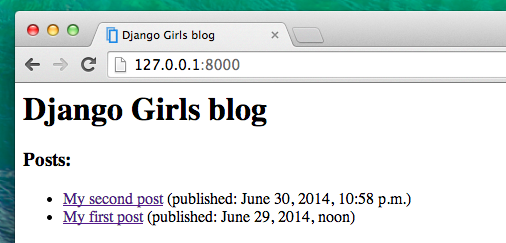
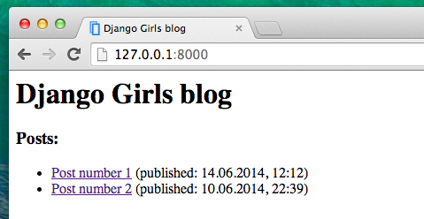

# Django templates

You may ask, what's a template? Template contains all your HTMLs! Yes, HTML we mentioned in the first chapter "How the Internet works". HTML is a code that is later processed by your web browser (like Chrome, Firefox or Safari) to display a website for user.

Templates are saved in `mysite/blog/templates/blog` folder. So first create a folder called _templates_ inside your blog folder. Then create another folder called `blog` inside your templates folder.

## What is HTML?

HTML stands for "HyperText Markup Language." __HyperText__ means it's a type of text that supports (hyper)links between pages. __Markup__ means we have taken a document and marked it up with code to tell something (in this case, a browser) how to interpret the page. HTML code is build with tags, that starts with `<`, and ends with `>`.

## Your first template!

First, you need to create a file. Everything is a file, right? You probably have noticed this already.

Create an empty `post_list.html` file inside of `mysite/blog/templates/blog` folder.

See how your website looks like now: http://127.0.0.1:8000/

No error anymore! Congrats :) However, your website is now empty, because everything you want to display needs to be placed in your HTML file.

Go ahead and write something in this file, just like that:

    <html>
        
Hi there!

        
It works!

    </html>

How your website look like know? Click to find out: http://127.0.0.1:8000/

It worked! Nice work there :)

- The most basic tag, `<html>`, is always the beginning of any webpage and `</html>` is the end. As you can see, the whole content of the website goes between the begining tag `<html>` and closing tag `</html>`
- `
` is a tag for paragraphs

## Head & body

Each website is also divided in two parts: __head__ and __body__. __Head__ contains information about the document that is not displayed on the screen and __body__ contains everything else that is displayed as part of the web page. We use `<head>` to tell the browser about the configuration of the website, and `<body>` to tell it how it should look like.

For example, you can setup a website title inside of `<head>`, like this:

    <html>
        <head>
            <title>Ola's blog</title>
        </head>
        <body>
            
Hi there!

            
It works!

        </body>
    </html>

Save a file and refresh your website.

You can that browser understood that "Ola's blog" should be a title of your website? Nice!

You should have also noticed that you have to nest your tags and always close them with the same tag containing `/`. Otherwise browser won't understand you.

## Customize your template

You can now have a little fun and try to customize your template! Here is a couple of useful tags for that:

- `<h1>Header nr 1</h1>` makes a big header
- `<h2>Header nr 2</h2>` makes a smaller header... and so on
- `<b>text</b>` bolds your text
- `<i>text</i>` makes it cursive
- ` ` goes to another line (you can't put anything inside br)
- `<a href="http://google.com/">link</a>` creates a clickable link
- `<ul><li>first item</li><li>second item</li></ul>` makes a list, just like this one!

We've built something like this:

    <html>
        <head>
            <title>Django Girls blog</title>
        </head>
        <body>
            <h1>Django Girls blog</h1>
            <h3>Posts:</h3>
            <ul>
                <li><a href="">Post number 1</a> (published: 14.06.2014, 12:12)</li>
                <li><a href="">Post number 2</a> (published: 10.06.2014, 22:39)</li>
            </ul>
        </body>
    </html>

Which gives us this effect:

Yaaay! But wait, we want to display real posts added in our Django admin, right? We will, of course, get there! Read on in the next chapter.

