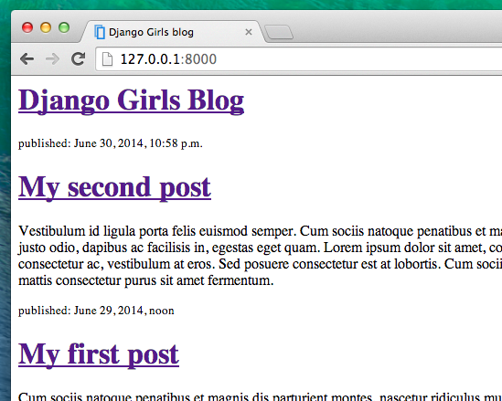

# Django templates

Time to display some data! Django gives us some helpful, built-in __template tags__ for that.

## What are template tags?

You see, in HTML, you can't really put Python code, because browsers don't understand it. They only know HTML. We know that HTML is rather static, while Python is much more dynamic.

__Django template tags__ allow us to transfer Python-like things into HTML, so you can build dynamic websites faster and easier. Yikes!

## Display post list template

In the previous chapter we gave our template a list of posts in the `posts` variable. Now we will display it in HTML.

To print a variable in Django template, we use double curly brackets with the variable's name inside, like this:

    {{ posts }}

Try this in your `blog/templates/blog/post_list.html` template (replace everything between the second `

` tags with `{{ posts }}` line), save the file and refresh the page to see the results:

As you can see, all we've got is this:

    [<Post: My second post>, <Post: My first post>]

This means that Django understands it as a list of objects. Remember from __Introduction to Python__ how we can display lists? Yes, with the for loops! In a Django template, you do them this way:

    
        {{ post }}
    

Try this in your template.

It works! But we want them to be displayed like the static posts we created earlier in the __Introduction to HTML__ chapter. You can mix HTML and template tags. Our `body` will look like this:

    

        <h1><a href="/">Django Girls Blog</a></h1>
    

    
        

            
published: {{ post.published_date }}

            <h1><a href="">{{ post.title }}</a></h1>
            
{{ post.text|linebreaks }}

        

    

Everything you put between `` and `` will be repeated for each object in the list. Refresh your page:

Have you noticed that we used a slightly different notation this time `{{ post.title }}` or `{{ post.text }}`? We are accessing data in each of the fields defined in our `Post` model. Also the `|linebreaks` is piping the posts' text through a filter to convert line-breaks into paragraphs.

## One more thing

It'd be good to see if your website will still be working on Heroku, right? Let's try deploying again. Open up your console and type this:

    heroku push --app djangogirlsblog

> __Note__: Remember to replace `djangogirlsblog` with the name of your application on Heroku.

Congrats! Now go ahead and try adding a new post in your Django admin (remember to add published_date!), then refresh your page to see if the post appears there.

Works like a charm? We're proud! Treat yourself something sweet, you have earned it :)

