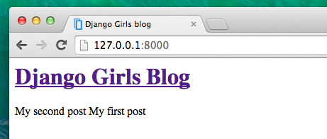

# Django templates

Time to display some data! Django gives us some helpful, built-in __template tags__ for that.

## What are template tags?

You see, in HTML, you can't really put Python code, because browsers don't understand it. They only know HTML. We know that HTML is rather static, while Python is much more dynamic.

__Django template tags__ allow us to transfer Python-like things into HTML, so you can build dynamic websites faster and easier. Yikes!

## Display post list template

In previous chapter we gave our template a list of posts in a `posts` variable. Now we will display it in HTML.

To print a variable in Django template, we use double curly brackets with the variable's name inside, like this:

    {{ posts }}

Try this in your `mysite/blog/templates/blog/post_list.html` template, save the file and refresh the page to see the results:

As you can see, all we've got is this:

    [<Post: My second post>, <Post: My first post>]

This means that Django understand it is a list of objects. Remember from Introduction to Python how we can display lists? Yes, with for loops! In Django template, you do them this way:

    
        {{ post }}
    

Try this in your template.

It works! But we want them to be displayed in a way we created earlier, like the static posts we put there before. You can mix HTML and template tags. Our `body` will look like that:

    

        <h1><a href="">Django Girls Blog</a></h1>
    

    
        

            <small>published: {{ post.published_date }}</small>
            <h1><a href="">{{ post.title }}</a></h1>
            
{{ post.text }}

        

    

Everything you put between  and  will be repeated for each object in the list. Refresh your page:

Congrats! Now go ahead and try adding a new post in your Django admin, then refresh your page to see if the post appeared there.

Works like a charm? We're proud! Treat yourself something sweet, you have earned it :)

