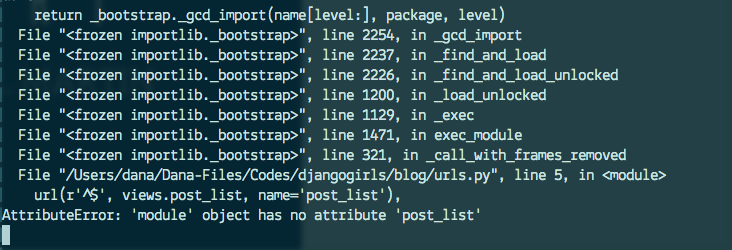

# Django urls

We're about to build our first webpage -- a homepage for your blog! But first, let's learn a little bit about Django urls.

## What is a URL?

A URL is simply a web address, you can see a URL every time you visit any website - it is visible in your browser's address bar (yes! `127.0.0.1:8000` is a URL! And http://djangogirls.com is also a URL):

Every page on the Internet needs its own URL. This way your application knows what it should show to a user who opens a URL. In Django we use something called `URLconf` (URL configuration), which is a set of patterns that Django will try to match with the received URL to find the correct view.

## How do URLs work in Django?

Let's open up the `mysite/urls.py` file and see what it looks like:

    from django.conf.urls import patterns, include, url

    from django.contrib import admin
    admin.autodiscover()

    urlpatterns = patterns('',
        # Examples:
        # url(r'^$', 'mysite.views.home', name='home'),
        # url(r'^blog/', include('blog.urls')),

        url(r'^admin/', include(admin.site.urls)),
    )

As you can see, Django already put something here for us.

Lines that start with `#` are comments - it means that those lines won't be run by Python. Pretty handy, right?

The admin URL, which you visited in previous chapter is already here:

    url(r'^admin/', include(admin.site.urls)),

It means that for every URL that starts with `admin/` Django will find a corresponding *view*. In this case we're including a lot of admin URLs so it isn't all packed into this small file -- it's more readable and cleaner.

## Regex

Do you wonder how Django matches URLs to views? Well, this part is tricky. Django uses `regex` -- regular expressions. Regex has a lot (a lot!) of rules that form a search pattern. It is not so easy to understand so we won't worry about it today and you'll definitely get to know them in the future. Today we will only use the ones we need.

## Your first Django url!

Time to create our first URL! We want http://127.0.0.1:8000/ to be a homepage of our blog and display a list of posts.

We also want to keep the `mysite/urls.py` file clean, so we will import urls from our `blog` application to the main `mysite/urls.py` file.

Go ahead, delete the commented lines (lines starting with `#`) and add a line that will import `blog.urls` into the main url (`''`).

Your `mysite/urls.py` file should now look like this:

    from django.conf.urls import patterns, include, url

    from django.contrib import admin
    admin.autodiscover()

    urlpatterns = patterns('',
        url(r'^admin/', include(admin.site.urls)),
        url(r'', include('blog.urls')),
    )

Django will now redirect everything that comes into `http://127.0.0.1:8000/` to `blog.urls` and look for further instructions there.

## blog.urls

Create a new `blog/urls.py` empty file. All right! Add these two first lines:

    from django.conf.urls import patterns, include, url
    from . import views

Here we're just importing Django's methods and all of our `views` from `blog` application (we don't have any yet, but we will get to that in a minute!)

After that, we can add our first URL pattern:

    urlpatterns = patterns('',
        url(r'^$', views.post_list),
    )

As you can see, we're now assigning a `view` called `post_list` to `^$` URL. But what does `^$` mean? It's a regex magic :) Let's break it down:
- `^` in regex means "the beginning"; from this sign we can start looking for our pattern
- `$` matches only "the end" of the string, which means that we will finish looking for our pattern here

If you put these two signs together, it looks like we're looking for an empty string! And that's correct, because in Django url resolvers, `http://127.0.0.1:8000/` is not a part of URL. This pattern will show Django that `views.post_list` is the right place to go if someone enters your website at the `http://127.0.0.1:8000/` address.

Everything all right? Open http://127.0.0.1:8000/ in your browser to see the result.

There is no "It works" anymore, huh? Don't worry, it's just an error page, nothing to be scared of! They're actually pretty useful:

You can read that there is __no attribute 'post_list'__. Is *post_list* reminding you of anything? This is how we called our view! This means that everything is in place, we just didn't create our *view* yet. No worries, we will get there.

> If you want to know more about Django URLconfs, look at the official documentation: https://docs.djangoproject.com/en/1.7/topics/http/urls/

