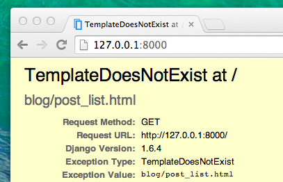

# Django views – ώρα να δημιουργήσουμε!

Ώρα να ξεφορτωθούμε το σφάλμα που δημιουργήσαμε στο προηγούμενο κεφάλαιο! :)

Ένα *view* είναι το μέρος όπου βάζουμε την "λογική" της εφαρμογής μας. Θα ζητήσει πληροφορίες από το μοντέλο μας (`model`) που δημιουργήσαμε νωρίτερα και θα το περάσει στο `template`. Θα δημιουργήσουμε ένα template στο επόμενο κεφάλαιο. Τα views είναι απλώς Python συναρτήσεις οι οποίες είναι ελαφρώς πιο περίπλοκες από αυτές που γράψαμε στο κεφάλαιο **Εισαγωγή στην Python**.

Τα views τοποθετούνται σε ένα αρχείο (ανα εφαρμογή) με το όνομα `views.py`. Θα προσθέσουμε τα δικά μας *views* στο αρχείο `blog/views.py`.

## blog/views.py

Ωραία. Ας ανοίξουμε το αρχείο να δούμε τι έχει μέσα:

blog/views.py

```python
from django.shortcuts import render

# Create your views here.
```

Όχι και πολλά πράγματα, ακόμα.

Θυμηθείτε ότι οι γραμμές που ξεκινούν με δίεση `#` είναι σχόλια. Αγνοούνται πλήρως από την Python.

Ας δημιουργήσουμε ένα *view* όπως προτείνει και το σχόλιο. Προσθέστε τα επόμενα από κάτω:

blog/views.py

```python
def post_list(request):
    return render(request, 'blog/post_list.html', {})
```

Όπως βλέπετε, δημιουργήσαμε μια συνάρτηση (`def`) με το όνομα `post_list` η οποία παίρνει την παράμετρο `request` και επιστρέφει `return` την τιμή που παίρνει από άλλη συνάρτηση, την `render`, η οποία κάνει render ("χτίζει") το template `blog/post_list.html`.

Αποθηκεύστε το αρχείο και επισκεφτείτε τη σελίδα http://127.0.0.1:8000/ να δούμε τι εμφανίζεται.

Κι άλλο σφάλμα! Διαβάστε το γιατί:



Αυτή τη φορά δείχνει ότι ο server, τουλάχιστον, τρέχει αλλά κάτι δεν πάει καλά, σωστά; Μην ανησυχείτε. Είναι απλώς μια σελίδα σφάλματος! Όπως ακριβώς τα μηνύματα σφάλματος στην κονσόλα, αυτά τα σφάλματα στον browser είναι στην πραγματικότητα πολύ χρήσιμα. Διαβάζετε ότι *TemplateDoesNotExist*. Ας το φτιάξουμε δημιουργώντας ένα template στο επόμενο κεφάλαιο!

> Διαβάστε περισσότερα για τα Django views στο επίσημο documentation: https://docs.djangoproject.com/en/2.0/topics/http/views/