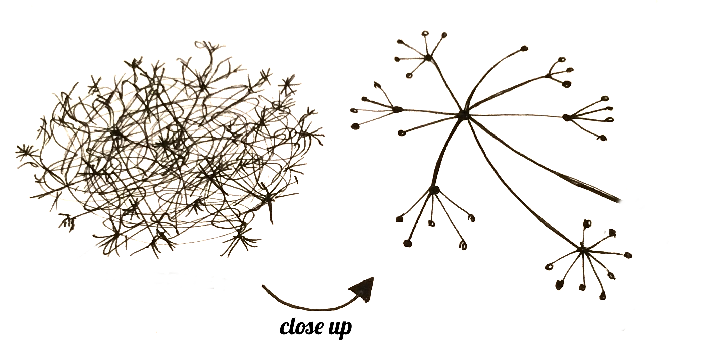

# Πως λειτουργεί το internet

> Για τους αναγνώστες στο σπίτι: αυτή η ενότητα καλύπτεται στο βίντεο [How the Internet Works](https://www.youtube.com/watch?v=oM9yAA09wdc).
> 
> Αυτό το κεφάλαιο είναι εμπνευσμένο από την ομιλία της Jessica McKellar με τίτλο "How the Internet works" (http://web.mit.edu/jesstess/www/).

Στοιχηματίζουμε ότι δουλεύετε το Internet κάθε μέρα. Αλλά ξέρετε τι συμβαίνει όταν πληκτρολογείτε μια διεύθυνση όπως https://djangogirls.org στο browser σας και μετά πατήσετε `enter`;

Το πρώτο πράγμα που πρέπει να καταλάβετε είναι ότι ένα website αποτελείτε από ένα σωρό από φακέλους αποθηκευμένους σε έναν σκληρό δίσκο. Όπως ακριβώς οι ταινίες, η μουσική και οι φωτογραφίες σας. Ωστόσο, υπάρχει ένα κομμάτι που είναι μοναδικό για τα websites: περιλαμβάνουν κώδικα υπολογιστή με το όνομα HTML.

Αν δεν είστε εξοικειωμένοι με προγραμματισμό θα σας φανεί λίγο δύσκολη η HTML στην αρχή. Αλλά οι web browsers (όπως Chrome, Safari, Firefox, κλπ) την αγαπούν. Οι web browsers σχεδιάστηκαν για να κατανοούν αυτό τον κώδικα, να ακολουθούν τις εντολές του και να παρουσιάζουν αυτά τα αρχεία από τα οποία είναι φτιαγμένα το website σας με τον τρόπο που εσείς θέλετε.

Όπως με κάθε αρχείο, χρειαζόμαστε να αποθηκεύουμε τα HTML αρχεία κάπου στον σκληρό δίσκο. Για το Internet, χρησιμοποιούμε ειδικούς υπολογιστές γι'αυτό, με το όνομα *servers*. Δεν έχουν οθόνη, ποντίκι ή πληκτρολόγιο επειδή ο μοναδικός σκοπός τους είναι να αποθηκεύουν δεδομένα και να τα εξυπηρετούν. Γι' αυτό το λόγο ονομάζονται *εξυπηρετητές*. Επειδή *εξυπηρετούν την μεταφορά* δεδομένων.

ΟΚ, αλλά θέλετε να μάθετε πως φαίνεται το Internet, σωστά;

Ζωγραφίσαμε μια εικόνα! Φαίνεται κάπως έτσι:

Λίγο χαοτική, έτσι; Στην πραγματικότητα είναι ένα δίκτυο συνδεδεμένων συσκευών (των προαναφερομένων *servers*). Εκατοντάδες χιλιάδες συσκευές! Πολλά πολλά χιλιόμετρα καλωδίων γύρω από ολόκληρο τον κόσμο! Μπορείτε να επισκεφτείτε την ιστοσελίδα του Submarine Cable Map (http://submarinecablemap.com) και να δείτε πόσο περίπλοκο είναι το δίκτυο. Παρακάτω φαίνεται ένα στιγμιότυπο από το website:

Φανταστικό, έτσι; Αλλά δεν είναι δυνατόν να έχουμε καλώδια ανάμεσα σε κάθε ζευγάρι συσκευών που είναι συνδεδμένο στο Internet. Οπότε, για να συνδεθούμε με μία συσκευή (για παράδειγμα, αυτή που είναι αποθηκευμένο το site https://djangogirls.org) θα χρειαστεί να περάσουμε ένα αίτημα (request) μέσα από πολλές πολλές διαφορετικές συσκευές.

Δείχνει κάπως έτσι:

Φανταστείτε ότι όταν πληκτρολογείτε https://djangogirls.org, στέλνετε ένα γράμμα που λέει: "Αγαπητά Django Girls, θα ήθελα να δω την σελίδα djangogirls.org. Στείλτε τη μου, παρακαλώ!"

Το γράμμα σας πηγαίνει στο πλησιέστερο ταχυδρομικό γραφείο. Μετά το γράμμα σας πηγαίνει σε άλλο γραφείο που είναι πιο κοντά στον παραλήπτη, μετά σε άλλον κοκ μέχρις ότου φτάσει στον προορισμό του. Το μόνο μοναδικό πράγμα είναι ότι αν στέλνετε πολλά γράμματα (*data packets*) στο ίδιο σημείο, τότε ίσως φτάσουν στον προορισμό τους μέσα από διαφορετικές διαδρομές και ταχυδρομικά γραφεία (*routers*). Αυτό εξαρτάται από το πως είναι ταξινομημένα σε κάθε γραφείο.

Έτσι λειτουργεί. Μπορείτε να στείλετε μηνύματα και να περιμένετε κάποια απάντηση. Αντί για χαρτί και στυλό χρησιμοποιείτε byte δεδομένων αλλά η ιδέα είναι η ίδια!

Αντί για διευθύνσεις με όνομα οδού, πόλη, ταχυδρομικό κώδικα και χώρα, χρησιμοποιούμε διευθύνσεις IP. Ο υπολογιστής σας ρωτά πρώτα το DNS (Domain Name System) για να μεταφραστεί η λέξη djangogirls.org σε μια διεύθυνση IP. Λειτουργεί λίγο σαν τους παλιούς τηλεφωνικούς καταλόγους όπου μπορείτε να αναζητήσετε το όνομα του ατόμου που θέλετε να επικοινωνήσετε και να βρείτε τον αριθμό τηλεφώνου και τη διεύθυνση τους.

Όταν στέλνετε ένα γράμμα, πρέπει να έχει ορισμένα χαρακτηριστικά πρέπει για να παραδοθεί σωστά: μια διεύθυνση, μια σφραγίδα, κλπ. Χρησιμοποιείτε επίσης μια γλώσσα που κατανοεί ο παραλήπτης, σωστά; Το ίδιο ισχύει για τα *data packets* που μπορείτε να στείλετε για να δείτε μια ιστοσελίδα. Χρησιμοποιούμε ένα πρωτόκολλο που ονομάζεται HTTP (Hypertext Transfer Protocol).

Έτσι, βασικά, όταν έχετε μια ιστοσελίδα, θα πρέπει να έχετε έναν *server* (συσκευή). Όταν ο *server* λαμβάνει μια εισερχόμενη *αίτηση* (σε ένα γράμμα), στέλνει πίσω την ιστοσελίδα σας (σε άλλη επιστολή).

Δεδομένου ότι αυτό είναι ένας Django οδηγός, μπορείτε να ρωτήσετε τι κάνει Django. Όταν στέλνετε μια απάντηση, δεν θέλετε να στέλνετε την ίδια σε όλους. Είναι πολύ καλύτερα αν τα γράμματα είναι εξατομικευμένα, ειδικά για το πρόσωπο που έχει γράψει αποκλειστικά για εσάς, σωστά; Το Django, σας βοηθά με τη δημιουργία αυτών των εξατομικευμένων, ενδιαφέροντων γραμμάτων. :)

Αρκετά μιλήσαμε. Πάμε να δημιουργήσουμε!