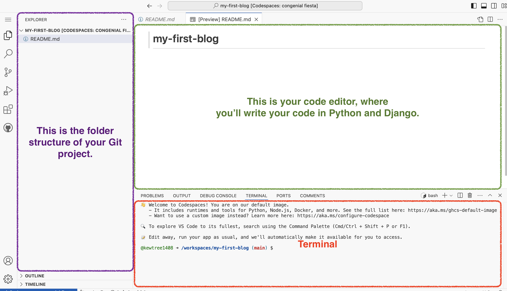

For people using a Chromebook or those with limited memory on their laptops, we recommend using a cloud IDE environment. This allows you to interact with the command line, Python, and Django directly through your browser, where a code editor is already installed.

Your installation experience will be a little different.

- Make a [GitHub](https://github.com) account.
- Create a GitHub project. Visit [this](https://github.com/new) link, choose any name for your project, and make it public (needed for deployment, you can make it private later). Also, add a `README.md` and `.gitignore` file.

In case you using this instruction, some steps of the tutorial don't have to be done again ("Deploy/Git" [part](https://tutorial.djangogirls.org/en/deploy/#installing-git)). 

- Start a Codespace. Go to GitHub [Codespaces](https://github.com/codespaces/new) and select the repository you just created. Click "Create Codespace".

Wait a little bit and you'll see something like that:

The [VSCode](https://code.visualstudio.com) editor will open for you automatically. If you see a notification that says "Install Python", please click on it. If not prompted, click the "Extensions" icon on the left sidebar in the Codespace editor. Search for "Python" and click "Install."

The bash terminal (similar to Linux) is at the bottom of the page.

By default, the GitHub Codespace environment will be deleted after 1 month (this applies only to the environment, not your code). To prevent auto-deletion, you can adjust the settings on the page: https://github.com/codespaces 

- Continue with the tutorial

Follow the next steps from the section [Set up virtual environment and install Django](https://tutorial.djangogirls.org/en/installation/#virtualenv).
Follow than sections for Ubuntu/Linux. Use the Codespaces command line (terminal), accessible through your browser.
