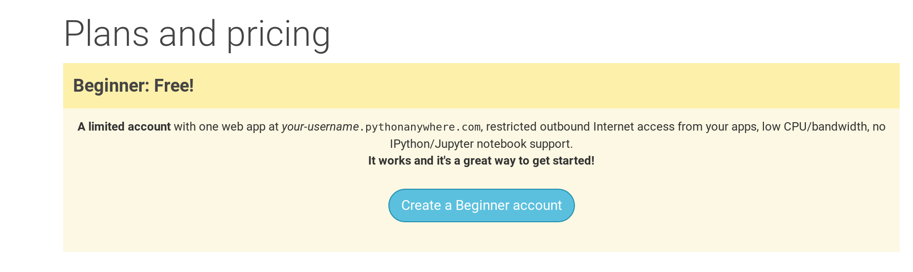

PythonAnywhere is a service for running Python code on servers "in the cloud". We'll use
it for hosting our site, live and on the Internet.

Sign up for a "Beginner" account on PythonAnywhere (the free tier is fine, you don't need a credit card).

* [www.pythonanywhere.com](https://www.pythonanywhere.com/)

> **Note** When choosing your username here, bear in mind that your blog's URL will take the form `yourusername.pythonanywhere.com`, so choose either your own nickname or a name for what your blog is all about.

## Creating a PythonAnywhere API token

This is something you only need to do once.  When you've signed up for PythonAnywhere, you'll be taken to your dashboard.  Find the link near the top right to your "Accounts" page, then select the tab named "API token", and hit the button that says "Create new API token".

