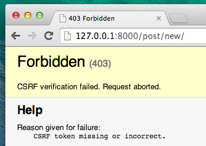
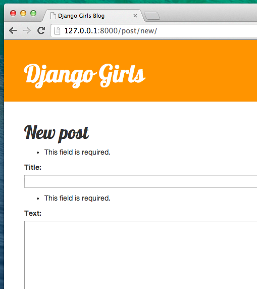
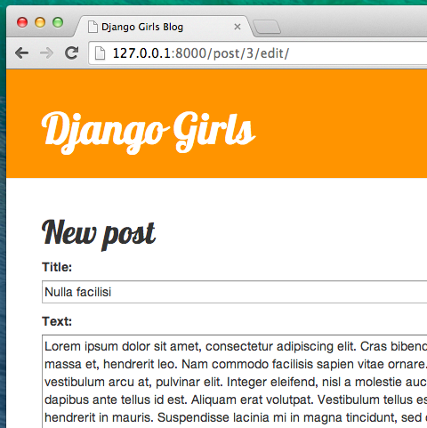

# Django Forms

The final thing we want to do on our website is create a nice way to add and edit blog posts. Django's `admin` is cool, but it is rather hard to customize and make pretty. With `forms` we will have absolute power over our interface - we can do almost anything we can imagine!

The nice thing about Django forms is that we can either define one from scratch or create a `ModelForm` which will save the result of the form to the model.

This is exactly what we want to do: we will create a form for our `Post` model.

Like every important part of Django, forms have their own file: `forms.py`.

We need to create a file with this name in the `blog` directory.

    blog
       └── forms.py

Ok, let's open it and type the following code:

```python
from django import forms

from .models import Post

class PostForm(forms.ModelForm):

    class Meta:
        model = Post
        fields = ('title', 'text',)
```

We need to import Django forms first (`from django import forms`) and, obviously, our `Post` model (`from .models import Post`).

`PostForm`, as you probably suspect, is the name of our form. We need to tell Django, that this form is a `ModelForm` (so Django will do some magic for us) - `forms.ModelForm` is responsible for that.

Next, we have `class Meta`, where we tell Django which model should be used to create this form (`model = Post`).

Finally, we can say which field(s) should end up in our form. In this scenario we want only `title` and `text` to be exposed - `author` should be the person who is currently logged in (you!) and `created_date` should be automatically set when we create a post (i.e in the code), right?

And that's it! All we need to do now is use the form in a *view* and display it in a template.

So once again we will create: a link to the page, a URL, a view and a template.

## Link to a page with the form

It's time to open `blog/templates/blog/base.html`. We will add a link in `div` named `page-header`:

```html
<a href="" class="top-menu"><span class="glyphicon glyphicon-plus"></span></a>
```

Note that we want to call our new view `post_new`. The class `"glyphicon glyphicon-plus"` is provided by the bootstrap theme we are using, and will display a plus sign for us.

After adding the line, your html file should now look like this:

```html

<html>
    <head>
        <title>Django Girls blog</title>
        <link rel="stylesheet" href="//maxcdn.bootstrapcdn.com/bootstrap/3.2.0/css/bootstrap.min.css">
        <link rel="stylesheet" href="//maxcdn.bootstrapcdn.com/bootstrap/3.2.0/css/bootstrap-theme.min.css">
        <link href='//fonts.googleapis.com/css?family=Lobster&subset=latin,latin-ext' rel='stylesheet' type='text/css'>
        <link rel="stylesheet" href="">
    </head>
    <body>
        <div class="page-header">
            <a href="" class="top-menu"><span class="glyphicon glyphicon-plus"></span></a>
            <h1><a href="/">Django Girls Blog</a></h1>
        </div>
        <div class="content container">
            <div class="row">
                <div class="col-md-8">
                    
                    
                </div>
            </div>
        </div>
    </body>
</html>
```

After saving and refreshing the page http://127.0.0.1:8000 you will obviously see a familiar `NoReverseMatch` error, right?

## URL

We open `blog/urls.py` and add a line:

```python
    url(r'^post/new/$', views.post_new, name='post_new'),
```

And the final code will look like this:

```python
from django.conf.urls import url
from . import views

urlpatterns = [
    url(r'^$', views.post_list, name='post_list'),
    url(r'^post/(?P<pk>\d+)/$', views.post_detail, name='post_detail'),
    url(r'^post/new/$', views.post_new, name='post_new'),
]
```

After refreshing the site, we see an `AttributeError`, since we don't have `post_new` view implemented. Let's add it right now.

## post_new view

Time to open the `blog/views.py` file and add the following lines with the rest of the `from` rows:

```python
from .forms import PostForm
```

and our *view*:

```python
def post_new(request):
    form = PostForm()
    return render(request, 'blog/post_edit.html', {'form': form})
```

To create a new `Post` form, we need to call `PostForm()` and pass it to the template. We will go back to this *view*, but for now, let's create quickly a template for the form.

## Template

We need to create a file `post_edit.html` in the `blog/templates/blog` directory. To make a form work we need several things:

- we have to display the form. We can do that for example with a simple `{{ form.as_p }}`.
- the line above needs to be wrapped with an HTML form tag: `<form method="POST">...</form>`
- we need a `Save` button. We do that with an HTML button: `<button type="submit">Save</button>`
- and finally just after the opening `<form ...>` tag we need to add ``. This is very important, since it makes your forms secure! Django will complain if you forget about this bit if you try to save the form:



Ok, so let's see how the HTML in `post_edit.html` should look:

```html



    <h1>New post</h1>
    <form method="POST" class="post-form">
        {{ form.as_p }}
        <button type="submit" class="save btn btn-default">Save</button>
    </form>

```

Time to refresh! Yay! Your form is displayed!


But, wait a minute! When you type something in `title` and `text` fields and try to save it - what will happen?

Nothing! We are once again on the same page and our text is gone... and no new post is added. So what went wrong?

The answer is: nothing. We need to do a little bit more work in our *view*.

## Saving the form

Open `blog/views.py` once again. Currently all we have in the `post_new` view is:

```python
def post_new(request):
    form = PostForm()
    return render(request, 'blog/post_edit.html', {'form': form})
```

When we submit the form, we are brought back to the same view, but this time we have some more data in `request`, more specifically in `request.POST` (the naming has nothing to do with a blog "post", it's to do with the fact that we're "posting" data). Remember that in the HTML file our `<form>` definition had the variable `method="POST"`? All the fields from the form are now in `request.POST`. You should not rename `POST` to anything else (the only other valid value for `method` is `GET`, but we have no time to explain what the difference is).

So in our *view* we have two separate situations to handle. First: when we access the page for the first time and we want a blank form. Second: when we go back to the *view* with all form's data we just typed. So we need to add a condition (we will use `if` for that).

```python
if request.method == "POST":
    [...]
else:
    form = PostForm()
```

It's time to fill in the dots `[...]`. If `method` is `POST` then we want to construct the `PostForm` with data from the form, right? We will do that with:

```python
form = PostForm(request.POST)
```

Easy! Next thing is to check if the form is correct (all required fields are set and no incorrect values will be saved). We do that with `form.is_valid()`.

We check if the form is valid and if so, we can save it!

```python
if form.is_valid():
    post = form.save(commit=False)
    post.author = request.user
    post.published_date = timezone.now()
    post.save()
```

Basically, we have two things here: we save the form with `form.save` and we add an author (since there was no `author` field in the `PostForm` and this field is required!). `commit=False` means that we don't want to save `Post` model yet - we want to add author first. Most of the time you will use `form.save()`, without `commit=False`, but in this case, we need to do that.
`post.save()` will preserve changes (adding author) and a new blog post is created!

Finally, it would be awesome if we can immediately go to `post_detail` page for newly created blog post, right? To do that we need one more import:

```python
from django.shortcuts import redirect
```

Add it at the very beginning of your file. And now we can say: go to `post_detail` page for a newly created post.

```python
return redirect('post_detail', pk=post.pk)
```

`post_detail` is the name of the view we want to go to. Remember that this *view* requires a `pk` variable? To pass it to the views we use `pk=post.pk`, where `post` is the newly created blog post!

Ok, we talked a lot, but we probably want to see what the whole *view* looks like now, right?

```python
def post_new(request):
    if request.method == "POST":
        form = PostForm(request.POST)
        if form.is_valid():
            post = form.save(commit=False)
            post.author = request.user
            post.published_date = timezone.now()
            post.save()
            return redirect('post_detail', pk=post.pk)
    else:
        form = PostForm()
    return render(request, 'blog/post_edit.html', {'form': form})
```

Let's see if it works. Go to the page http://127.0.0.1:8000/post/new/, add a `title` and `text`, save it... and voilà! The new blog post is added and we are redirected to `post_detail` page!

You might have noticed that we are setting publish date before saving the post. Later on, we will introduce a _publish button_ in __Django Girls Tutorial: Extensions__.

That is awesome!

> As we have recently used the Django admin interface the system currently thinks we are logged in. There are a few situations that could lead to us being logged out (closing the browser, restarting the DB etc.). If you find that you are getting errors creating a post referring to a lack of a logged in user, head to the admin page http://127.0.0.1:8000/admin and log in again. This will fix the issue temporarily. There is a permanent fix awaiting you in the __Homework: add security to your website!__ chapter after the main tutorial.


## Form validation

Now, we will show you how cool Django forms are. A blog post needs to have `title` and `text` fields. In our `Post` model we did not say (as opposed to `published_date`) that these fields are not required, so Django, by default, expects them to be set.

Try to save the form without `title` and `text`. Guess, what will happen!



Django is taking care of validating that all the fields in our form are correct. Isn't it awesome?


## Edit form

Now we know how to add a new form. But what if we want to edit an existing one? It is very similar to what we just did. Let's create some important things quickly (if you don't understand something, you should ask your coach or look at the previous chapters, since we covered all these steps already).

Open `blog/templates/blog/post_detail.html` and add this line:

```python
<a class="btn btn-default" href=""><span class="glyphicon glyphicon-pencil"></span></a>
```

so that the template will look like:

```html



    <div class="post">
        
            <div class="date">
                {{ post.published_date }}
            </div>
        
        <a class="btn btn-default" href=""><span class="glyphicon glyphicon-pencil"></span></a>
        <h1>{{ post.title }}</h1>
        <p>{{ post.text|linebreaksbr }}</p>
    </div>

```

In `blog/urls.py` we add this line:

```python
    url(r'^post/(?P<pk>\d+)/edit/$', views.post_edit, name='post_edit'),
```

We will reuse the template `blog/templates/blog/post_edit.html`, so the last missing thing is a *view*.

Let's open a `blog/views.py` and add at the very end of the file:

```python
def post_edit(request, pk):
    post = get_object_or_404(Post, pk=pk)
    if request.method == "POST":
        form = PostForm(request.POST, instance=post)
        if form.is_valid():
            post = form.save(commit=False)
            post.author = request.user
            post.published_date = timezone.now()
            post.save()
            return redirect('post_detail', pk=post.pk)
    else:
        form = PostForm(instance=post)
    return render(request, 'blog/post_edit.html', {'form': form})
```

This looks almost exactly the same as our `post_new` view, right? But not entirely. First thing: we pass an extra `pk` parameter from urls. Next: we get the `Post` model we want to edit with `get_object_or_404(Post, pk=pk)` and then, when we create a form we pass this post as an `instance` both when we save the form:

```python
form = PostForm(request.POST, instance=post)
```

and when we just opened a form with this post to edit:

```python
form = PostForm(instance=post)
```

Ok, let's test if it works! Let's go to `post_detail` page. There should be an edit button in the top-right corner:


When you click it you will see the form with our blog post:



Feel free to change the title or the text and save changes!

Congratulations! Your application is getting more and more complete!

If you need more information about Django forms you should read the documentation: https://docs.djangoproject.com/en/1.9/topics/forms/

## Security

Being able to create new posts just by clicking a link is awesome! But, right now, anyone that visits your site will be able to post a new blog post and that's probably not something you want. Let's make it so the button shows up for you but not for anyone else.

In `blog/templates/blog/base.html`, find our `page-header` `div` and the anchor tag you put in there earlier. It should look like this:

```html
<a href="" class="top-menu"><span class="glyphicon glyphicon-plus"></span></a>
```

We're going to add another `` tag to this which will make the link only show up for users that are logged into the admin. Right now, that's just you! Change the `<a>` tag to look like this:

```html

    <a href="" class="top-menu"><span class="glyphicon glyphicon-plus"></span></a>

```

This `` will cause the link to only be sent to the browser if the user requesting the page is logged in. This doesn't protect the creation of new posts completely, but it's a good first step. We'll cover more security in the extension lessons.

Remember the edit icon we just added to our detail page? We also want to add the same change there, so other people won't be able to edit existing posts.

Open `blog/templates/blog/post_detail.html` and find:

```html
<a class="btn btn-default" href=""><span class="glyphicon glyphicon-pencil"></span></a>
```

Change it to:

```html

	<a class="btn btn-default" href=""><span class="glyphicon glyphicon-pencil"></span></a>

```

Since you're likely logged in, if you refresh the page, you won't see anything different. Load the page in a new browser or an incognito window, though, and you'll see that the link doesn't show up, and the icon doesn't display either!

## One more thing: deploy time!

Let's see if all this works on PythonAnywhere. Time for another deploy!

* First, commit your new code, and push it up to Github

```
$ git status
$ git add --all .
$ git status
$ git commit -m "Added views to create/edit blog post inside the site."
$ git push
```

* Then, in a [PythonAnywhere Bash console](https://www.pythonanywhere.com/consoles/):

```
$ cd my-first-blog
$ git pull
[...]
```

* Finally, hop on over to the [Web tab](https://www.pythonanywhere.com/web_app_setup/) and hit **Reload**.


And that should be it! Congrats :)
