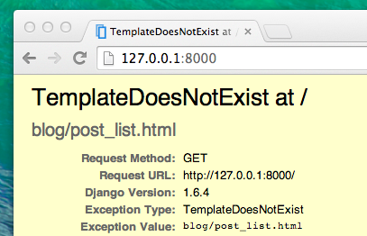

# Django views – time to create!

Time to get rid of the bug we created in the last chapter! :)

A *view* is a place where we put the "logic" of our application. The views do the following:

1. Receive the `request` information (current user session and other stuff) as well as parameters parsed from the url (for example, the id of a blog post)
2. Fetch the information from the `model`, probably adding some logic (like filtering logic to show only the published posts)
3. Create a response by filling a `template` with the fetched info

We'll create a template in the next chapter. Now we'll create a view. Technically, views are Python functions, exactly like the ones we wrote in the __Introduction to Python__ chapter. These functions take `request` as a parameter and return `HttpResponse`. You shouldn't worry about the type of the return value because another function from the Django framework will construct it for us.

Views are placed in the `views.py` file. We will add our *views* to the `blog/views.py` file.

## blog/views.py

OK, let's open up this file in our code editor and see what's in there:

blog/views.py
```python
from django.shortcuts import render

# Create your views here.
```

Not too much stuff here yet.

Remember that lines starting with `#` are comments – this means that those lines won't be run by Python.

Let's create a *view* as the comment suggests. Add the following minimal view below it:

blog/views.py
```python
def post_list(request):
    return render(request, 'blog/post_list.html', {})
```

Now your `blog/views.py` file should look like this:

blog/views.py
```python
from django.shortcuts import render

def post_list(request):
    return render(request, 'blog/post_list.html', {})
```

As you can see, we created a function called `post_list`. It takes `request` and will `render` (display) our template `blog/post_list.html`. 

Save the file, go to http://127.0.0.1:8000/ and see what we've got.

Another error! But don't worry, we will fix it. Let's first understand what the error message is telling us:



This shows that the web server is running, at least, but it still doesn't look right, does it? Don't worry, it's just an error page, nothing to be scared of! Just like the error messages in the console, these are actually pretty useful. The *TemplateDoesNotExist* message indicates our template `blog/post_list.html` does not exist. Indeed, we have not created the template file yet.

Let's fix this by creating the template `blog/post_list.html` in the next chapter!

> Learn more about Django views by reading the official documentation: https://docs.djangoproject.com/en/5.1/topics/http/views/
