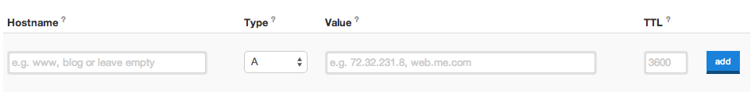

# Domain

PythonAnywhere gave you a free domain, but maybe you don't want to have ".pythonanywhere.com" at the end of your blog URL. Maybe you want your blog to just live at "www.infinite-kitten-pictures.org" or "www.3d-printed-steam-engine-parts.com" or "www.antique-buttons.com" or "www.mutant-unicornz.net", or whatever it'll be.

Here we'll talk a bit about where to get a domain, and how to hook it up to your web app on PythonAnywhere. However, you should know that most domains cost money, and PythonAnywere also charges a monthly fee to use your own domain name -- it's not much money in total, but this is probably something you only want to do if you're really committed!

## Where to register a domain?

A typical domain costs around $15 a year. There are cheaper and more expensive options, depending on the provider. There are a lot of companies that you can buy a domain from: a simple [google search](https://www.google.com/search?q=register%20domain) will give hundreds of options.

Our favourite one is [I want my name](https://iwantmyname.com/). They advertise as "painless domain management" and it really is painless.

You can also get domains for free. [dot.tk](http://www.dot.tk) is one place to get one, but you should be aware that free domains sometimes feel a bit cheap -- if your site is going to be for a professional business, you might want to think about paying for a "proper" domain that ends in `.com`.

## How to point your domain at PythonAnywhere

If you went through *iwantmyname.com*, click `Domains` in the menu and choose your newly purchased domain. Then locate and click on the `manage DNS records` link:

Now you need to locate this form:

And fill it in with the following details:
- Hostname: www
- Type: CNAME
- Value: your domain from PythonAnywhere (for example djangogirls.pythonanywhere.com)
- TTL: 60

Click the Add button and Save changes at the bottom.

> **Note** If you used a different domain provider, the exact UI for finding your DNS / CNAME settings will be different, but your objective is the same: to set up a CNAME that points your new domain at `yourusername.pythonanywhere.com`.

It can take a few minutes for your domain to start working, so be patient!

## Configure the domain via a web app on PythonAnywhere.

You also need to tell PythonAnywhere that you want to use your custom domain.

Go to the [PythonAnywhere Accounts page](https://www.pythonanywhere.com/account/) and upgrade your account. The cheapest option (a "Hacker" plan) is fine to start with, you can always upgrade it later when you get super-famous and have millions of hits.

Next, go over to the [Web tab](https://www.pythonanywhere.com/web_app_setup/) and note down a couple of things:

* Copy the **path to your virtualenv** and put it somewhere safe
* Click through to your **wsgi config file**, copy the contents, and paste them somewhere safe.

Next, **Delete** your old web app. Don't worry, this doesn't delete any of your code, it just switches off the domain at *yourusername.pythonanywhere.com*. Next, create a new web app, and follow these steps:

* Enter your new domain name
* Choose "manual configuration"
* Pick Python 3.4
* And we're done!

When you get taken back to the web tab.

* Paste in the virtualenv path you saved earlier
* Click through to the wsgi configuration file, and paste in the contents from your old config file

Hit reload web app, and you should find your site is live on its new domain!

If you run into any problems, hit the "Send feedback" link on the PythonAnywhere site, and one of their friendly admins will be there to help you in no time.

