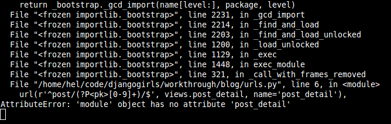

# Extend your application

We've already completed all the different steps necessary for the creation of our website: we know how to write a model, url, view and template. We also know how to make our website pretty.

Time to practice!

The first thing we need in our blog is, obviously, a page to display one post, right?

We already have a `Post` model, so we don't need to add anything to `models.py`.

## Create a template link to a post's detail

We will start with adding a link inside `blog/templates/blog/post_list.html` file. So far it should look like:
```html



    
        <div class="post">
            <div class="date">
                {{ post.published_date }}
            </div>
            <h1><a href="">{{ post.title }}</a></h1>
            <p>{{ post.text|linebreaks }}</p>
        </div>
    


```

We want to have a link from a post's title in the post list to the post's detail page. Let's change `<h1><a href="">{{ post.title }}</a></h1>` so that it links to the post's detail page:

```html
<h1><a href="">{{ post.title }}</a></h1>
```

Time to explain the mysterious ``. As you might suspect, the `` notation means that we are using Django template tags. This time we will use one that will create a URL for us!

`blog.views.post_detail` is a path to a `post_detail` *view* we want to create. Please note: `blog` is the name of our application (the directory `blog`), `views` is from the name of the `views.py` file and the last bit - `post_detail` - is the name of the *view*.

Now when we go to: http://127.0.0.1:8000/ we will have an error (as expected, since we don't have a URL or a *view* for `post_detail`). It will look like this:


## Create a URL to a post's detail

Let's create a URL in `urls.py` for our `post_detail` *view*!

We want our first post's detail to be displayed at this **URL**: http://127.0.0.1:8000/post/1/

Let's make a URL in the `blog/urls.py` file to point Django to a *view* named `post_detail`, that will show an entire blog post. Add the line `url(r'^post/(?P<pk>\d+)/$', views.post_detail, name='post_detail'),` to the `blog/urls.py` file. The file should look like this:

```python
from django.conf.urls import include, url
from . import views

urlpatterns = [
    url(r'^$', views.post_list, name='post_list'),
    url(r'^post/(?P<pk>\d+)/$', views.post_detail, name='post_detail'),
]
```

This part ``^post/(?P<pk>\d+)/$`` looks scary, but no worries - we will explain it for you:
- it starts with `^` again -- "the beginning"
- `post/` only means that after the beginning, the URL should contain the word __post__ and __/__. So far so good.
- `(?P<pk>\d+)` - this part is trickier. It means that Django will take everything that you place here and transfer it to a view as a variable called `pk`. `\d` also tells us that it can only be a digit, not a letter (so everything between 0 and 9). `+` means that there needs to be one or more digits there. So something like `http://127.0.0.1:8000/post//` is not valid, but `http://127.0.0.1:8000/post/1234567890/` is perfectly ok!
- `/` - then we need __/__ again
- `$` - "the end"!

That means if you enter `http://127.0.0.1:8000/post/5/` into your browser, Django will understand that you are looking for a *view* called `post_detail` and transfer the information that `pk` equals `5` to that *view*.

`pk` is shortcut for `primary key`. This name is often used in Django projects. But you can name your variable as you like (remember: lowercase and `_` instead of whitespaces!). For example instead of `(?P<pk>\d+)` we could have variable `post_id`, so this bit would look like: `(?P<post_id>\d+)`.

Ok, we've added a new URL pattern to `blog/urls.py`! Let's refresh the page: http://127.0.0.1:8000/ Boom! The server has stopped running again. Have a look at the console - as expected, there's yet another error!



Do you remember what the next step is? Of course: adding a view!

## Add a post's detail view

This time our *view* is given an extra parameter `pk`. Our *view* needs to catch it, right? So we will define our function as `def post_detail(request, pk):`. Note that we need to use exactly the same name as the one we specified in urls (`pk`). Omitting this variable is incorrect and will result in an error!

Now, we want to get one and only one blog post. To do this we can use querysets like this:

    Post.objects.get(pk=pk)

But this code has a problem. If there is no `Post` with given `primary key` (`pk`) we will have a super ugly error!


We don't want that! But, of course, Django comes with something that will handle that for us: `get_object_or_404`. In case there is no `Post` with the given `pk` it will display much nicer page (called `Page Not Found 404` page).


The good news is that you can actually create your own `Page not found` page and make it as pretty as you want. But it's not super important right now, so we will skip it.

Ok, time to add a *view* to our `views.py` file!

We should open `blog/views.py` and add the following code:

```python
from django.shortcuts import render, get_object_or_404
```

Near other `from` lines. And at the end of the file we will add our *view*:

```python
def post_detail(request, pk):
    post = get_object_or_404(Post, pk=pk)
    return render(request, 'blog/post_detail.html', {'post': post})
```

Yes. It is time to refresh the page: http://127.0.0.1:8000/


It worked! But what happens when you click a link in blog post title?


Oh no! Another error! But we already know how to deal with it, right? We need to add a template!

## Create a template for post detail

We will create a file in `blog/templates/blog` called `post_detail.html`.

It will look like this:

```html



    <div class="post">
        
            <div class="date">
                {{ post.published_date }}
            </div>
        
        <h1>{{ post.title }}</h1>
        <p>{{ post.text|linebreaks }}</p>
    </div>

```

Once again we are extending `base.html`. In the `content` block we want to display a post's published_date (if it exists), title and text. But we should discuss some important things, right?

` ... ` is a template tag we can use when we want to check something (remember `if ... else ..` from __Introduction to Python__ chapter?). In this scenario we want to check if a post's `published_date` is not empty.

Ok, we can refresh our page and see if `TemplateDoesNotExist` is gone now.


Yay! It works!

## One more thing: deploy time!

It'd be good to see if your website will still be working on PythonAnywhere, right? Let's try deploying again.

```
$ git status
$ git add --all .
$ git status
$ git commit -m "Added view and template for detailed blog post as well as CSS for the site."
$ git push
```

* Then, in a [PythonAnywhere Bash console](https://www.pythonanywhere.com/consoles/):

```
$ cd my-first-blog
$ git pull
[...]
```

* Finally, hop on over to the [Web tab](https://www.pythonanywhere.com/web_app_setup/) and hit **Reload**.

And that should be it! Congrats :)
