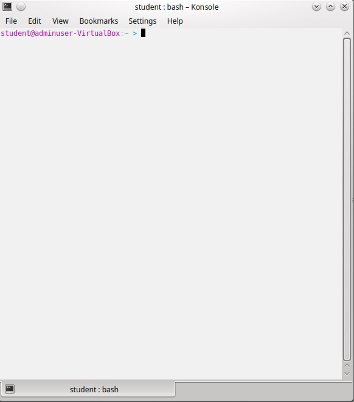
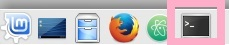
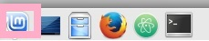
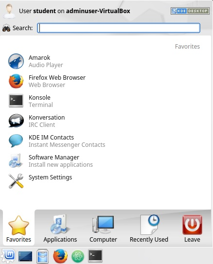

# Using the Linux Command Line

## What is it? ##
- A way to control your computer by **typing** instead of clicking
- You will also hear it called a **"terminal"** or "command prompt".  In this version of linux the program is called **Konsole**
- Windows has one, too
- Your **home** directory is where the terminal always starts when you open a new one.  The symbol for it is **~**
- It looks like this: 



## HowTo ##

- Open a new terminal window
	- Click the Konsole icon on the quickstart panel 
	- **OR** open the Mint menu 
	- Type ```konsole``` in the search bar
	- ```Enter```



- Find out where you are on the computer
	- Print working directory
	- ```pwd```

*Example*
```
    student@adminuser-VirtualBox:~ > pwd
    /home/student
    student@adminuser-VirtualBox:~ >
```
- Look at what is in the current directory
	- List
	- ```ls```

*Example*
```shell
	student@adminuser-VirtualBox:~ > ls
	Desktop  Documents  Downloads  Music  Pictures  Projects  Videos
	student@adminuser-VirtualBox:~ >
```
- Move to another directory
	- Change directory
	- ```cd <directory path>```

*Example*
```shell
    student@adminuser-VirtualBox:~ >cd Documents
    student@adminuser-VirtualBox:~/Documents >
```
or
```shell
    student@adminuser-VirtualBox:~/Documents > cd ~
    student@adminuser-VirtualBox:~ >
```
- Make a new directory (folder)
	- Make directory
	- ```mkdir <name>```

*Example*
```shell
	student@adminuser-VirtualBox:~ > mkdir workspace
	student@adminuser-VirtualBox:~ >
```
- Delete or remove a file directory
	- Remove
	- ```rm [-r] <name>```
		- Note: the ```-r``` is necessary only when deleting directories, not files.  Putting it inside ```[ ]``` indicates that it is optional.

*Example*

```
	student@adminuser-VirtualBox:~ > rm -r workspace
```
or
```
	student@adminuser-VirtualBox:~ > rm test.txt
```

- Close the terminal
	- Press the x or type ```exit```