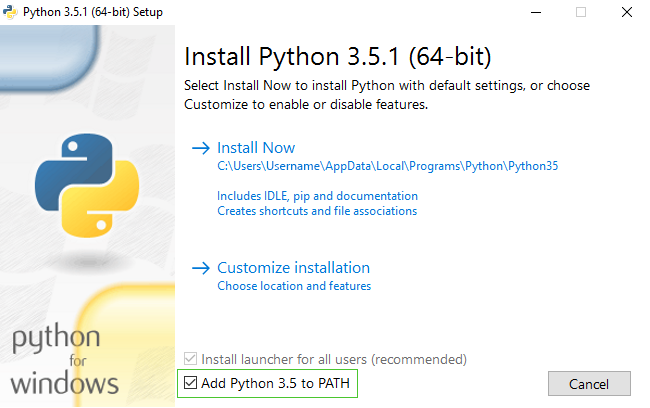

> For readers at home: this chapter is covered in [Installing Python & Code Editor](https://www.youtube.com/watch?v=pVTaqzKZCdA) video.

> This section is based on a tutorial by Geek Girls Carrots (https://github.com/ggcarrots/django-carrots)

Django is written in Python. We need Python to do anything in Django. Let's start with installing it! We want you to install Python 3.4, so if you have any earlier version, you will need to upgrade it.

### Windows

You can download Python for Windows from the website https://www.python.org/downloads/release/python-343/. After downloading the ***.msi** file, you should run it (double-click on it) and follow the instructions there. It is important to remember the path (the directory) where you installed Python. It will be needed later!

One thing to watch out for:  on the second screen of the installation wizard, marked "Customize", make sure you scroll down to the "Add python.exe to the Path" option and select "Will be installed on local hard drive", as shown here:

### Linux

It is very likely that you already have Python installed out of the box. To check if you have it installed (and which version it is), open a console and type the following command:

    $ python3 --version
    Python 3.4.3

If you have a different 'micro version' of Python installed, e.g. 3.4.0, then you don't have to upgrade. If you don't have Python installed, or if you want a different version, you can install it as follows:

#### Debian or Ubuntu

Type this command into your console:

    $ sudo apt-get install python3.4

#### Fedora (up to 21)

Use this command in your console:

    $ sudo yum install python3

#### Fedora (22+)

Use this command in your console:

    $ sudo dnf install python3

### OS X

You need to go to the website https://www.python.org/downloads/release/python-343/ and download the Python installer:

* Download the *Mac OS X 64-bit/32-bit installer* file,
* Double click *python-3.4.3-macosx10.6.pkg* to run the installer.

Verify the installation was successful by opening the *Terminal* application and running the `python3` command:

    $ python3 --version
    Python 3.4.3

----

If you have any doubts, or if something went wrong and you have no idea what to do next - please ask your coach! Sometimes things don't go smoothly and it's better to ask for help from someone with more experience.
