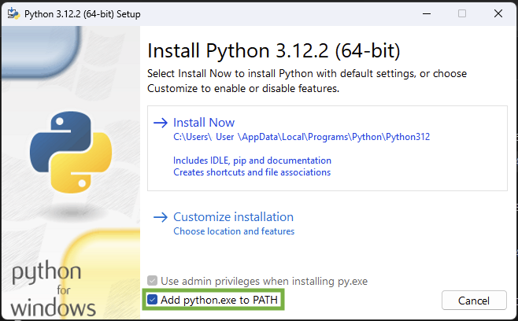
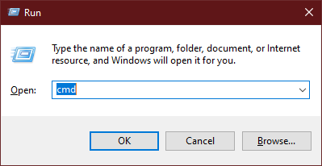

> For readers at home: this chapter is covered in the [Installing Python & Code Editor](https://www.youtube.com/watch?v=pVTaqzKZCdA) video.

> This section is based on a tutorial by Geek Girls Carrots (https://github.com/ggcarrots/django-carrots)

Django is written in Python. We need Python to do anything in Django. Let's start by installing it! We want you to install Python 3.5, so if you have any earlier version, you will need to upgrade it.


<!--sec data-title="Windows" data-id="python_windows" data-collapse=true ces-->

First check whether your computer is running a 32-bit version or a 64-bit version of Windows at https://support.microsoft.com/en-au/kb/827218. You can download Python for Windows from the website https://www.python.org/downloads/windows/. Click on the "Latest Python 3 Release - Python x.x.x" link. If your computer is running a **64-bit** version of Windows, download the **Windows x86-64 executable installer**. Otherwise, download the **Windows x86 executable installer**. After downloading the installer, you should run it (double-click on it) and follow the instructions there.

One thing to watch out for: During the installation you will notice a window marked "Setup". Make sure you tick the "Add Python 3.5 to PATH" checkbox and click on "Install Now", as shown here:



In upcoming steps, you'll be using the Windows Command Line (which we'll also tell you about). For now, if you need to type in some commands, go to Start menu → All Programs → Accessories → Command Prompt. You can also hold in the Windows key and press the "R"-key until the "Run" window pops up. To open the Command Line, type "cmd" and press enter in the "Run" window. (On newer versions of Windows, you might have to search for "Command Prompt" since it's sometimes hidden.)



<!--endsec-->

<!--sec data-title="Linux" data-id="python_linux"
data-collapse=true ces-->

It is very likely that you already have Python installed out of the box. To check if you have it installed (and which version it is), open a console and type the following command:

command-line
```
$ python3 --version
Python 3.5.1
```

If you have a different 'micro version' of Python installed, e.g. 3.5.0, then you don't have to upgrade. If you don't have Python installed, or if you want a different version, you can install it as follows:


<!--endsec-->

<!--sec data-title="Debian or Ubuntu" data-id="python_debian"
data-collapse=true ces-->

Type this command into your console:

command-line
```
$ sudo apt-get install python3.5
```

<!--endsec-->

<!--sec data-title="Fedora (up to 21)" data-id="python_fedora"
data-collapse=true ces-->


Use this command in your console:

command-line
```
$ sudo yum install python3
```

<!--endsec-->

<!--sec data-title="Fedora (22+)" data-id="python_fedora22"
data-collapse=true ces-->

Use this command in your console:

command-line
```
$ sudo dnf install python3
```

<!--endsec-->

<!--sec data-title="openSUSE" data-id="python_openSUSE"
data-collapse=true ces-->

Use this command in your console:

command-line
```
$ sudo zypper install python3
```

<!--endsec-->

<!--sec data-title="OS X" data-id="python_OSX"
data-collapse=true ces-->

> **Note** Before you install Python on OS X, you should ensure your Mac settings allow installing packages that aren't from the App Store. Go to System Preferences (it's in the Applications folder), click "Security & Privacy," and then the "General" tab. If your "Allow apps downloaded from:" is set to "Mac App Store," change it to "Mac App Store and identified developers."

You need to go to the website https://www.python.org/downloads/release/python-351/ and download the Python installer:

* Download the *Mac OS X 64-bit/32-bit installer* file,
* Double click *python-3.5.1-macosx10.6.pkg* to run the installer.

<!--endsec-->

Verify the installation was successful by opening the *Terminal* application and running the `python3` command:

command-line
```
$ python3 --version
Python 3.5.1
```

----

If you have any doubts, or if something went wrong and you have no idea what to do next, please ask your coach! Sometimes things don't go smoothly and it's better to ask for help from someone with more experience.
