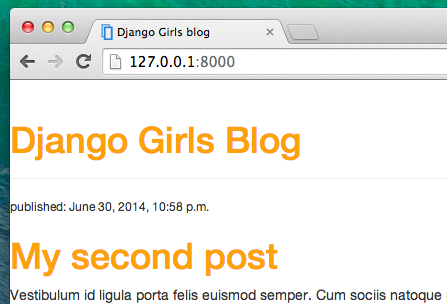

# CSS - ¡Que quede bonito!

Nuestro blog todavía es un poco feo, ¿no te parece? ¡Es hora de ponerlo bonito! Para eso, vamos a usar CSS.

## ¿Qué es CSS?

El lenguaje CSS (las siglas en inglés de Hojas de Estilos en Cascada, o Cascading Style Sheets) sirve para describir la apariencia de un sitio web escrito en un lenguaje de marcado (como HTML). Es como la capa de pintura para nuestra página web. ;)

Pero no queremos empezar de cero otra vez, ¿verdad? De nuevo vamos a usar algo que otros programadores han publicado ya en Internet. Estar siempre reinventando la rueda no mola.

## ¡Vamos a usar Bootstrap!

Bootstrap es uno de los frameworks de HTML y CSS más populares para desarrollar sitios web atractivos: https://getbootstrap.com/

Lo escribieron programadores que trabajaban en Twitter. ¡Ahora lo mantienen y desarrollan voluntarios de todo el mundo!

## Instalar Bootstrap

Para instalar Bootstrap, abre tu fichero `.html` en el editor de código y añade esto a la sección `<head>`:

blog/templates/blog/post_list.html

```html
<link rel="stylesheet" href="//maxcdn.bootstrapcdn.com/bootstrap/3.2.0/css/bootstrap.min.css">
<link rel="stylesheet" href="//maxcdn.bootstrapcdn.com/bootstrap/3.2.0/css/bootstrap-theme.min.css">
```

Esto no añade ningún archivo a tu proyecto. Solo apunta a archivos que existen en Internet. Así que adelante, accede a tu sitio web y refresca la página ¡Aquí la tienes!


¡Ya tiene mejor pinta!

## Archivos estáticos (static files) en Django

Finalmente nos vamos a fijar en esto que hemos estado llamando **archivos estáticos**. Los archivos estáticos son los archivos CSS e imágenes. Su contenido no depende del contexto de la petición y siempre será el mismo para todos los usuarios.

### Dónde poner los archivos estáticos en Django

Django ya sabe dónde encontrar los archivos estáticos de la app "admin". Ahora necesitamos añadir los archivos estáticos de nuestra aplicación, `blog`.

Crearemos una carpeta llamada `static` dentro de la app blog:

    djangogirls
    ├── blog
    │   ├── migrations
    │   ├── static
    │   └── templates
    └── mysite
    

Django encontrará automáticamente cualquier carpeta llamada "static" dentro de cualquiera de las carpetas de tus apps. Podrá usar su contenido como archivos estáticos.

## ¡Tu primer archivo CSS!

Vamos a crear un archivo CSS, para añadir tu propio estilo a la página. Crea un nuevo directorio llamado `css` dentro de la carpeta `static`. A continuación, crea un nuevo archivo llamado `blog.css` dentro de la carpeta `css`. ¿Listos?

    djangogirls
    └─── blog
         └─── static
              └─── css
                   └─── blog.css
    

¡Vamos a escribir algo de CSS! Abre el archivo `blog/static/css/blog.css` en el editor de código.

No vamos a profundizar demasiado en cómo personalizar y aprender CSS. Pero te podemos recomendar un un curso gratuito de CSS al final de esta página por si quieres aprender más.

Pero vamos a hacer al menos un poco. ¿Quizás podamos cambiar el color de nuestros encabezados? Los ordenadores utilizan códigos especiales para expresar los colores. Estos códigos empiezan con `#` seguidos por 6 letras (A-F) y números (0-9). Por ejemplo, el código del color azul es `#0000FF`. Puedes encontrar los códigos de muchos colores aquí: http://www.colorpicker.com/ y en otras páginas web. También puedes utilizar [colores predefinidos](http://www.w3schools.com/colors/colors_names.asp) utilizando su nombre en inglés, como `red` y `green`.

En el archivo `blog/static/css/blog.css` deberías añadir el siguiente código:

blog/static/css/blog.css

```css
h1 a, h2 a {
     color: #C25100;
}

```

`h1 a` es un selector CSS. Esto significa que estamos aplicando nuestros estilos a cualquier elemento de `a` dentro de un elemento de `h1`; el selector `h2 a` hace lo mismo para los elementos de `h2`. Así, cuando tenemos algo como `<h1><a href="">link</a></h1>`, se aplicará el estilo `h1 a`. En este caso, le estamos diciendo que cambie el color a un `#C25100`, que es un naranjo oscuro. O puedes poner tu propio color aqui, ¡pero asegúrate que tenga un buen contraste contra un fondo blanco!

En un archivo CSS se definen los estilos de los elementos que aparecen en el archivo HTML. La primera forma de identificar los elementos es por su nombre. Puede que los recuerdes como 'tags' de la sección de HTML. Cosas como `a`, `h1`, y `body` son algunos ejemplos de nombres de elementos. También podemos identificar elementos por el atributo `class` o el atributo `id`. Los valores de "class" e "id" son nombres que das al elemento para poderlo identificar. Con el atributo "class" identificamos grupos de elementos del mismo tipo y con el atributo "id" identificamos un elemento específico. Por ejemplo, el siguiente elemento lo podrías identificar por su nombre de "tag" `a`, por su "class" `external_link`, o por su "id" `link_to_wiki_page`:

```html
<a href="https://en.wikipedia.org/wiki/Django" class="external_link" id="link_to_wiki_page">
```

Si quieres aprender más sobre los selectores CSS puedes consultar en [Selectores de CSS en w3schools](http://www.w3schools.com/cssref/css_selectors.asp).

También necesitamos decirle a nuestra plantilla HTML que hemos añadido código CSS. Abre el archivo `blog/templates/blog/post_list.html` en el editor de código y añade esta línea al principio del todo:

blog/templates/blog/post_list.html

```html

```

Aquí solo estamos cargando archivos estáticos. :) Entre las etiquetas `<head>` y `</head>`, después de los enlaces a los archivos CSS de Bootstrap, añade esta línea:

blog/templates/blog/post_list.html

```html
<link rel="stylesheet" href="">
```

El navegador lee los archivos en el orden que le son dados, por lo que debemos asegurarnos de que está en el lugar correcto. De lo contrario, el código en nuestro archivo podría ser reemplazado por código en nuestros archivos Bootstrap. Le acabamos de decir a nuestra plantilla dónde se encuentra nuestro archivo CSS.

Ahora tu archivo debe tener este aspecto:

blog/templates/blog/post_list.html

```html

<html>
    <head>
        <title>Django Girls blog</title>
        <link rel="stylesheet" href="//maxcdn.bootstrapcdn.com/bootstrap/3.2.0/css/bootstrap.min.css">
        <link rel="stylesheet" href="//maxcdn.bootstrapcdn.com/bootstrap/3.2.0/css/bootstrap-theme.min.css">
        <link rel="stylesheet" href="">
    </head>
    <body>
        <div>
            <h1><a href="/">Django Girls Blog</a></h1>
        </div>

        
            <div>
                <p>published: {{ post.published_date }}</p>
                <h2><a href="">{{ post.title }}</a></h2>
                <p>{{ post.text|linebreaksbr }}</p>
            </div>
        
    </body>
</html>
```

De acuerdo, ¡guarda el archivo y actualiza el sitio!



¡Buen trabajo! ¿Tal vez nos gustaría también dar un poco de aire a nuestro sitio web y aumentar el margen en el lado izquierdo?. ¡Vamos a intentarlo!

blog/static/css/blog.css

```css
body {
    padding-left: 15px;
}
```

Añade esto a tu CSS, guarda el archivo y ¡mira cómo funciona!


¿Quizá podríamos personalizar la tipografía del título? Pega esto en la sección `<head>` del archivo `blog/templates/blog/post_list.html`:

blog/templates/blog/post_list.html

```html
<link href="//fonts.googleapis.com/css?family=Lobster&subset=latin,latin-ext" rel="stylesheet" type="text/css">
```

Como antes, revisa el orden y pon antes del enlace a `blog/static/css/blog.css`. Esta línea importará un estilo de letra llamada *Lobster* de Google Fonts (https://www.google.com/fonts).

Encuentra el bloque de declaración (el código entre las llaves `{` y `}`) `h1 a` en el archivo CSS `blog/static/css/blog.css`. Ahora añade la línea `font-family: 'Lobster';` entre las llaves y actualiza la página:

blog/static/css/blog.css

```css
h1 a, h2 a {
    color: #FCA205;
    font-family: 'Lobster';
}
```


¡Genial!

Como ya hemos dicho, CSS tiene un concepto de clases. Las clases te permiten dar un nombre a una parte del código HTML para aplicar estilos solo a esta parte, sin afectar a otras. ¡Esto puede ser súper útil! Quizá tienes dos divs haciendo algo diferente (como el encabezado y el texto de tu publicación). Las clases pueden ayudarte a asignarles estilos distintos.

Adelante, nombra algunas partes del código HTML. Añade una clase llamada `page-header` a tu `div` que contiene el encabezado, así:

blog/templates/blog/post_list.html

```html
<div class="page-header">
    <h1><a href="/">Django Girls Blog</a></h1>
</div>
```

Y ahora añade una clase `post` a tu `div` que contiene una publicación del blog.

blog/templates/blog/post_list.html

```html
<div class="post">
    <p>publicado: {{ post.published_date }}</p>
    <h2><a href="">{{ post.title }}</a></h2>
    <p>{{ post.text|linebreaksbr }}</p>
</div>
```

Ahora añadiremos bloques de declaración a varios selectores. Los selectores que comienzan con `.` hacen referencia a clases. Hay muchos tutoriales y explicaciones excelentes sobre CSS en la Web que te pueden ayudar a entender el código que sigue a continuación. Por ahora, copia y pega lo siguiente en tu archivo `blog/static/css/blog.css`:

blog/static/css/blog.css

```css
.page-header {
    background-color: #C25100;
    margin-top: 0;
    padding: 20px 20px 20px 40px;
}

.page-header h1, .page-header h1 a, .page-header h1 a:visited, .page-header h1 a:active {
    color: #ffffff;
    font-size: 36pt;
    text-decoration: none;
}

.content {
    margin-left: 40px;
}

h1, h2, h3, h4 {
    font-family: 'Lobster', cursive;
}

.date {
    color: #828282;
}

.save {
    float: right;
}

.post-form textarea, .post-form input {
    width: 100%;
}

.top-menu, .top-menu:hover, .top-menu:visited {
    color: #ffffff;
    float: right;
    font-size: 26pt;
    margin-right: 20px;
}

.post {
    margin-bottom: 70px;
}

.post h2 a, .post h2 a:visited {
    color: #000000;
}
```

Luego rodea el código HTML que muestra los posts con declaraciones de clases. Cambia esto:

blog/templates/blog/post_list.html

```html

    <div class="post">
        <p>publicado: {{ post.published_date }}</p>
        <h2><a href="">{{ post.title }}</a></h2>
        <p>{{ post.text|linebreaksbr }}</p>
    </div>

```

en `blog/templates/blog/post_list.html` por esto:

blog/templates/blog/post_list.html

```html
<div class="content container">
    <div class="row">
        <div class="col-md-8">
            
                <div class="post">
                    <div class="date">
                        <p>publicado: {{ post.published_date }}</p>
                    </div>
                    <h2><a href="">{{ post.title }}</a></h2>
                    <p>{{ post.text|linebreaksbr }}</p>
                </div>
            
        </div>
    </div>
</div>
```

Guarda estos archivos y recarga tu sitio.


¡Woohoo! Queda genial, ¿Verdad? Mira el código que acabamos de pegar para encontrar los lugares donde añadimos clases en el HTML y las usamos en el CSS. ¿Qué cambiarías si quisieras que la fecha fuera color turquesa?

No tengas miedo a experimentar con este CSS un poco y tratar de cambiar algunas cosas. Jugar con el CSS te puede ayudar a entender lo que hacen las distintas secciones. Si algo deja de funcionar, no te preocupes, ¡siempre puedes deshacerlo!

Realmente te recomendamos seguir este [Curso de HTML y CSS de CodeAcademy](https://www.codecademy.com/tracks/web). Puede ayudarte a aprender todo lo que necesitas para hacer tus websites más bonitos con CSS.

¡¿Lista para el siguiente capítulo?! :)
