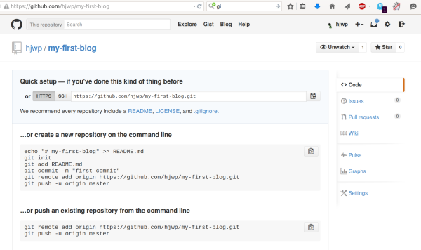

# ¡Despliega!

> **Nota** El siguiente capítulo puede ser, a veces, un poco difícil de seguir. Ten paciencia y acábalo. El despliegue es una parte importante del proceso en el desarrollo de un sitio web. Este capítulo está a mitad del tutorial para que tu mentor pueda ayudarte a conseguir que tu sitio web esté online, algo que puede ser un poco complicado. Así, aunque se te acabe el tiempo, podrás terminar el tutorial por tu cuenta.

Hasta ahora, tu sitio web sólo está disponible en tu ordenador. ¡Ahora aprenderás como desplegarlo! El despliegue es el proceso de publicar tu aplicación en internet para que la gente pueda acceder y ver tu sitio web. :)

Como ya has aprendido, un sitio web tiene que estar en un servidor. Hay muchos proveedores de servidores disponibles en internet, nosotros vamos a usar [PythonAnywhere](https://www.pythonanywhere.com/). PythonAnywhere es gratuito para aplicaciones pequeñas que no tienen muchos visitantes, y con eso tendrás más que suficiente por ahora.

El otro servicio externo que vamos a utilizar es [GitHub](https://www.github.com), un servicio de almacenamiento de código. Hay otras opciones por ahí, pero hoy en día casi todas las programadoras y programadores tenemos una cuenta de GitHub, ¡y ahora tú también la vas a tener!

Estos tres lugares serán importantes para ti. Tu ordenador local será el lugar donde desarrollas y pruebas. Cuando estés contento con los cambios, subirás una versión de tu programa a GitHub. Tu sitio web estará en PythonAnywhere y para actualizarlo descargarás la última versión de tu código desde GitHub.

# Git

> **Nota** Si ya has realizado los pasos de instalación, no los tienes que repetir, puedes avanzar a la siguiente sección y empezar a crear tu repositorio de Git.



## Crear nuestro repositorio Git

Git sigue los cambios realizados a un grupo determinado de archivos en lo que llamamos un repositorio de código (abreviado "repo"). Vamos a crear uno para nuestro proyecto. Abre la consola y ejecuta los siguientes comandos en el directorio de `djangogirls`:

> **Nota** Comprueba en qué directorio estás ahora mismo (es decir, el directorio de trabajo actual) con el comando `pwd` (OSX/Linux) o `cd` (Windows) antes de inicializar el repositorio. Deberías estar en la carpeta `djangogirls`.

command-line

    $ git init
    Initialized empty Git repository in ~/djangogirls/.git/
    $ git config --global user.name "Tu nombre"
    $ git config --global user.email tu@ejemplo.com
    

Inicializar el repositorio de git es algo que sólo tenemos que hacer una vez por proyecto (y no tendrás que volver a teclear tu nombre de usuario y correo electrónico nunca más).

Git llevará un seguimiento de los cambios realizados en todos los archivos y carpetas en este directorio, pero hay algunos archivos que queremos que ignore. Esto lo hacemos creando un archivo llamado `.gitignore` en el directorio base. Abre tu editor y crea un nuevo archivo con el siguiente contenido:

.gitignore

    *.pyc
    *~
    __pycache__
    myvenv
    db.sqlite3
    /static
    .DS_Store
    

Y guárdalo como `.gitignore` en la carpeta "djangogirls".

> **Nota** ¡El punto al principio del nombre del archivo es importante! Si tienes problemas para crearlo (a los Mac no les gusta que crees ficheros con un punto al principio del nombre usando el Finder por ejemplo), entonces usa la opción "Save As" o "Guardar como" de tu editor, esto funcionará seguro. Asegúrate de no añadir `.txt`, `.py`, o ninguna otra extensión al nombre de fichero -- Git solo lo reconocerá si se llama exactamente `.gitignore`, sin nada más.
> 
> **Nota** Uno de los archivos especificados en tu `.gitignore` es `db.sqlite3`. Ese fichero es tu base de datos local, donde se almacenan los usuarios y publicaciones de tu blog. Vamos a seguir las buenas prácticas de programación web: vamos a usar bases de datos separadas para tu sitio local y tu sitio en producción en PythonAnywhere. La base de datos en PythonAnywhere podría ser SQLite, como en tu máquina de desarrollo, pero también podrías usar otro gestor de base de datos como MySQL o PostgreSQL que pueden soportar muchas más visitas que SQLite. En cualquier caso, al ignorar la base de datos SQLite en tu copia de GitHub, todos los posts y el super usuario que has creado hasta el momento solo estarán disponibles en local, y tendrás que crear nuevos usuarios y publicaciones en producción. Tu base de datos local es un buen campo de pruebas donde puedes probar diferentes cosas sin miedo a estropear o borrar las publicaciones reales de tu blog.

Te recomendamos utilizar el comando `git status` antes de `git add` o en cualquier momento en que no sepas muy bien lo que ha cambiado. Esto te ayudará a evitar sorpresas, como subir cambios o archivos que no queríamos subir. El comando `git status` muestra información sobre cualquier archivo no seguido ("untracked"), modificado ("modified"), preparado ("staged"), el estado de la rama y muchas cosas más. La salida debería ser parecida a esto:

command-line

    $ git status
    On branch master
    
    No commits yet
    
    Untracked files:
      (use "git add <file>..." to include in what will be committed)
    
            .gitignore
            blog/
            manage.py
            mysite/
            requirements.txt
    
    nothing added to commit but untracked files present (use "git add" to track)
    

Y finalmente guardamos nuestros cambios. Ve a la consola y ejecuta estos comandos:

command-line

    $ git add --all .
    $ git commit -m "Mi aplicación Django Girls, primer commit"
     [...]
     13 files changed, 200 insertions(+)
     create mode 100644 .gitignore
     [...]
     create mode 100644 mysite/wsgi.py
    

## Subiendo tu código a Github

Vete a [GitHub.com](https://www.github.com) y regístrate para obtener una cuenta de usuario nueva y gratuita. (Si ya lo hiciste en la preparación del taller, ¡eso es genial!) Asegúrate de recordar tu contraseña (agrégala a tu administrador de contraseñas, si usas uno).

A continuación, crea un nuevo repositorio con el nombre "my-first-blog". Deja el checkbox "initialize with a README" sin marcar, deja la opción de .gitignore vacía (ya lo hemos hecho manualmente) y deja la licencia como None.

> **Nota** El nombre `my-first-blog` es importante - podrías escoger otro, pero va a salir muchas veces en las instrucciones que vienen a continuación, y vas a tener que acordarte de cambiarlo cada vez. Lo más fácil es quedarse con el nombre `my-first-blog`.

En la siguiente pantalla, verás la URL para clonar el repo, que tendrás que usar en los comandos que van a continuación:

Ahora necesitas enlazar el repositorio Git en tu ordenador con el repositorio de GitHub.

Escribe lo siguiente en la consola (cambia `<your-github-username>` por tu nombre de usuario de GitHub, pero sin los símbolos < y > -- fíjate en que la URL debería coincidir con la URL para clonar el repo que acabas de ver):

command-line

    $ git remote add origin https://github.com/<your-github-username>/my-first-blog.git
    $ git push -u origin master
    

Cuando hagas push a GitHub, te preguntará tu usuario y password de GitHub, y después de introducirlos, deberías ver algo como esto:

command-line

    Counting objects: 6, done.
    Writing objects: 100% (6/6), 200 bytes | 0 bytes/s, done.
    Total 3 (delta 0), reused 0 (delta 0)
    To https://github.com/ola/my-first-blog.git
    
     * [new branch]      master -> master
    Branch master set up to track remote branch master from origin.
    

<!--TODO: maybe do ssh keys installs in install party, and point ppl who dont have it to an extension -->

Tu código ya está subido a GitHub. ¡Ve y compruébalo! Encontrarás que está en buena compañía - [Django](https://github.com/django/django), [Django Girls Tutorial](https://github.com/DjangoGirls/tutorial) y muchos otros proyectos de software libre están alojados en GitHub. :)

# Configurar nuestro blog en PythonAnywhere

## Crea una cuenta en PythonAnywhere

> **Nota** A lo mejor ya has creado una cuenta en PythonAnywhere durante los pasos de instalación. Si es así, no necesitas hacerlo otra vez.



## Configurar nuestro sitio en PythonAnywhere

Vuelve al [dashboard de PythonAnywhere](https://www.pythonanywhere.com/) haciendo click en el logo, y escoge la opción de iniciar una consola "Bash" – esta terminal es como la que hay en tu ordenador, pero en el servidor de PythonAnywhere.

> **Nota** PythonAnywhere está basado en Linux, así que si estás en Windows, la consola será un poco distinta a la de tu ordenador.

Para desplegar una aplicación web en PythonAnywhere necesitas descargar tu código de GitHub y configurar PythonAnywhere para que lo reconozca y lo sirva como una aplicación web. Hay formas de hacerlo manualmente, pero PythonAnywhere tiene una herramienta automática que lo hará todo por nosotros. Lo primero, vamos a instalar la herramienta:

PythonAnywhere command-line

    $ pip3.6 install --user pythonanywhere
    

Eso debería mostrar en pantalla algunos mensajes como `Collecting pythonanywhere`, y finalmente una linea diciendo que ha terminado bien: `Successfully installed (...) pythonanywhere- (...)`.

Ahora ejecutaremos el asistente para configurar automáticamente nuestra aplicación desde GitHub. Teclea lo siguiente en la consola de PythonAnywhere (no te olvides de usar tu propio nombre de usuario de GitHub en lugar de `<your-github-username>`, para que la URL sea como la URL de clonar el repo de GitHub):

PythonAnywhere command-line

    $ pa_autoconfigure_django.py --python=3.6 https://github.com/<your-github-username>/my-first-blog.git
    

A medida que se ejecuta, podrás ver lo que hace:

- Se descarga tu código de GitHub.
- Crea un virtualenv en PythonAnywhere, como el de tu propia computadora.
- Actualiza tus ficheros de settings con algunos settings de despliegue.
- Crea la base de datos en PythonAnywhere ejecutando el comando `manage.py migrate`.
- Configura los archivos estáticos (static) (luego hablaremos de éstos con más detalle).
- Y configura PythonAnywhere para publicar tu aplicación web a través de su API.

En PythonAnywhere todos estos pasos están automatizados, pero son los mismos que tendrías que seguir en cualquier otro proveedor de servidores.

Lo más importante que debes notar en este momento es que tu base de datos en PythonAnywhere está totalmente separada de tu base de datos en tu propia computadora, por lo que puedes tener diferentes publicaciones y cuentas de administrador. Como consecuencia, igual que lo hicimos en tu ordenador, tenemos que crear la cuenta de administrador con el comando `createsuperuser`. PythonAnywhere ya ha activado el virtualenv automáticamente, así que lo único que tienes que hacer es ejecutar:

PythonAnywhere command-line

    (ola.pythonanywhere.com) $ python manage.py createsuperuser
    

Teclea las credenciales para tu usuario admin. Para evitar confusiones, te recomendamos usar el mismo nombre de usuario que usaste en tu ordenador local; aunque a lo mejor prefieres que la contraseña en PythonAnywhere sea más segura.

Ahora, si quieres, también puedes ver tu código en PythonAnywhere con el comando `ls`:

PythonAnywhere command-line

    (ola.pythonanywhere.com) $ ls
    blog  db.sqlite3  manage.py  mysite requirements.txt static
    (ola.pythonanywhere.com) $ ls blog/
    __init__.py  __pycache__  admin.py  apps.py  migrations  models.py
    tests.py  views.py
    

También puedes ir a la página de ficheros ("Files") y navegar por los ficheros y directorios usando el visor de PythonAnywhere. (Desde la página de la consola ("Console"), puedes ir a cualquier otra página de PythonAnywhere usando el botón de la esquina superior derecha. Desde el resto de páginas, también hay enlaces a las otras en la parte superior.)

## ¡Ya estás en vivo!

¡Tu sitio ya debería estar online en internet! Haz click en la página "Web" de PythonAnywhere para obtener un enlace a él. Puedes compartir este enlace con quien tu quieras :)

> **Nota** Este es un tutorial para principiantes, y al desplegar este sitio hemos tomado algunos atajos que tal vez no sean las mejores prácticas desde el punto de vista de la seguridad. Si decide construir sobre este proyecto, o comenzar un nuevo proyecto, debe revisar la [lista de verificación de despliegue de Django](https://docs.djangoproject.com/en/2.2/howto/deployment/checklist/) para obtener algunos consejos sobre cómo proteger su sitio.

## Consejos de depuración

Si te sale un error al ejecutar el script `pa_autconfigure_django.py`, aquí hay algunas causas comunes:

- Te has olvidado de crear el token de API de PythonAnywhere.
- No has puesto bien la URL de GitHub.
- Si ves un error diciendo *"Could not find your settings.py*, es probable que no añadieras todos tus archivos a Git, y/o no los subiste a GitHub correctamente. Repasa la sección de Git más arriba.
- Si anteriormente te suscribiste a una cuenta de PythonAnywhere y tuviste un error con *collectstatic*, probablemente tengas una versión antigua de SQLite (por ejemplo, 3.8.2) en tu cuenta. En este caso, regístrate con una nueva cuenta e intenta los comandos en la sección PythonAnywhere anterior.

Si ves un error al visitar tu sitio, el primer lugar para ver qué está pasando es el **log de errores**. Encontrarás un enlace en la página ["Web"](https://www.pythonanywhere.com/web_app_setup/) de PythonAnywhere. Mira si hay algún mensaje de error allí; los más recientes están en la parte inferior.

Hay también algunos [consejos generales de depuración en la página de ayuda de PythonAnywhere](http://help.pythonanywhere.com/pages/DebuggingImportError).

Y recuerda, ¡tu mentora está aquí para ayudar!

# ¡Comprueba tu página!

La página por defecto debería decir "It worked!", tal como dice en tu ordenador local. Prueba a añadir `/admin/` al final de la URL y llegarás a la página de administración. Entra con tu usuario y password, y verás que puedes añadir nuevas publicaciones en el servidor -- recuerda, los post que tenías en tu base de datos local no se han subido a al blog publicado en producción.

Después de crear algunas publicaciones, puedes volver a tu instalación local (no la de PythonAnywhere). A partir de ahora, trabaja en tu instalación local para hacer los siguientes cambios. Este es un flujo de trabajo típico en el desarrollo web – haz cambios localmente, sube (push) esos cambios a GitHub, y descarga (pull) tus cambios al servidor de publicación. Esto te permite trabajar y experimentar en local sin romper tu página publicada. Mola, ¿eh?

¡Date una *GRAN* palmada en la espalda! Desplegar a un servidor es una de las partes más complicadas de desarrollo web y a menudo la gente necesita varios días para que funcione del todo. Pero tú ya tienes tu sitio publicado, ¡en internet de verdad!