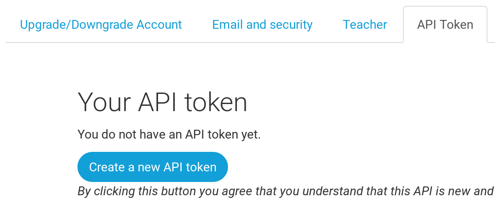

PythonAnywhere es un servicio para ejecutar código Python en servidores "en la nube". Lo vamos a usar para alojar nuestro sitio para que esté disponible en Internet.

Almacenaremos del blog que estamos construyendo sobre Python Anywhere. Crea una cuenta como "Principiante/Beginner" en Python Anywhere (el modo gratuito esta bien, no necesitas una tarjeta de crédito).

* [www.pythonanywhere.com](https://www.pythonanywhere.com/)

> **Nota** Cuando elijas un nombre de usuario, recuerda que la URL de tu blog tendrá la forma `tunombredeusuario.pythonanywhere.com`, así que lo mejor será usar tu apodo o elegir un nombre que indique de qué trata tu blog. Asegúrate también de recordar tu contraseña (añádela a tu gestor de contraseñas, si usas uno).

## Crear un token para la API de PythonAnywhere

Este paso solo necesita ser completado una vez. Una vez que te hayas registrado en PythonAnywhere, serás llevado a tu tablón principal. Encontrarás el enlace a la página de tu "Cuenta" en la esquina superior derecha:

Después selecciona la lengueta llamada "API token", y haz click en el botón que dice "Crear nueva API token"

