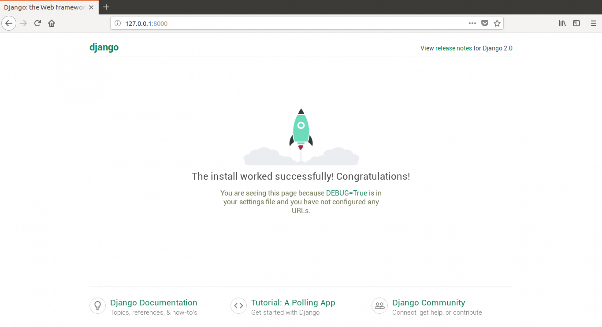

# ¡Tu primer proyecto en Django!

> Parte de este capítulo se basa en tutoriales por Geek Girls Carrots (https://github.com/ggcarrots/django-carrots).
> 
> Parte de este capítulo está basado en el [ tutorial django-marcador](http://django-marcador.keimlink.de/) bajo licencia de Creative Commons Attribution-ShareAlike 4.0 internacional. El tutorial de django-marcador tiene derechos de autor de Markus Zapke-Gündemann et al.

¡Vamos a crear un blog sencillo!

El primer paso es iniciar un nuevo proyecto de Django. Básicamente, significa que vamos a lanzar unos scripts proporcionados por Django que nos crearán el esqueleto de un proyecto de Django. Son solo un montón de directorios y archivos que usaremos más tarde.

Los nombres de algunos archivos y directorios son muy importantes para Django. No deberías renombrar los archivos que estamos a punto de crear. Moverlos a un lugar diferente tampoco es buena idea. Django necesita mantener una cierta estructura para poder encontrar cosas importantes.

> Recuerda ejecutar todo en el virtualenv. Si no ves un prefijo `(myvenv)` en tu consola tienes que activar tu virtualenv. Explicamos cómo hacerlo en el capítulo de **Instalación de Django** en la sección **Trabajar con virtualenv**. Basta con escribir `myvenv\Scripts\activate` en Windows o `source myvenv/bin/activate` en Mac OS / Linux.

<!--sec data-title="Create project: OS X or Linux" data-id="django_start_project_OSX_Linux" data-collapse=true ces-->

En MacOS o Linux deberías ejecutar el siguiente comando en la consola. **no te olvides de añadir el punto `.` al final**

command-line

    (myvenv) ~/djangogirls$ django-admin startproject mysite .
    

> El punto `.` es crucial porque le dice al script que instale Django en el directorio actual (para el cual el punto `.` sirve de abreviatura).
> 
> **Nota** Cuando escribas los comandos de arriba acuérdate de que sólo tienes que escribir la parte que empieza por `django-admin`. La parte de `(myvenv) ~/djangogirls$` que mostramos aquí es sólo un ejemplo del mensaje que aparecerá en tu línea de comandos.

<!--endsec-->

<!--sec data-title="Create project: Windows" data-id="django_start_project_windows" data-collapse=true ces-->

En Windows debes ejecutar el siguiente comando. **(No olvides incluir el punto `.` al final)**:

command-line

    (myvenv) C:\Users\Name\djangogirls> django-admin.exe startproject mysite .
    

> El punto `.` es crucial porque le dice al script que instale Django en el directorio actual (para el cual el punto `.` sirve de abreviatura).
> 
> **Nota** Cuando teclees los comandos de arriba, recuerda que sólo tienes que escribir la parte que empieza por `django-admin.exe`. La parte de `(myvenv) C:\Users\Name\djangogirls>` que mostramos aquí es sólo un ejemplo del mensaje que aparecerá en tu línea de comandos.

<!--endsec-->

`django-admin.py` es un script que creará los archivos y directorios para ti. Ahora deberías tener una estructura de directorios parecida a esta:

    djangogirls
    ├── manage.py
    ├── mysite
    │   ├── __init__.py
    │   ├── settings.py
    │   ├── urls.py
    │   └── wsgi.py
    ├── myvenv
    │   └── ...
    └── requirements.txt
    

> **Nota**: en tu estructura de directorios, también verás el directorio `venv` que creamos anteriormente.

`manage.py` es un script que ayuda con la administración del sitio. Con él podremos iniciar un servidor web en nuestro ordenador sin necesidad de instalar nada más, entre otras cosas.

El archivo `settings.py` contiene la configuración de tu sitio web.

Recuerdas cuando hablamos de una cartera que debía comprobar dónde entregar una carta? El archivo `urls.py` contiene una lista de los patrones utilizados por `urlresolver`.

Por ahora vamos a ignorar el resto de archivos porque no los vamos a cambiar. ¡Sólo acuérdate de no borrarlos accidentalmente!

## Cambiar la configuración

Vamos a hacer algunos cambios en `mysite/settings.py`. Abre el archivo usando el editor de código que has instalado anteriormente.

**Nota**: Ten en cuenta que `settings.py` es un archivo normal, como cualquier otro. Puedes abrirlo con el editor de texto, usando "file -> open" en el menu de acciones. Esto te debería llevar a la típica ventana donde puedes buscar el archivo `settings.py` y seleccionarlo. Como alternativa, puedes abrir el archivo haciendo click derecho en la carpeta djangogirls en tu escritorio. Luego, selecciona tu editor de texto en la lista. Elegir el editor es importante puesto que puede que tengas otros programas que pueden abrir el archivo pero que no te dejaran editarlo.

Sería bueno tener el horario correcto en nuestro sitio web. Ve a [lista de Wikipedia de las zonas horarias](https://en.wikipedia.org/wiki/List_of_tz_database_time_zones) y copia tu zona horaria (TZ) (e.g. `Europa/Berlín`).

En `settings.py`, encuentra la línea que contiene `TIME_ZONE` y modifícala para elegir tu zona horaria. Por ejemplo:

mysite/settings.py

```python
TIME_ZONE = 'Europe/Berlin'
```

Un código de idioma tiene dos partes: el idioma, p.ej. `en` para inglés o `de` para alemán, y el código de país, p.ej. `de` para Alemania o `ch` para Suiza. Si tu idioma nativo no es el inglés, puedes añadir lo siguiente para cambiar el idioma de los botones y notificaciones de Django. Así tendrás el botón "Cancel" traducido al idioma que pongas aquí. [Django viene con muchas traducciones preparadas](https://docs.djangoproject.com/en/2.2/ref/settings/#language-code).

Si quieres un idioma diferente, cambia el código de idioma cambiando la siguiente línea:

mysite/settings.py

```python
LANGUAGE_CODE = 'es-es'
```

También tenemos que añadir una ruta para archivos estáticos. (Veremos todo acerca de archivos estáticos y CSS más adelante.) Ve al *final* del archivo, y justo debajo de la entrada `STATIC_URL`, añade una nueva llamada `STATIC_ROOT`:

mysite/settings.py

```python
STATIC_URL = '/static/'
STATIC_ROOT = os.path.join(BASE_DIR, 'static')
```

Cuando `DEBUG` es `True` y `ALLOWED_HOST` esta vacío, el host es validado contra `['localhost', '127,0.0.1', '[::1]']`. Una vez despleguemos nuestra aplicación este no sera el mismo que nuestro nombre de host en PythonAnywhere asi que cambiaremos la siguiente opción:

mysite/settings.py

```python
ALLOWED_HOSTS = ['127.0.0.1', '.pythonanywhere.com']
```

> **Nota**: si estas usando un Chromebook, añade esta linea al final del archivo settings.py: `MESSAGE_STORAGE =
'django.contrib.messages.storage.session.SessionStorage'`
> 
> Añade también `.c9users.io` a `ALLOWED_HOSTS` si estás usando cloud9

## Configurar una base de datos

Hay una gran variedad de opciones de bases de datos para almacenar los datos de tu sitio. Utilizaremos la que viene por defecto, `sqlite3`.

Esta ya está configurado en esta parte de tu archivo `mysite/settings.py`:

mysite/settings.py

```python
DATABASES = {
    'default': {
        'ENGINE': 'django.db.backends.sqlite3',
        'NAME': os.path.join(BASE_DIR, 'db.sqlite3'),
    }
}
```

Para crear una base de datos para nuestro blog, ejecutemos lo siguiente en la consola: `python manage.py migrate` (necesitamos estar en el directorio de `djangogirls` que contiene el archivo `manage.py`). Si eso va bien, deberías ver algo así:

command-line

    (myvenv) ~/djangogirls$ python manage.py migrate
    Operations to perform:
      Apply all migrations: auth, admin, contenttypes, sessions
    Running migrations:
      Rendering model states... DONE
      Applying contenttypes.0001_initial... OK
      Applying auth.0001_initial... OK
      Applying admin.0001_initial... OK
      Applying admin.0002_logentry_remove_auto_add... OK
      Applying contenttypes.0002_remove_content_type_name... OK
      Applying auth.0002_alter_permission_name_max_length... OK
      Applying auth.0003_alter_user_email_max_length... OK
      Applying auth.0004_alter_user_username_opts... OK
      Applying auth.0005_alter_user_last_login_null... OK
      Applying auth.0006_require_contenttypes_0002... OK
      Applying auth.0007_alter_validators_add_error_messages... OK
      Applying auth.0008_alter_user_username_max_length... OK
      Applying auth.0009_alter_user_last_name_max_length... OK
      Applying sessions.0001_initial... OK
    

Y, ¡terminamos! Es hora de iniciar el servidor web y ver si está funcionando nuestro sitio web!

## Iniciar el servidor

Debes estar en el directorio que contiene el archivo `manage.py` (en la carpeta `djangogirls`). En la consola, podemos iniciar el servidor web ejecutando `python manage.py runserver`:

command-line

    (myvenv) ~/djangogirls$ python manage.py runserver
    

Si estas usando un Chromebook, utiliza este comando:

Cloud 9

    (myvenv) ~/djangogirls$ python manage.py runserver 0.0.0.0:8080
    

Si estás en Windows y te falla con un error `UnicodeDecodeError`, utiliza en su lugar este comando:

command-line

    (myvenv) ~/djangogirls$ python manage.py runserver 0:8000
    

Ahora necesitas revisar que tu website se esta ejecutando. Abre tu navegador (Firefox, Chrome, Safari, Internet Explorer, o cualquiera que uses) y escribe esta dirección:

browser

    http://127.0.0.1:8000/
    

Si estás usando una Chromebook y Cloud9, haga clic en la URL de la ventana emergente que debería haber aparecido en la esquina superior derecha de la ventana de comandos donde se está ejecutando el servidor web. La URL se verá parecida a:

browser

    https://<a bunch of letters and numbers>.vfs.cloud9.us-west-2.amazonaws.com
    

¡Enhorabuena! ¡Has creado tu primer sitio web y lo has iniciado usando un servidor web! ¿No es genial?



Tenga en cuenta que una ventana de comandos sólo puede ejecutar una cosa a la vez, y la ventana de comandos que abrió antes está ejecutando el servidor web. Mientras el servidor web esté corriendo y esperando solicitudes adicionales, la terminal aceptará nuevo texto pero no ejecutará nuevos comandos.

> Miramos como funcionan los servidores web en el capítulo **Cómo funciona el internet**.

Para escribir comandos adicionales mientras el servidor web está corriendo, abra una nueva ventana de terminal y active su virtualenv -- para revisar las instrucciones sobre cómo abrir una segunda ventana de terminal, vea [Introducción a la línea de comandos](../intro_to_command_line/README.md). Para parar el servidor web, ve a la ventana donde se esté ejecutando y pulsa CTRL+C, las teclas Control y C a la vez ( en Windows puede que tengas que pulsar Ctrl+Break).

¿Preparada para el próximo paso? ¡Es momento de crear algo de contenido!