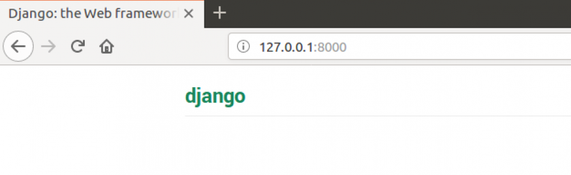

# URLs en Django

Estamos a punto de construir nuestra primera página web: ¡una página de inicio para el blog! Pero primero, vamos a aprender un poco acerca de las urls en Django.

## ¿Qué es una URL?

Una URL es una dirección de la web. Puedes ver una URL cada vez que visitas una página. Se ve en la barra de direcciones del navegador. (Sí! ¡`127.0.0.1:8000` es una URL! Y `https://djangogirls.org` también es una URL.)



Cada página en Internet necesita su propia URL. De esta manera tu aplicación sabe lo que debe mostrar a un usuario que abre una URL. En Django utilizamos algo que se llama `URLconf` (configuración de URL). URLconf es un conjunto de patrones que Django intentará comparar con la URL recibida para encontrar la vista correcta.

## ¿Cómo funcionan las URLs en Django?

Vamos a abrir el archivo `mysite/urls.py` en el editor de código de tu elección y veamos lo que tiene:

mysite/urls.py

```python
"""mysite URL Configuration

[...]
"""
from django.contrib import admin
from django.urls import path

urlpatterns = [
    path('admin/', admin.site.urls),
]
```

Como puedes ver, Django ya puso algo aquí por nosotros.

Líneas entre triples comillas (`'''` o `"""`) son llamadas docstrings - puedes escribirlos en la parte superior de un archivo, clase o método para describir lo que hace. No serán ejecutadas por Python.

La URL de admin, que hemos visitado en el capítulo anterior ya está aquí:

mysite/urls.py

```python
    path('admin/', admin.site.urls),
```

Esta linea dice que para cada URL que empieza con `admin/` Django encontrará su correspondiente *view*. En este caso estamos incluyendo muchas URLs admin así que no todo está empaquetado en este pequeño archivo. Es más limpio y legible.

## ¡Tu primera URL de Django!

¡Es hora de crear nuestra primera URL! Queremos que 'http://127.0.0.1:8000/' sea la página de inicio del blog y que muestre una lista de post.

También queremos mantener limpio el archivo `mysite/urls.py`, así que vamos a importar las urls de nuestra aplicación `blog` en el archivo principal `mysite/urls.py`.

Vamos, añade la línea para importar `blog.urls`. Tú también necesitarás cambiar la línea `desde django.urls...` porque estaremos usando la función `include` aquí, así que se necesitará añadir ese import a la línea.

El archivo `mysite/urls.py` debería verse ahora así:

mysite/urls.py

```python
from django.contrib import admin
from django.urls import path, include

urlpatterns = [
    path('admin/', admin.site.urls),
    path('', include('blog.urls')),
]
```

Ahora Django redirigirá todo lo que entre a 'http://127.0.0.1:8000/' hacia `blog.urls` y buscará más instrucciones allí.

## blog.urls

Crea un nuevo fichero vacío llamado `urls.py` el el directorio `blog`, y ábrelo en el editor de código. ¡Vale! Añade las dos primeras líneas:

blog/urls.py

```python
from django.urls import path
from . import views
```

Aquí estamos importando la función de Django `path` y todos nuestras `views` desde la aplicación `blog` (no tenemos una aun, pero veremos eso en un minuto!)

Luego de esto, podemos agregar nuestro primer patrón URL:

blog/urls.py

```python
urlpatterns = [
    path('', views.post_list, name='post_list'),
]
```

Como puedes ver, estamos asociando una vista (`view`) llamada `post_list` a la URL raíz. Este patrón de URL coincidirá con una cadena vacía y el solucionador de URL de Django ignorará el nombre de dominio (es decir, http://127.0.0.1:8000/) que prefija la ruta de URL completa. Este patrón le dirá a Django que `views.post_list` es el lugar correcto al que ir si alguien entra a tu sitio web con la dirección 'http://127.0.0.1:8000/'.

La última parte `name='post_list'` es el nombre de la URL que se utilizará para identificar a la vista. Puede coincidir con el nombre de la vista pero también puede ser algo completamente distinto. Utilizaremos las URL con nombre más delante en el proyecto así que es importante darle un nombre a cada URL de la aplicación. También deberíamos intentar mantener los nombres de las URL únicos y fáciles de recordar.

Si tratas de visitar http://127.0.0.1:8000/ ahora, encontrarás un mensaje de error 'web page not available' a algo así. Esto es porque el servidor (¿recuerdas que escribimos `runserver`?) ya no está funcionando. Mira la ventana de la consola del servidor para saber por qué.


La consola esta mostrando un error, pero no te preocupes - de hecho es muy útil: está diciendote que **no existe el atributo 'post_list'**. Ese es el nombre del *view* que Django está tratando de encontrar y usar, pero aun no lo hemos creado. En esta etapa tu `/admin/` tampoco funcionará. No te preocupes, ya llegaremos a eso. Si ves un error diferente, intenta reiniciar el servidor web. Para hacerlo, en la ventana de la consola que ejecuta el servidor web, deténgalo presionando Ctrl+C (las teclas juntas Control y C). En Windows, es posible que deba presionar Ctrl+Break. Luego, debe reiniciar el servidor web ejecutando un comando `python manage.py runserver`.

> Si quieres saber más sobre URLconfs de Django, mira la documentación oficial: https://docs.djangoproject.com/en/2.2/topics/http/urls/