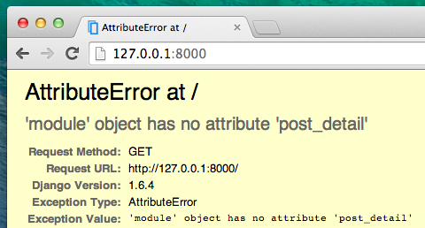

# Extiende tu aplicación

Ya hemos completado todos los pasos necesarios para la creación de nuestro sitio web: sabemos cómo escribir un model, url, view y template. También sabemos cómo hacer que nuestro sitio web se vea lindo.

¡Hora de practicar!

Lo primero que necesitamos en nuestro blog es, obviamente, una página para mostrar un post, ¿cierto?

We already have a `Post` model, so we don't need to add anything to `models.py`.

## Crea un enlace al detalle de una entrada

We will start with adding a link inside `blog/templates/blog/post_list.html` file. So far it should look like this: blog/templates/blog/post_list.html

```html



    
        <div class="post">
            <div class="date">
                {{ post.published_date }}
            </div>
            <h1><a href="">{{ post.title }}</a></h1>
            <p>{{ post.text|linebreaksbr }}</p>
        </div>
    

```

Queremos tener un enlace que vaya desde el título de la entrada en la lista de entradas hasta la página de detalle de la entrada. Vamos a cambiar `<h1><a href="">{{ post.title }}</a></h1>` para que enlace a la página de detalle de la entrada:

blog/templates/blog/post_list.html

```html
<h1><a href="">{{ post.title }}</a></h1>
```

Es hora de explicar el misterioso ``. Como probablemente sospeches, la notación `` significa que estamos utilizando Django template tags. ¡Esta vez vamos a usar una que creará una URL!

The `post_detail` part means that Django will be expecting a URL in `blog/urls.py` with name=post_detail

And how about `pk=post.pk`? `pk` is short for primary key, which is a unique name for each record in a database. Because we didn't specify a primary key in our `Post` model, Django creates one for us (by default, a number that increases by one for each record, i.e. 1, 2, 3) and adds it as a field named `pk` to each of our posts. We access the primary key by writing `post.pk`, the same way we access other fields (`title`, `author`, etc.) in our `Post` object!

Now when we go to http://127.0.0.1:8000/ we will have an error (as expected, since we do not yet have a URL or a *view* for `post_detail`). It will look like this:


## Crea una URL al detalle de una entrada

Let's create a URL in `urls.py` for our `post_detail` *view*!

Queremos que el detalle de la primera entrada se visualice en esta **URL**: http://127.0.0.1:8000/post/1/

Vamos a crear una URL en el fichero `blog/urls.py` que dirija a Django hacia una *vista* llamada `post_detail`, que mostrará una entrada de blog completa. Add the line `url(r'^post/(?P<pk>\d+)/$', views.post_detail, name='post_detail'),` to the `blog/urls.py` file. El fichero debería parecerse a esto:

blog/urls.py

```python
from django.conf.urls import url
from . import views

urlpatterns = [
    url(r'^$', views.post_list, name='post_list'),
    url(r'^post/(?P<pk>\d+)/$', views.post_detail, name='post_detail'),
]
```

This part `^post/(?P<pk>\d+)/$` looks scary, but no worries – we will explain it for you:

- it starts with `^` again – "the beginning".
- `post/` just means that after the beginning, the URL should contain the word **post** and a **/**. So far so good.
- `(?P<pk>\d+)` – this part is trickier. Significa que Django cogerá todo lo que pongas aquí y lo transferirá a una vista como una variable llamada `pk`. (Note that this matches the name we gave the primary key variable back in `blog/templates/blog/post_list.html`!) `\d` also tells us that it can only be a digit, not a letter (so everything between 0 and 9). `+` significa que ahí tiene que haber uno o más dígitos. So something like `http://127.0.0.1:8000/post//` is not valid, but `http://127.0.0.1:8000/post/1234567890/` is perfectly OK!
- `/` – then we need a **/** again.
- `$` – "the end"!

That means if you enter `http://127.0.0.1:8000/post/5/` into your browser, Django will understand that you are looking for a *view* called `post_detail` and transfer the information that `pk` equals `5` to that *view*.

OK, we've added a new URL pattern to `blog/urls.py`! Let's refresh the page: http://127.0.0.1:8000/ Boom! The server has stopped running again. Have a look at the console – as expected, there's yet another error!



¿Recuerdas cuál es el próximo paso? Por supuesto: ¡agregar una vista!

## Añade una vista de detalle de la entrada

This time our *view* is given an extra parameter, `pk`. Nuestra *vista* necesita recibirlo, ¿verdad? Así que definiremos nuestra función como `def post_detail (request, pk):`. Ten en cuenta que tenemos que usar exactamente el mismo nombre que especificamos en las urls (`pk`). ¡Omitir esta variable es incorrecto y resultará en un error!

Now, we want to get one and only one blog post. To do this, we can use querysets, like this:

blog/views.py

```python
Post.objects.get(pk=pk)
```

But this code has a problem. If there is no `Post` with the given `primary key` (`pk`) we will have a super ugly error!


¡No queremos eso! Pero, por supuesto, Django viene con algo que se encargará de ese problema por nosotros: `get_object_or_404`. In case there is no `Post` with the given `pk`, it will display much nicer page, the `Page Not Found 404` page.


La buena noticia es que puedes crear tu propia página `Page Not Found` y diseñarla como desees. Pero por ahora no es tan importante, así que lo omitiremos.

OK, time to add a *view* to our `views.py` file!

In `blog/urls.py` we created a URL rule named `post_detail` that refers to a view called `views.post_detail`. This means that Django will be expecting a view function called `post_detail` inside `blog/views.py`.

We should open `blog/views.py` and add the following code near the other `from` lines:

blog/views.py

```python
from django.shortcuts import render, get_object_or_404
```

And at the end of the file we will add our *view*:

blog/views.py

```python
def post_detail(request, pk):
    post = get_object_or_404(Post, pk=pk)
    return render(request, 'blog/post_detail.html', {'post': post})
```

Sí. Es hora de actualizar la página: http://127.0.0.1:8000/


¡Funcionó! Pero ¿qué pasa cuando haces click en un enlace en el título del post?


¡Oh no! ¡Otro error! Pero ya sabemos cómo lidiar con eso, ¿no? ¡Tenemos que añadir una plantilla!

## Create a template for the post details

We will create a file in `blog/templates/blog` called `post_detail.html`.

Se verá así:

blog/templates/blog/post_detail.html

```html



    <div class="post">
        
            <div class="date">
                {{ post.published_date }}
            </div>
        
        <h1>{{ post.title }}</h1>
        <p>{{ post.text|linebreaksbr }}</p>
    </div>

```

Una vez más estamos extendiendo `base.html`. En el bloque `content` queremos mostrar la fecha de publicación (si existe), título y texto de nuestros posts. Pero deberíamos discutir algunas cosas importantes, ¿cierto?

` ...` </code> is a template tag we can use when we want to check something. (Remember `if ... else ..` from **Introduction to Python** chapter?) In this scenario we want to check if a post's `published_date` is not empty.

OK, we can refresh our page and see if `TemplateDoesNotExist` is gone now.


¡Yay! ¡Funciona!

## Una cosa más: ¡Tiempo de despliegue!

Sería bueno verificar que tu sitio web aún funcionará en PythonAnywhere, ¿cierto? Intentemos desplegar de nuevo.

command-line

    $ git status
    $ git add --all .
    $ git status
    $ git commit -m "Added view and template for detailed blog post as well as CSS for the site."
    $ git push
    

Luego, en una [consola Bash de PythonAnywhere](https://www.pythonanywhere.com/consoles/)

command-line

    $ cd my-first-blog
    $ git pull
    [...]
    

Finally, hop on over to the [Web tab](https://www.pythonanywhere.com/web_app_setup/) and hit **Reload**.

¡Y eso debería ser todo! Felicidades :)