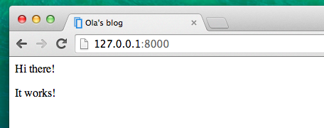

# Introducción a HTML

Te estarás preguntando, ¿qué es una plantilla?

A template is a file that we can re-use to present different information in a consistent format – for example, you could use a template to help you write a letter, because although each letter might contain a different message and be addressed to a different person, they will share the same format.

A Django template's format is described in a language called HTML (that's the HTML we mentioned in the first chapter, **How the Internet works**).

## ¿Qué es HTML?

HTML is a simple code that is interpreted by your web browser – such as Chrome, Firefox or Safari – to display a web page for the user.

HTML significa HyperText Markup Language - en español, Lenguaje de Marcas de HyperTexto. **HyperText** -hipertexto en español- significa que es un tipo de texto que soporta hipervínculos entre páginas. **Markup** significa que hemos tomado un documento y lo hemos marcado con código para decirle a algo (en este caso, un navegador) cómo interpretar la página. El código HTML está construido con **etiquetas**, cada una comenzando con `<` y terminando con `>`. These tags represent markup **elements**.

## ¡Tu primera plantilla!

Crear una plantilla significa crear un archivo de plantilla. Todo es un archivo, ¿verdad? Probablemente hayas notado esto ya.

Las plantillas se guardan en el directorio de `blog/templates/blog`. Así que primero crea un directorio llamado `templates` dentro de tu directorio blog. Luego crea otro directorio llamado `blog` dentro de tu directorio de templates:

    blog
    └───templates
        └───blog
    

(You might wonder why we need two directories both called `blog` – as you will discover later, this is simply a useful naming convention that makes life easier when things start to get more complicated.)

Y ahora crea un archivo `post_list.html` (déjalo en blanco por ahora) dentro de la carpeta `blog/templates/blog`.

Mira cómo se ve su sitio web ahora: http://127.0.0.1:8000/

> If you still have an error `TemplateDoesNotExist`, try to restart your server. Go into command line, stop the server by pressing Ctrl+C (Control and C keys together) and start it again by running a `python manage.py runserver` command.


¡Ningún error más! Felicidades :) Sin embargo, por ahora, tu sitio web no está publicando nada excepto una página en blanco, porque la plantilla también está vacía. Tenemos que arreglarlo.

Añade lo siguiente a tu archivo de plantilla:

blog/templates/blog/post_list.html

```html
<html>
    <p>Hi there!</p>
    <p>It works!</p>
</html>
```

So how does your website look now? Visit it to find out: http://127.0.0.1:8000/


¡Funcionó! Buen trabajo :)

* The most basic tag, `<html>`, is always the beginning of any web page and `</html>` is always the end. Como puedes ver, todo el contenido de la página web va desde el principio de la etiqueta `<html >` y hasta la etiqueta de cierre `</html >`
* `<p>` es una etiqueta para los elementos de párrafo; `</p>` cierra cada párrafo

## Head and body

Each HTML page is also divided into two elements: **head** and **body**.

* **head** es un elemento que contiene información sobre el documento que no se muestra en la pantalla.

* **body** es un elemento que contiene todo lo que se muestra como parte de la página web.

Usamos `<head>` para decirle el navegador acerca de la configuración de la página y `<body>` para decir lo que realmente está en la página.

For example, you can put a web page title element inside the `<head>`, like this:

blog/templates/blog/post_list.html

```html
<html>
    <head>
        <title>Ola's blog</title>
    </head>
    <body>
        <p>Hi there!</p>
        <p>It works!</p>
    </body>
</html>
```

Guarda el archivo y actualiza tu página.



¿Observas cómo el navegador ha comprendido que "Ola's blog" es el título de tu página? Ha interpretado `<title>Ola's blog</title>` y colocó el texto en la barra de título de tu navegador (también se utilizará para marcadores y así sucesivamente).

Probablemente también hayas notado que cada etiqueta de apertura coincide con una *etiqueta de cierre*, con un `/`, y que los elementos son *anidados* (es decir, no puedes cerrar una etiqueta particular hasta que todos los que estaban en su interior se hayan cerrado también).

Es como poner cosas en cajas. You have one big box, `<html></html>`; inside it there is `<body></body>`, and that contains still smaller boxes: `<p></p>`.

You need to follow these rules of *closing* tags, and of *nesting* elements – if you don't, the browser may not be able to interpret them properly and your page will display incorrectly.

## Personaliza tu plantilla

¡Ahora puedes divertirte un poco y tratar de personalizar tu plantilla! Aquí hay algunas etiquetas útiles para eso:

* `<h1>A heading</h1>` for your most important heading
* `<h2>Un subtítulo</h2>` - para el título del siguiente nivel
* `<h3>A sub-sub-heading</h3>` …and so on, up to `<h6>`
* `<p>A paragraph of text</p>`
* `<em>texto</em>` - pone en cursiva tu texto
* `<strong>texto</strong>` - pone en negrita tu texto
* `<br />` - un salto de línea (no puedes colocar nada dentro de br)
* `<a href="https://djangogirls.org">link</a>` creates a link
* `<ul><li>primer elemento</li><li>segundo elemento</li></ul>` - crea una lista, ¡igual que esta!
* `<div></div>` - define una sección de la página

Here's an example of a full template, copy and paste it into `blog/templates/blog/post_list.html`:

blog/templates/blog/post_list.html

```html
<html>
    <head>
        <title>Django Girls blog</title>
    </head>
    <body>
        <div>
            <h1><a href="">Django Girls Blog</a></h1>
        </div>

        <div>
            <p>published: 14.06.2014, 12:14</p>
            <h2><a href="">My first post</a></h2>
            <p>Aenean eu leo quam. Pellentesque ornare sem lacinia quam venenatis vestibulum. Donec id elit non mi porta gravida at eget metus. Fusce dapibus, tellus ac cursus commodo, tortor mauris condimentum nibh, ut fermentum massa justo sit amet risus.</p>
        </div>

        <div>
            <p>published: 14.06.2014, 12:14</p>
            <h2><a href="">My second post</a></h2>
            <p>Aenean eu leo quam. Pellentesque ornare sem lacinia quam venenatis vestibulum. Donec id elit non mi porta gravida at eget metus. Fusce dapibus, tellus ac cursus commodo, tortor mauris condimentum nibh, ut f.</p>
        </div>
    </body>
</html>
```

Aquí hemos creado tres secciones `div`.

* The first `div` element contains the title of our blog – it's a heading and a link
* Otros dos elementos `div` contienen nuestros posts con la fecha de publicación, `h2` con un título que es clickeable y dos `p` (párrafo) de texto, uno para la fecha y uno para nuestro post.

Nos da este efecto:


¡Yaaay! But so far, our template only ever displays exactly **the same information** – whereas earlier we were talking about templates as allowing us to display **different** information in the **same format**.

What we really want to do is display real posts added in our Django admin – and that's where we're going next.

## Una cosa más: ¡despliega!

Sería bueno ver todo esto disponible en Internet, ¿no? Hagamos otro despliegue en PythonAnywhere:

### Haz un commit y sube tu código a GitHub

En primer lugar, vamos a ver qué archivos han cambiado desde la última puesta en marcha (ejecute estos comandos localmente, no en PythonAnywhere):

command-line

    $ git status
    

Asegúrate de que estás en el directorio `djangogirls` y vamos a decirle a `git` que incluya todos los cambios dentro de este directorio:

command-line

    $ git add --all .
    

> **Note** `--all` means that `git` will also recognize if you've deleted files (by default, it only recognizes new/modified files). También recuerda (del capítulo 3) que `.` significa el directorio actual.

Antes de que subamos todos los archivos, vamos a ver qué es lo que `git` subirá (todos los archivos que `git` cargará deberían aparecer en verde):

command-line

    $ git status
    

Ya casi estamos, ahora es tiempo de decirle que guarde este cambio en su historial. Vamos a darle un "mensaje de commit" donde describimos lo que hemos cambiado. Puedes escribir cualquier cosa que te gustaría en esta etapa, pero es útil escribir algo descriptivo para que puedes recordar lo que has hecho en el futuro.

command-line

    $ git commit -m "Cambie el HTML para la página."
    

> **Nota** Asegúrate de usar comillas dobles alrededor del mensaje de commit.

Once we've done that, we upload (push) our changes up to GitHub:

command-line

    $ git push
    

### Descarga tu nuevo código a PythonAnywhere y actualiza tu aplicación web

* Abre la [página de consolas de PythonAnywhere](https://www.pythonanywhere.com/consoles/) y ve a tu **consola Bash** (o comienza una nueva). Luego, ejecuta:

command-line

    $ cd ~/my-first-blog
    $ git pull
    [...]
    

Y mira cómo tu código se descarga. Si quieres comprobar que ya ha terminado, puedes ir a la pestaña **Files** y ver tu código en PythonAnywhere.

* Finalmente, dirígete a la pestaña [Web](https://www.pythonanywhere.com/web_app_setup/) y selecciona **Reload** en tu aplicación web.

Your update should be live! Go ahead and refresh your website in the browser. Changes should be visible. :)