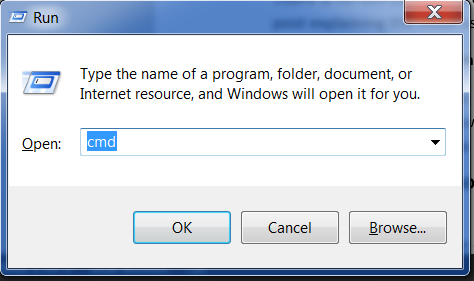

<!--sec data-title="Opening: Windows" data-id="windows_prompt" data-collapse=true ces-->

Dependiendo de tu versión de Windows y tu teclado, una de las opciones siguientes debería abrir una ventana de comandos (puede que necesites experimentar un poco, pero no se necesita probar todas estas sugerencias):

- Ve al menú o pantalla de Inicio, y escribe "Símbolo del Sistema" en el cuadro de búsqueda.
- Ve a Menú de inicio → Windows System → Command Prompt.
- Ve al menú de Inicio → Todos los Programas → Accessorios → Símbolo del Sistema.
- Ve a la pantalla de Inicio, pasa el ratón sobre la esquina inferior izquierda de la pantalla, y haz click en la flecha hacia abajo (en una pantalla táctil, desliza hacia arriba desde la parte baja de la pantalla). La página de la Aplicación debería abrirse. Haz click en Símbolo del Sistema en la sección Sistema de Windows.
- Mantén la tecla especial de Windows de tu teclado y pulsa "X". Elige "Símbolo del Sistema" del menú emergente.
- Mantén pulsada la tecla de Windows y pulsa "R" para abrir una ventana "Ejecutar". Escribe "cmd" en la caja, y haz click en OK.

Más adelante en este tutorial, necesitarás tener dos consolas de comandos abiertas a la misma vez. Sin embargo, en algunas versiones de Windows, si ya tienes abierta una ventana de comandos e intentas abrir otra usando el mismo método, simplemente maximizará la que ya tienes abierta. ¡Inténtalo ahora en tu ordenador y mira qué ocurre! Si solo se abre una ventana de comandos, intenta alguno de los otros métodos explicados anteriormente. Al menos uno de ellos debería abrir una nueva ventana de comandos.

<!--endsec-->

<!--sec data-title="Opening: macOS" data-id="macOS_prompt" data-collapse=true ces-->

Ve a Aplicaciones → Utilidades → Terminal.

<!--endsec-->

<!--sec data-title="Opening: Linux" data-id="linux_prompt" data-collapse=true ces-->

Probablemente se encuentre en Aplicaciones → Accesorios → Terminal, o Aplicaciones → Sistema → Terminal, aunque esto dependerá de tu sistema. Si no lo encuentras allí, intenta buscarlo en Google. :)

<!--endsec-->
