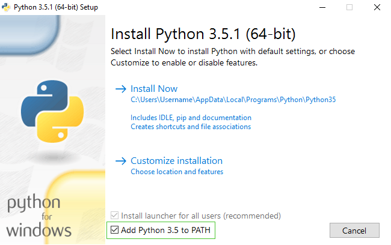

> Para lectores en casa: esta parte está cubierta en el video [Installing Python & Code Editor](https://www.youtube.com/watch?v=pVTaqzKZCdA).

> Esta sección está basada en un tutorial por Geek Girls Carrots (https://github.com/ggcarrots/django-carrots)

Django está escrito en Python. Necesitamos Python para hacer cualquier cosa en Django. ¡Vamos a empezar con la instalación! Queremos que instales Python 3.5, así que si tienes alguna versión anterior, deberás actualizarla.

<!--sec data-title="Windows" data-id="python_windows" data-collapse=true ces-->

Primero comprueba si tu computadora está corriendo una versión de 32-bit o una de 64-bit de Windows en https://support.microsoft.com/en-au/kb/827218. Puedes descargar Python para Windows desde el sitio web https://www.python.org/downloads/windows/. Haz click en link "Latest Python 3 Release - Python x.x.x". Si tu computadora está corriendo una versión de **64-bit** de Windows, descarga el **Windows x86-64 executable installer**. De lo contrario, descarga el **Windows x86 executable installer**. Luego de descargar el instalador, debes ejecutarlo (doble click en él) y seguir las instrucciones.

Algo para tener en cuenta: Durante la installación notarás una ventana llamada "Setup". Asegúrate de tildar la opción "Add Python 3.5 to PATH" y luego hacer click en "Install Now", como se muestra aquí:



En los siguientes pasos, vamos a usar la Línea de Comandos de Windows (ya te vamos a contar sobre ella). Por ahora, si necesitas escribir algún comando, ve a Menu → Todos los programas → Accesorios → Símbolo del sistema. También puedes mantener presionada la tecla de Windows y presionar la tecla "R" hasta que aparezca la ventanita "Run". Para abrir la Línea de Comandos de Windows, escribe "cmd" y presiona `intro` la ventana "Run" (en las nuevas veriones de Windows, quizás tengas que buscar "Línea de Comandos" ya que a veces está escondido)


Nota: si estás usando una versión más vieja de Windows (7, Vista o cualquiera más vieja) y el instalador de Python 3.5.x falla con un error, puedes probar lo siguiente:
1. instala todos las Actualizaciones de Windows y prueba volver a instalar Python 3.5
2. instala una [versión más vieja de Python](https://www.python.org/downloads/windows/), por ejemplo la [3.4.4](https://www.python.org/downloads/release/python-344/).

Si instalas una versión más vieja de Python, es posible que la pantalla del instalador se vea un poquito diferente que la mostrada anteriormente. Asegúrate de ir hacia el final y ver "Add python.exe to Path", luego hacer click en el botón y seleccionar "Will be installed on local hard drive":


<!--endsec-->

<!--sec data-title="OS X" data-id="python_OSX"
data-collapse=true ces-->

> **Note** Antes de que instales Python en OS X, debes asegurarte de que las configuraciones de tu Mac te permitan instalar paquetes que no son del App Store. Ve a Preferencias del Sistema (está en la carpeta Aplicaciones), haz click en "Seguridad y Privacidad", y luego en la pestaña "General". Si yo "Permitir aplicaciones descargadas desde:" está configurado como "Mac App Store", cámbialo a "Mac App Store and identified developers"

Necesitas ir a la página web https://www.python.org/downloads/release/python-351/ y descargar el instalador de Python:

* Descarga el archivo *Mac OS X 64-bit/32-bit installer*,
* Haz doble click en *python-3.5.1-macosx10.6.pkg* para ejecutar el instalador.

<!--endsec-->

<!--sec data-title="Linux" data-id="python_linux"
data-collapse=true ces-->

Es muy posible que ya tengas Python instalado de serie. Para verificar que ya lo tienes instalado (y qué versión es), abre una consola y escribe el siguiente comando:

command-line
```
$ python3 --version
Python 3.5.1
```

Si tienes una 'micro versión' diferente de Python instalado, por ejemplo 3.5.0, no necesitas actualizar. Si no tienes instalado Python o si deseas una versión diferente, puedes instalarla de la siguiente manera:

<!--endsec-->

<!--sec data-title="Debian or Ubuntu" data-id="python_debian"
data-collapse=true ces-->

Escribe este comando en tu consola:

command-line
```
$ sudo apt-get install python3.5
```


<!--endsec-->

<!--sec data-title="Fedora (up to 21)" data-id="python_fedora"
data-collapse=true ces-->

Usa este comando en tu consola:

command-line
```
$ sudo yum install python3
```

<!--endsec-->

<!--sec data-title="Fedora (22+)" data-id="python_fedora22"
data-collapse=true ces-->

Usa este comando en tu consola:

command-line
```
$ sudo dnf install python3
```

<!--endsec-->

<!--sec data-title="openSUSE" data-id="python_openSUSE"
data-collapse=true ces-->

Use this command in your console:

command-line
```
$ sudo zypper install python3
```

<!--endsec-->

Verifica que la instalación fue correcta abriendo la aplicación de *Terminal* y ejecutando el comando `python3`:

command-line
```
$ python3 --version
Python 3.5.1
```

**NOTA:** Si estás en Windows y obtienes un mensaje de error diciendo `python3` no se reconoce como comando, intenta con `python` (sin el `3`) y comprueba si todavía es una versión de Python 3.5.

----

Si tienes alguna duda o si algo salió mal y no sabes cómo resolverlo - ¡pide ayuda a tu tutor! A veces las cosas no van bien y que es mejor pedir ayuda a alguien con más experiencia.
