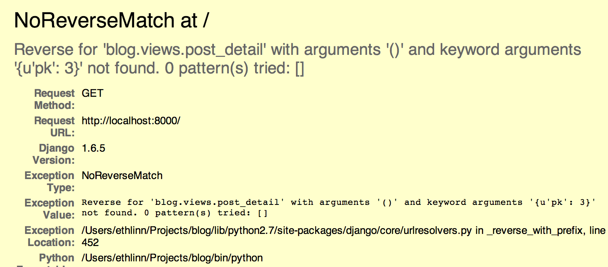
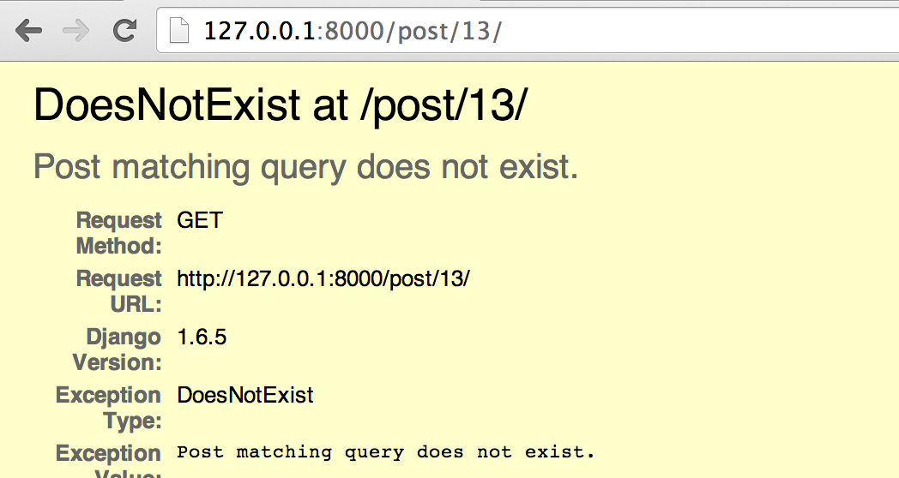
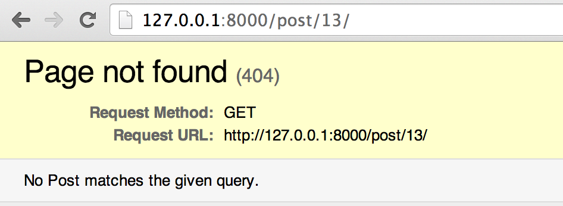
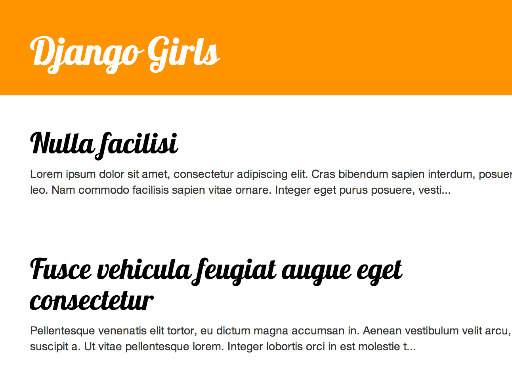
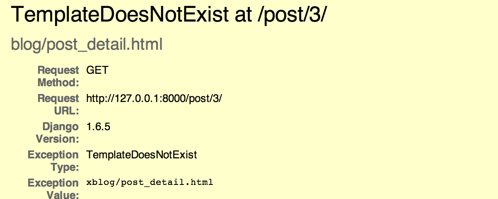

# Extend your application

We've' already completed all the different steps necessary for the creation of our website: we know how to write a model, url, view and template. We also know how to make our website pretty.

Time to practice!

First thing neccesary in our blog is obviously a page that display one post, right?

We already have a `Post` model, so we don't need to add anything to `models.py`.

## Create a link in the template

We will start with adding a link inside `post_list.html` (in `blog/template/blog` directory) file. So far it should look like:

    <html>
        <head>
            <title>Django Girls blog</title>
        </head>
        <body>
            

                <h1>{{ post.title }}</h1>
                
{{ post.text|truncatechars:200 }}

            

        </body>
    </html>

We want to have a link to a post detail page on the post's title. Let's change `<h1>{{ post.title }}</h1>` with a link:

    <h1><a href="">{{ post.title }}</a></h1>

Time to explain mysterious ``. As you suspect `` notation means that we are using Django template tags. This time we will use one that will create a URL for us!

`blog.views.post_detail` is a path to a `post_detail` view we want to create. Please note: `blog` is the name of our application (in folder `blog`), `views` is from the name of the `views.py` file and the last bit: `post_detail` is the name of the view.

Now when we go to:

    http://127.0.0.1:8000/

we will have an error (as suspected, since we don't have a url or a view for `post_detail`). It will look like this:

Let's create a url in `urls.py` for our `post_detail` view!

### URL: http://127.0.0.1:8000/post/1/

We now want to create a URL to point Django to a view called `post_detail`, that will show an entire blog post. Add the line `url(r'^post/(?P<pk>[0-9]+)/$', views.post_detail),` to the `urls.py` file. It should look like this:

    from django.conf.urls import patterns, include, url

    from django.contrib import admin
    admin.autodiscover()

    urlpatterns = patterns('',
        url(r'^$', views.post_list),
        url(r'^post/(?P<pk>[0-9]+)/$', views.post_detail),
    )

That one looks scary, but no worries - we will explain it for you:
- it's starts with `^` again -- "the beginning"
- `post/` only means that after the beginning, the URL should contain the word __post__ and __/__. So far so good.
- `(?P<pk>[0-9]+)` - this part is trickier. It means that Django will take everything that you'll place here and transfer it to a view as a variable called `pk`. `[0-9]` also tells us that it can only be a number, not a letter (so everything between 0 and 9). `+` means that there needs to be one or more digits there. So something like `http://127.0.0.1:8000/post//` is not valid, but `http://127.0.0.1:8000/post/1234567890/` is perfectly ok!
- `/` - then we need __/__ again
- `$` - "the end"!

That means if you enter `http://127.0.0.1:8000/post/5/` into your browser, Django will understand that you look for a view called `post_detail` and transfer the information that `pk` equals `5`.

`pk` is shortcut from `primary key`. This name is very often used in many Django projects. But you can name your variable as you like (remember: lowercase and `_` instead of whitespaces!). For example instead of `(?P<pk>[0-9]+)` we could have variable `post_id`, so this bit would look like: `(?P<post_id>[0-9]+)`.

Ok! Let's refresh the page:

    http://127.0.0.1:8000/

Boom! Yet another error! As expected!

Do you remember what the next step is? Of course: adding a view!

## post_detail view

This time our view is given an extra parameter `pk`. Our view needs to catch it, right? So we will define our function as `def post_detail(request, pk):`. Note that we need to use exactly the same name as the one we specified in urls (`pk`). Ommiting this variable is also incorrect!

Now, we want to get one and only one blog post. To do this we can use querysets like this:

    Post.objects.get(pk=pk)

But this code has a problem. If there is no `Post` with given `primary key` we will have super ugly error!

We don't want it! But, of course, Django comes with something that will handle that for us: `get_object_or_404`. In case there is no `Post` with given `pk` it will display much nicer page (called `Page Not Found 404` page).

The good news is that you actually can create your own `Page not found` page and make it as pretty as you want. But it's not super important right now, so we will skip it.

Ok, time to add a view to our `views.py` file!

We should open `blog/views.py` and add the following code:

    from django.shortcuts import render, get_object_or_404

Near other `from` lines. And at the end of the file we will add our view:

    def post_detail(request, pk):
        post = get_object_or_404(Post, pk=pk)
        return render(request, 'blog/post_detail.html', {'post': post})

Yes. It is time to refresh the page:

    http://127.0.0.1:8000/

It worked! But what happens when you click a link in blog post title?

Oh no! Error once again. But we already know how to deal with it, right? We need to add a template!

We will create a file in `blog/template/blog` called `post_detail.html`.

It will look like this:

    

    
        

            
                {{ post.published_date }}
            
        

        <h1>{{ post.title }}</h1>
        
{{ post.text }}

    

Once again we are extending `base.html`. In `content` block we want to display a post's published_date (if it exists), title and text. But we should discuss some important things, right?

` ... ` is a templatetag we can use when we want to check something. In this scenario we want to check if a post's `published_date` is not empty.

Ok we can refresh our page and see if `Page not found` is gone now.

Yay! It works!

You should be proud of yourself!

