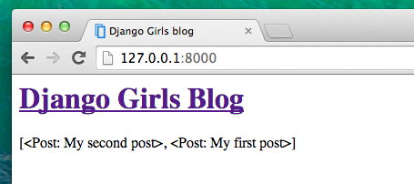
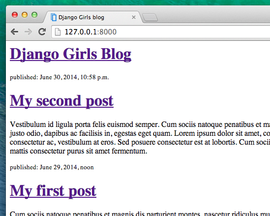

# templates در جنگو

وقت آن است که داده‌ها را در وبسایت نمایش دهیم. جنگو چندین **template tag** مفید در اختیار ما قرار می‌دهد.

## template tag چیست؟

میدانیم که در کدهای HTML نمی‌توانیم از کد های پایتون استفاده کنیم،به این دلیل که مرورگر نمی‌تواند کد پایتون را درک کند. مرورگرها فقط HTML را می‌فهمند. همینطور می‌دانیم که HTML ایستا است، در حالی که پایتون بسیار پویاتر است.

** template tags در جنگو ** ما را قادر می‌سازد تا اشیا پایتونی را به HTML انتقال دهیم، بنابراین شما می‌توانید با سرعت بیشتری وبسایت‌های پویا توسعه دهید. چه خوب!

## نمایش دادن قالب لیست پست‌های وبلاگ

در بخش قبلی، ما لیستی از پست‌ها را در قالب متغیر `posts` به template دادیم. حالا آن را به وسیله HTML نمایش می‌دهیم.

برای چاپ یک متغیر در template های جنگو، نام متغیر را درون دو جفت آکولاد قرار می دهیم. مانند کد زیر:

blog/templates/blog/post_list.html

```html
{{ posts }}
```

این مورد را در قالب `blog/templates/blog/post_list.html` امتحان کنید. آن را در ویرایشگر کد باز کنید، و هر چیزی از دومین `<div>` تا سومین `</div>` را با `{{ posts }}` جایگزین کنید. فایل را ذخیره کنید، و صفحه را برای دیدن نتیجه refresh کنید:



همینطوری که مشاهده می‌کنید، تمام چیزی که به دست آورده‌ایم این است:

blog/templates/blog/post_list.html

```html
<QuerySet [<Post: My second post>, <Post: My first post>]>
```

این به معنای آن است که جنگو این متغیر را به عنوان لیستی از اشیا در نظر می‌گیرد. آیا از بخش **معرفی پایتون** بخاطر دارید که چگونه می‌توانیم لیست‌ها را نمایش دهیم؟ بله، با حلقه for ! در یک template جنگو شما این کار را به صورت زیر انجام خواهید داد:

blog/templates/blog/post_list.html

```html

    {{ post }}

```

این کار را در template خود امتحان کنید.


کار میکند! اما ما میخواهیم تا پست ها مانند پست های ایستایی که پیش از این در بخش **معرفی HTML** ساختیم، نمایش داده شود. میتوانید HTML و template tag را با هم استفاده کنید. قسمت `body` به صورت زیر خواهد بود:

blog/templates/blog/post_list.html

```html
<header>
    <h1><a href="/">Django Girls Blog</a></h1>
</header>


    <article>
        <time>published: {{ post.published_date }}</time>
        <h2><a href="">{{ post.title }}</a></h2>
        <p>{{ post.text|linebreaksbr }}</p>
    </article>

```

 هر چیزی که بین `` و `` قرار می‌دهید، برای هر شی در لیست تکرار می‌شود. صفحه خود را refresh کنید: 



آیا توجه کردید که این بار از نشانه گذاری متفاوتی استفاده کردیم؟ (`{{ post.title }}` یا `{{ post.text }}`)؟ ما در حال دسترسی به داده‌های موجود در هر فیلد تعریف شده در مدل `Post` هستیم. همچنین، `|linebreaksbr` متن پست‌ها را از فیلتری رد می‌کند که line-break ها را به پاراگراف تبدیل می‌کند.

## یک مورد دیگر

خوب است اگر بدانیم وب سایت شما روی اینترنت عمومی نیز به درستی کار می‌کند یا نه، درست است؟ بیایید تا دوباره انتشار آن را روی PythonAnywhere امتحان کنیم. خلاصه‌ای از مراحل در زیر آورده شده‌ است…

* ابتدا کد خود را روی گیتهاب push کنید

command-line

    $ git status
    [...]
    $ git add .
    $ git status
    [...]
    $ git commit -m "Modified templates to display posts from database."
    [...]
    $ git push
    

* سپس دوباره به [PythonAnywhere](https://www.pythonanywhere.com/consoles/) وارد شوید و به **Bash console** خود بروید ( یا یک کنسول خط فرمان جدید باز کنید)، و دستورات زیر را اجرا کنید:

PythonAnywhere command-line

    $ cd <your-pythonanywhere-domain>.pythonanywhere.com
    $ git pull
    [...]
    

(به خاطر داشته باشید `<your-pythonanywhere-domain>` را با زیردامنه PythonAnywhere خود جایگزین کنید، بدون علامت های <>)

* سرانجام، به برگه ["Web" page](https://www.pythonanywhere.com/web_app_setup/) بروید و **Reload** را انتخاب کنید. (برای رسیدن به سایر صفحات در PythonAnywhere از دکمه منو در سمت بالا و راست صفحه استفاده کنید.) به روز رسانی شما باید در آدرس https://subdomain.pythonanywhere.com موجود باشد در مرورگر خود آن را امتحان کنید! اگر پست‌های وبلاگی شما در PythonAnywhere با پست‌های شما در سرور فعال روی کامپیوترتان یکی نیست، نگران نباشید همه چیز مرتب است. پایگاه داده موجود روی کامپیوتر شما و PythonAnywhere، برخلاف سایر فایل‌های شما، با یکدیگر یکسان سازی نمی‌شوند و یکی نیستند.

تبریک! حالا سعی کنید که یک پست جدید از طریق پنل مدیریت جنگو (به یاد دارید که published_date را اضافه کردیم) اضافه کنید مطمئن شوید که در بخش مدیریت جنگو در وبسایت PythonAnywhere باشید، https://subdomain.pythonanywhere.com/admin. سپس صفحه خود را دوباره بارگزاری کنید و ببینید آیا پست جدید به آن اضافه شده است.

جذاب نیست؟ به شما افتخار می‌کنیم! کمی از کامپیوتر خود دور شوید، لازم است کمی استراحت کنید. :)

