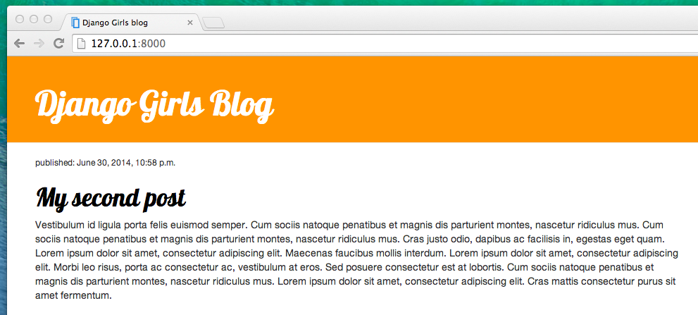

# CSS - Rendez votre site joli !

Soyons honnêtes : notre blog est plutôt moche, non ? Un peu de CSS devrait nous permettre d'arranger ça !

## Qu'est-ce que le CSS ?

Les feuilles de style (CSS : Cascading Style Sheets) sont un langage utilisé pour décrire l'apparence et la disposition d'un site écrit en langage de balisage (comme HTML). Considérez-le comme le maquillage de notre page web. ;)

Mais on ne souhaite pas repartir de zéro. Une fois de plus, nous utiliserons quelque chose que les programmeurs ont publié gratuitement sur Internet. Réinventer la roue n'est pas amusant, n'est-ce pas ?

## Utilisons Bootstrap !

Bootstrap est l'un des frameworks HTML/CSS les plus populaires pour développer de beaux sites web : https://getbootstrap.com/

Il a été créé par d'anciens développeurs de Twitter. Il est maintenant développé par des bénévoles aux quatre coins du monde !

## Installer Bootstrap

Pour installer Bootstrap, ouvrez votre fichier `.html` dans l'éditeur de code et ajoutez cela à la section `<head>` :

blog/templates/blog/post_list.html

```html
<link rel="stylesheet" href="//maxcdn.bootstrapcdn.com/bootstrap/3.2.0/css/bootstrap.min.css">
<link rel="stylesheet" href="//maxcdn.bootstrapcdn.com/bootstrap/3.2.0/css/bootstrap-theme.min.css">
```

Cela n'ajoute pas de fichier à votre projet, mais crée seulement un lien vers des fichiers existant sur internet. Allez-y, ouvrez votre site web et rafraichissez la page. Et voilà !


C'est déjà un peu mieux !

## Les fichiers statiques dans Django

Enfin, allons jeter un coup d'œil à ces **fichiers statiques** dont nous n'arrêtons pas de vous parler. Les fichiers statiques correspondent à tous vos CSS et vos images. Leur contenu ne dépend pas du contexte de la requête et sera le même pour tous les utilisateurs.

### Où ranger les fichiers statiques dans Django ?

Django sait déjà où trouver les fichiers statiques pour l'application "admin" intégrée. Maintenant, nous devons ajouter quelques fichiers statiques pour notre propre application, `blog`.

Pour cela, nous allons créer un dossier appelé `static` à l'intérieur de notre appli blog :

    djangogirls
    ├── blog
    │   ├── migrations
    │   ├── static
    │   └── templates
    └── mysite


Django va rechercher automatiquement tous les dossiers dits "statiques" à l'intérieur de vos dossiers d'appli. Ensuite, il sera en mesure d'utiliser leur contenu sous forme de fichiers statiques.

## Votre premier fichier CSS !

Nous allons maintenant créer un fichier CSS afin de personnaliser votre page. Créez un nouveau dossier appelé `css` à l'intérieur de votre dossier `static`. Ensuite, créez un nouveau fichier appelé `blog.css` à l'intérieur du dossier `css`. Vous êtes prêt ?

    djangogirls
    └─── blog
         └─── static
              └─── css
                   └─── blog.css

Et c'est parti pour un peu de CSS ! Ouvrez le fichier `blog/static/css/blog.css` dans votre éditeur de texte.

Nous n'irons pas trop loin dans la personnalisation et l'apprentissage du CSS ici. Il y a à la fin de cette page une recommandation pour un cours CSS gratuit si vous souhaitez en savoir plus.

Que pourrions-nous faire rapidement ? Pourquoi ne pas changer la couleur de notre en-tête ? Pour indiquer la couleur que nous souhaitons utiliser, nous devons utiliser un code particulier. Ce code commence par un `#` suivi de 6 lettres (A-F) et chiffres (0-9). Par exemple, le code pour du bleu est `#0000FF`. Afin de trouver le code associé à la couleur de votre choix, vous pouvez consulter le site http://www.colorpicker.com/. Vous pouvez aussi utiliser des [couleurs prédéfinies](http://www.w3schools.com/colors/colors_names.asp), comme `red` ou `green`.

Dans votre fichier `blog/static/css/blog.css`, ajoutez le code suivant :

blog/static/css/blog.css

```css
h1 a, h2 a {
    color: #C25100;
}

```

`h1 a` est un sélecteur CSS. Cela signifie que nous allons appliquer nos styles à tout élément `a` qui se trouve dans un élément `h1` ; le sélecteur `h2 a` fait la même chose pour les éléments `h2`. Donc lorsque nous avons quelque chose comme `<h1><a href="">lien</a></h1>`, le style `h1 a` est appliqué. Dans notre cas, nous indiquons de changer sa couleur en `#C25100`, c'est à dire en orange foncé. Ou vous pouvez mettre votre propre couleur ici, mais assurez-vous qu’il contraste bien avec le fond blanc !

Un fichier CSS permet de déterminer le style des éléments présents dans un fichier HTML. La première façon pour identifier des éléments, c'est avec leur nom d'élément. Vous vous en souviendrez car ces noms proviennent des balises HTML. Exemple : `a`, `h1` et `body` sont tous des noms d'élément. Vous pouvez aussi identifier les éléments par leur attribut `class` ou `id`. La classe et l'identifiant sont des noms que vous choisissez vous-même. Les classes définissent des groupes d'éléments tandis que les identifiants pointent un élément spécifique. Par exemple, vous pouvez identifier la ligne suivant par le nom `a`, la classe `.external_link`, ou l'identifiant `#link_to_wiki_page` :

```html
<a href="https://en.wikipedia.org/wiki/Django" class="external_link" id="link_to_wiki_page">
```

Apprenez-en plus à propos des [Sélecteurs CSS sur W3Schools](http://www.w3schools.com/cssref/css_selectors.asp).

Nous devons aussi dire à notre modèle HTML que nous avons utilisé un peu de CSS. Ouvrez le fichier `blog/templates/blog/post_list.html` dans l'éditeur de code et ajoutez cette ligne au tout début :

blog/templates/blog/post_list.html

```html

```

On vient tout juste de charger les fichiers statiques :). Entre les balises `<head>` et `</head>`, après les liens vers les fichiers CSS de Bootstrap, ajoutez cette ligne :

blog/templates/blog/post_list.html

```html
<link rel="stylesheet" href="">
```

Le navigateur lit les fichiers dans l'ordre où ils sont donnés, donc nous devons nous assurer que c'est dans le bon endroit. Dans le cas contraire, le code dans notre fichier peut être écrasé par le code des fichiers Bootstrap. Nous venons simplement de dire à notre template où trouver notre fichier CSS.

Maintenant, votre fichier doit ressembler à ceci :

blog/templates/blog/post_list.html

```html

<html>
    <head>
        <title>Django Girls blog</title>
        <link rel="stylesheet" href="//maxcdn.bootstrapcdn.com/bootstrap/3.2.0/css/bootstrap.min.css">
        <link rel="stylesheet" href="//maxcdn.bootstrapcdn.com/bootstrap/3.2.0/css/bootstrap-theme.min.css">
        <link rel="stylesheet" href="">
    </head>
    <body>
        <div>
            <h1><a href="/">Django Girls Blog</a></h1>
        </div>

        
            <div>
                <p>published: {{ post.published_date }}</p>
                <h2><a href="">{{ post.title }}</a></h2>
                <p>{{ post.text|linebreaksbr }}</p>
            </div>
        
    </body>
</html>
```

Ok, on sauvegarde et on rafraîchit la page !


Bravo ! Peut-être que nous pourrions aérer un peu notre page web en augmentant la marge du côté gauche ? Essayons pour voir !

blog/static/css/blog.css

```css
body {
    padding-left: 15px;
}
```

Ajoutez ceci à votre CSS, enregistrez le fichier et regarder comment cela fonctionne !


Et si nous changions aussi la police de caractères de notre entête ? Collez ceci dans le `<head>` de votre fichier `blog/templates/blog/post_list.html` :

blog/templates/blog/post_list.html

```html
<link href="//fonts.googleapis.com/css?family=Lobster&subset=latin,latin-ext" rel="stylesheet" type="text/css">
```

Comme précédemment, vérifiez l'ordre et placez le avant `blog/static/css/blog.css`. Cette ligne importera une police appelée *Lobster* à partir de Google Fonts (https://www.google.com/fonts).

Retrouvez le bloc de règles `h1 a` (délimité par les accolades `{` `}`) dans le fichier css `blog/static/css/blog.css`. Ajoutez maintenant la ligne `font-family; 'Lobster',` dans les accolades et rafraîchissez la page :

blog/static/css/blog.css

```css
h1 a, h2 a {
    color: #C25100;
    font-family: 'Lobster';
}
```


Super !

Comme mentionné ci-dessus, CSS a un concept de classe. Ce concept vous permet de nommer une partie de code HTML et d'y appliquer des styles, uniquement pour cette partie, sans affecter le reste. Cela peut être très utile ! Peut-être que vous avez deux divs qui sont en train de faire quelque chose de différent (comme votre en-tête et votre contenu). Une classe peut vous aider à leur donner un aspect différent.

Allons donner des noms à certaines parties de notre code html. Ajouter la classe `page-header` à votre `div` qui contient votre en-tête. Votre fichier doit ressembler maintenant à ceci :

blog/templates/blog/post_list.html

```html
<div class="page-header">
    <h1><a href="/">Django Girls Blog</a></h1>
</div>
```

Maintenant, ajoutez la classe `post` à votre `div` contenant votre billet de blog.

blog/templates/blog/post_list.html

```html
<div class="post">
    <p>published: {{ post.published_date }}</p>
    <h2><a href="">{{ post.title }}</a></h2>
    <p>{{ post.text|linebreaksbr }}</p>
</div>
```

Nous allons maintenant ajouter des blocs de règles aux différents sélecteurs. Les sélecteurs qui commencent par `.` désignent des classes. De nombreux tutoriels et explications sur le CSS existent sur le Web, cela pourra vous aider qui à comprendre le code suivant. Pour le moment, copiez et collez-le dans votre fichier `blog/static/css/blog.css` :

blog/static/css/blog.css

```css
.page-header {
    background-color: #C25100;
    margin-top: 0;
    padding: 20px 20px 20px 40px;
}

.page-header h1, .page-header h1 a, .page-header h1 a:visited, .page-header h1 a:active {
    color: #ffffff;
    font-size: 36pt;
    text-decoration: none;
}

.content {
    margin-left: 40px;
}

h1, h2, h3, h4 {
    font-family: 'Lobster', cursive;
}

.date {
    color: #828282;
}

.save {
    float: right;
}

.post-form textarea, .post-form input {
    width: 100%;
}

.top-menu, .top-menu:hover, .top-menu:visited {
    color: #ffffff;
    float: right;
    font-size: 26pt;
    margin-right: 20px;
}

.post {
    margin-bottom: 70px;
}

.post h2 a, .post h2 a:visited {
    color: #000000;
}
```

Nous allons maintenant nous intéresser au code concernant les posts. Il va falloir remplacer le code le code suivant :

blog/templates/blog/post_list.html

```html

    <div class="post">
        <p>published: {{ post.published_date }}</p>
        <h2><a href="">{{ post.title }}</a></h2>
        <p>{{ post.text|linebreaksbr }}</p>
    </div>

```

se trouvant dans le fichier `blog/templates/blog/post_list.html` par :

blog/templates/blog/post_list.html

```html
<div class="content container">
    <div class="row">
        <div class="col-md-8">
            
                <div class="post">
                    <div class="date">
                        <p>published: {{ post.published_date }}</p>
                    </div>
                    <h2><a href="">{{ post.title }}</a></h2>
                    <p>{{ post.text|linebreaksbr }}</p>
                </div>
            
        </div>
    </div>
</div>
```

Sauvegardez les fichiers modifiés et rafraîchissez votre page.



Woohoo ! Ça a l'air génial, non ? Intéressez-vous au code que nous venons juste de coller pour trouver quelles règles CSS sont appliquées aux sélecteurs HTML que nous avons nommés précédemment. Où feriez-vous le changement si l'on souhaite mettre la date en turquoise ?

N'ayez pas peur de bricoler un peu le CSS et essayer de changer certaines choses. Jouer avec le CSS peut vous aider à comprendre comment et qui agit sur quoi. Si vous cassez quelque chose, ne vous inquiétez pas – vous pouvez toujours faire marche arrière !

Nous vous recommandons chaudement de suivre les cours en ligne "Basic HTML & HTML5" et "Basic CSS" sur [freeCodeCamp](https://learn.freecodecamp.org/). Ils vous aideront à en apprendre plus sur le sujet et à créer de magnifiques sites web avec HTML et CSS.

Prêt pour le chapitre suivant ? :)
