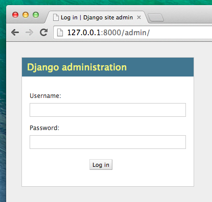
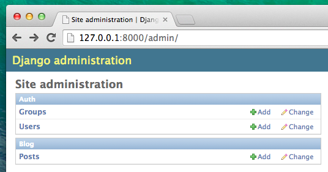

# Django admin

To add, edit and delete the posts we've just modeled, we will use Django admin.

Let's open the `blog/admin.py` file and replace its contents with this:

blog/admin.py

```python
from django.contrib import admin
from .models import Post

admin.site.register(Post)
```

Comme vous pouvez le voir, nous importons le modèle « Post » que nous avons écrit dans le chapitre précédent. Afin que notre modèle soit visible dans l'interface d'administration, nous avons besoin d'enregistrer notre modèle à l'aide de `admin.site.register(Post)`.

Voilà, il est temps de jeter un œil à notre modèle Post. N'oubliez pas d'exécuter `python manage.py runserver` dans votre console afin de lancer le serveur web. Go to your browser and type the address http://127.0.0.1:8000/admin/. Vous verrez une page de login qui ressemble à celle-ci :



To log in, you need to create a *superuser* - a user account that has control over everything on the site. Go back to the command line, type `python manage.py createsuperuser`, and press enter.

> Remember, to write new commands while the web server is running, open a new terminal window and activate your virtualenv. We reviewed how to write new commands in the **Your first Django project!** chapter, in the **Starting the web server** section.

Mac OS X or Linux:

    (myvenv) ~/djangogirls$ python manage.py createsuperuser
    

Windows:

    (myvenv) C:\Users\Name\djangogirls> python manage.py createsuperuser
    

When prompted, type your username (lowercase, no spaces), email address, and password. **Don't worry that you can't see the password you're typing in – that's how it's supposed to be.** Just type it in and press `enter` to continue. The output should look like this (where the username and email should be your own ones):

    Username: admin
    Email address: admin@admin.com
    Password:
    Password (again):
    Superuser created successfully.
    

Return to your browser. Log in with the superuser's credentials you chose; you should see the Django admin dashboard.



Go to Posts and experiment a little bit with it. Add five or six blog posts. Don't worry about the content – you can simply copy-paste some text from this tutorial to save time. :)

Make sure that at least two or three posts (but not all) have the publish date set. It will be helpful later.


If you want to know more about Django admin, you should check Django's documentation: https://docs.djangoproject.com/en/1.11/ref/contrib/admin/

This is probably a good moment to grab a coffee (or tea) or something to eat to re-energize yourself. You created your first Django model – you deserve a little break!