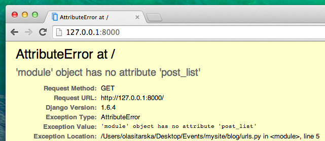

# Django URLs

We're about to build our first webpage: a homepage for your blog! But first, let's learn a little bit about Django URLs.

## Qu'est-ce qu'une URL ?

Une URL est simplement une adresse web. You can see a URL every time you visit a website – it is visible in your browser's address bar. (Yes! `127.0.0.1:8000` est aussi une URL ! And `https://djangogirls.org` is also a URL.)


Chaque page internet a besoin de sa propre URL. This way your application knows what it should show to a user who opens that URL. Dans Django, nous utilisons un outil appelé `URLconf` (configuration des URLs) : URLconf is a set of patterns that Django will try to match with the requested URL to find the correct view.

## Comment les URLs fonctionnent-elles dans Django ?

Ouvrons le fichier `mysite/urls.py` dans notre éditeur de code et regardons à quoi il ressemble :

mysite/urls.py

```python
"""mysite URL Configuration

[...]
"""
from django.conf.urls import url
from django.contrib import admin

urlpatterns = [
    url(r'^admin/', admin.site.urls),
]
```

As you can see, Django has already put something here for us.

Lines between triple quotes (`'''` or `"""`) are called docstrings – you can write them at the top of a file, class or method to describe what it does. They won't be run by Python.

The admin URL, which you visited in previous chapter, is already here:

mysite/urls.py

```python
    url(r'^admin/', admin.site.urls),
```

This line means that for every URL that starts with `admin/`, Django will find a corresponding *view*. In this case we're including a lot of admin URLs so it isn't all packed into this small file – it's more readable and cleaner.

## Regex

Vous vous demandez sûrement comment Django arrive à faire correspondre les URLs aux vues correspondantes ? Bon, on respire un grand coup car ça va être un peu complexe. Django utilise des `regex` ("expressions régulières"). Les regex ont beaucoup (vraiment beaucoup ! ) de règles qui permettent de donner une description de la chaine de caractères que l'on recherche (pattern). Étant donné que les regex sont un sujet avancé, nous ne rentrerons pas en détail dans leur fonctionnement.

If you still wish to understand how we created the patterns, here is an example of the process – we will only need a limited subset of the rules to express the pattern we are looking for, namely:

* `^` for the beginning of the text
* `$` for the end of the text
* `\d` for a digit
* `+` to indicate that the previous item should be repeated at least once
* `()` to capture part of the pattern

Anything else in the URL definition will be taken literally.

Now imagine you have a website with the address like `http://www.mysite.com/post/12345/`, where `12345` is the number of your post.

Ce serait vraiment pénible de devoir écrire une vue différente pour chaque post que nous aimerions rédiger. With regular expressions, we can create a pattern that will match the URL and extract the number for us: `^post/(\d+)/$`. Let's break this down piece by piece to see what we are doing here:

* **^post/** is telling Django to take anything that has `post/` at the beginning of the url (right after `^`)
* **(\d+)** signifie qu'il y aura un nombre (un ou plusieurs chiffres) que nous souhaitons capturer et extraire
* **/** dit à Django que le caractère `/` doit suivre le nombre
* **$** marque la fin de l'URL, ce qui signifie que seules les chaines de caractères se terminant par `/` correspondrons au pattern

## Your first Django URL!

Time to create our first URL! We want 'http://127.0.0.1:8000/' to be the home page of our blog and to display a list of posts.

We also want to keep the `mysite/urls.py` file clean, so we will import URLs from our `blog` application to the main `mysite/urls.py` file.

Go ahead, add a line that will import `blog.urls`. Note that we are using the `include` function here so you will need to add that import.

Votre fichier `mysite/urls.py` devrait maintenant ressembler à ceci:

mysite/urls.py

```python
from django.conf.urls import include
from django.conf.urls import url
from django.contrib import admin

urlpatterns = [
    url(r'^admin/', admin.site.urls),
    url(r'', include('blog.urls')),
]
```

Django va maintenant rediriger tout ce qui arrive sur "http://127.0.0.1:8000/" vers `blog.urls` puis regardera dans ce fichier pour y trouver la suite des instructions à suivre.

Writing regular expressions in Python is always done with `r` in front of the string. Cela permet d'indiquer à Python que ce qui va suivre inclus des caractères qu'il ne doit pas interpréter en tant que code python mais en tant qu'expression régulière.

## blog.urls

Create a new empty file named `urls.py` in the `blog` directory. All right! Add these first two lines:

blog/urls.py

```python
from django.conf.urls import url
from . import views
```

Here we're importing Django's function `url` and all of our `views` from the `blog` application. (We don't have any yet, but we will get to that in a minute!)

Après ça, nous pouvons ajouter notre premier pattern d'URL:

blog/urls.py

```python
urlpatterns = [
    url(r'^$', views.post_list, name='post_list'),
]
```

As you can see, we're now assigning a `view` called `post_list` to the `^$` URL. This regular expression will match `^` (a beginning) followed by `$` (an end) – so only an empty string will match. Ça tombe bien car c'est exactement ce que nous voulons ! En effet, l'URL resolver de Django ne considère pas 'http://127.0.0.1:8000/' comme faisant partie de l'URL. Ce pattern va donc indiquer à Django d'afficher la vue `views.post_list` à un utilisateur de votre site web qui se rendrait à l'adresse "http://127.0.0.1:8000/".

The last part, `name='post_list'`, is the name of the URL that will be used to identify the view. Ce nom peut être le même que celui de la vue ou quelque chose de complètement différent. We will be using the named URLs later in the project, so it is important to name each URL in the app. We should also try to keep the names of URLs unique and easy to remember.

If you try to visit http://127.0.0.1:8000/ now, then you'll find some sort of 'web page not available' message. This is because the server (remember typing `runserver`?) is no longer running. Take a look at your server console window to find out why.



Your console is showing an error, but don't worry – it's actually pretty useful: It's telling you that there is **no attribute 'post_list'**. That's the name of the *view* that Django is trying to find and use, but we haven't created it yet. At this stage your `/admin/` will also not work. No worries – we will get there.

> Si vous voulez en savoir plus au sujet de la configuration des URLs dans Django, vous pouvez aller consulter la documentation officielle du framework : https://docs.djangoproject.com/en/1.11/topics/http/urls/