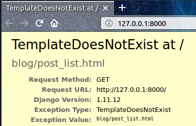

# Vues Django - C'est l'heure de créer !

Il est enfin temps de se débarrasser du bug que nous avons créé dans le chapitre précédent! :)

C'est dans la *vue* que nous allons ranger toute la partie "logique" de notre application. C'est elle qui va se charger d'aller chercher les informations liées à notre `modèle `que nous venons de créer et de les passer à un `template`. Nous allons créer ce template dans le chapitre suivant. Concrètement, les vues ne sont que des fonctions Python un peu plus élaborées que celles que nous avons créées dans la partie **Introduction à Python**.

Les vues sont placées dans le fichier `views.py`. Nous allons créer nos *vues* dans le fichier `blog/views.py`.

## blog/views.py

Ok, allons-y ! Ouvrons ce fichier dans notre éditeur de code pour voir ce qu'il contient :

blog/views.py

```python
from django.shortcuts import render

# Create your views here.
```

Pas beaucoup de choses pour l'instant.

N’oubliez pas que les lignes commençant par `#` sont des commentaires, ce qui signifie qu'elles ne sont pas exécutées par Python.

Nous allons créer une *vue* comme l’indique le commentaire. Ajoutez la vue minimale suivante :

blog/views.py

```python
def post_list(request):
    return render(request, 'blog/post_list.html', {})
```

Comme vous pouvez le voir, nous avons créé une fonction (`def`) appelée `post_list` qui prend une `request (requête)` et qui va `return (retourner)` la valeur donnée par une autre fonction `render` qui va assembler notre template `blog/post_list.html`.

Sauvegardez votre fichier et allez à l'adresse http://127.0.0.1:8000/ pour voir ce qui s'affiche maintenant.

Une autre erreur ! Voyons ce qu'elle nous dit :



Cela indique que le serveur tourne, ce qui est bien, mais il y a quelque chose qui ne va pas, non ? Ne vous inquiétez pas, c’est juste une page d’erreur, il ne faut pas avoir peur d'elle ! Au contraire, tout comme les messages d’erreur dans la console, elle nous est très utile. Vous pouvez lire que *TemplateDoesNotExist*. Nous allons corriger ce bug et créer un modèle (template) dans le prochain chapitre !

> Pour en apprendre un peu plus sur les vues dans Django, consultez la documentation officielle : https://docs.djangoproject.com/en/2.2/topics/http/views/