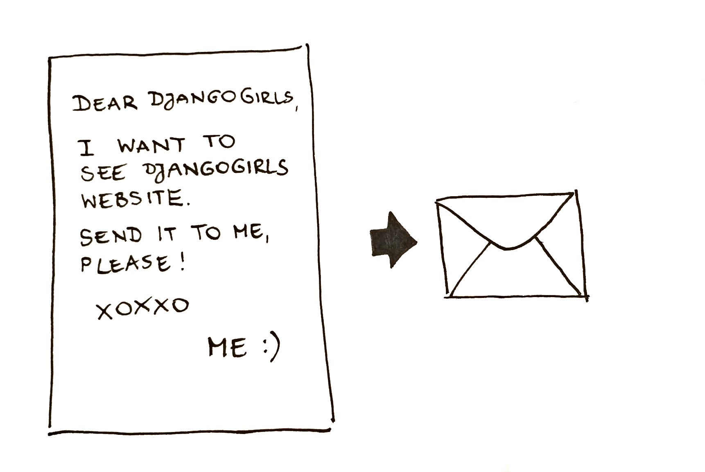

# Comment fonctionne Internet

> Pour les lectrices autodidactes : ce chapitre est traité dans la vidéo [How the Internet Works](https://www.youtube.com/watch?v=oM9yAA09wdc).
> 
> Ce chapitre s’inspire de la conférence « Comment fonctionne Internet » de Jessica McKellar (http://web.mit.edu/jesstess/www/).

Vous utilisez sûrement Internet tous les jours. Mais savez-vous ce qui ce passe vraiment quand vous tapez une adresse comme https://beta.gouv.fr dans votre navigateur et appuyez sur `Entrée`?

La première chose que vous devez comprendre c’est qu’un site Web consiste en un tas de fichiers sauvegardés sur un disque dur -- tout comme vos films, musiques ou photos. Cependant, les sites web ont quelque chose d'unique : ils contiennent du code informatique appelé HTML.

Si vous n'avez pas l'habitude de la programmation, il peut être difficile de comprendre HTML au début, mais vos navigateurs web (comme Chrome, Safari, Firefox, etc.) adorent ça. Les navigateurs web sont conçus pour comprendre ce code, pour suivre les instructions qu'il contient et présenter les fichiers de votre site web exactement comme vous voulez qu'ils soient présentés.

Comme pour n'importe quel autre fichier, il faut stocker les fichiers HTML sur un disque dur quelque part. Pour Internet, on utilise des ordinateurs spéciaux, très puissants, appelés *serveurs*. Ils n'ont pas d'écran, de clavier ou de souris, car leur rôle est de stocker des données, et de les servir. C'est pour ça qu'on les appelle des *serveurs* : parce qu'ils sont là pour vous *servir* des données.

Bon, d'accord. Mais vous avez envie de savoir à quoi Internet ressemble, n'est-ce-pas ?

Nous vous avons fait un dessin ! Voilà à quoi ça ressemble :

C'est le bazar, non ? En fait, c'est un réseau de machines connectées entre elles (les *serveurs* dont on parlait plus tôt). Des centaines de milliers de machines ! Des millions de kilomètres de câbles, partout dans le monde ! Vous pouvez aller voir une carte des câbles sous-marins (http://submarinecablemap.com/) pour voir à quel point le réseau est compliqué. Voici une capture d'écran du site :

Fascinant, non ? Cependant, il n'est pas possible de tirer un câble entre chaque machine connectée à Internet. Du coup, pour atteindre une machine (par exemple, celle où https://djangogirls.org est sauvegardé), on doit faire passer une requête par plein d'autres machines.

Ça ressemble ça :

C'est un peu comme si, quand vous tapiez https://beta.gouv.fr, vous envoyiez une lettre qui dit "Chèrs BetaGouvers, je voudrais voir le site beta.gouv.fr. Pouvez-vous me l'envoyer ?"

Votre lettre part vers le bureau de poste le plus proche. Ensuite, il file vers un autre, qui est plus proche de votre destinataire. Puis un autre, et encore un autre, jusqu'à sa destination. Une chose à retenir : si vous envoyez beaucoup de lettres (*data packets*) au même endroit, il se pourrait qu'elles transitent par des postes différentes (*routers*). Cela dépend de la manière dont elles sont distribuées à chaque bureau de poste.

Cela fonctionne comme ça - vous envoyez des messages et attendez une réponse. Vous utilisez des octets de données à la place du papier et du crayon, mais l'idée est la même !

À la place des adresses postales (nom de rue, ville, code postal), nous utilisons des adresses IP. Votre ordinateur commence par demander au DNS (Domaine Name System) de traduire beta.gouv.fr en une adresse IP. Ça marche un peu comme un de ces vieux annuaires où l'on peut chercher le nom d'une personne et trouver son numéro de téléphone et son adresse.

Quand vous envoyez une lettre, elle a besoin de certaines choses pour transiter correctement : une adresse, un timbre, etc. Vous devez aussi utiliser une langue que votre destinataire comprend. C'est la même chose pour les paquets de données que vous envoyez pour voir un site web. Vous utilisez un protocole appelé HTTP (Hypertext Tranfer Protocol).

Donc, au final, pour avoir un site web il faut qu'il soit sur un *serveur* (c'est une machine). Lorsque le *serveur* reçoit une *requête/0> (dans une lettre), il envoie votre site Web (dans une autre lettre).
 

Puisqu'on est dans un tutoriel sur Django, vous devez vous demander ce que Django fait. Quand vous envoyez une réponse, vous ne renvoyez pas toujours la même réponse à tout le monde. C'est bien mieux quand les lettres sont personnalisées, surtout quand elles s'adressent à quelqu'un qui vient de vous écrire, non ? Et bien Django vous aide à écrire les lettres personnalisées et intéressantes. :)

Assez parlé, il est temps de commencer à créer des trucs !