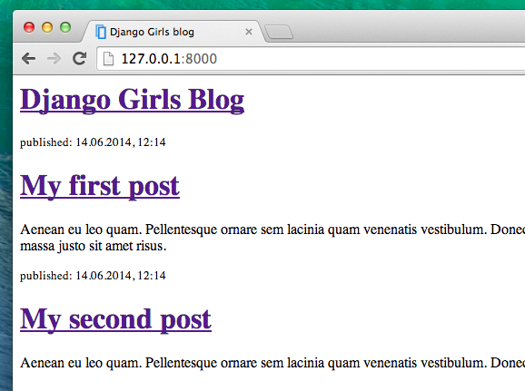

# Introduction au HTML

Vous vous demandez sûrement ce qu'est un template.

Un template est un fichier que vous pouvez réutiliser afin de présenter des informations différentes sous un seul et même format. Par exemple, vous pourriez avoir envie d'utiliser un template pour écrire une lettre : bien que son contenu varie ou qu'elle puisse être adressée à des personnes différentes, sa forme reste la même.

Le format d'un template Django est décrit grâce à un langage qui s'appelle HTML (c'est le même HTML que celui dont nous parlions dans le chapitre un, **Comment fonctionne l'Internet**).

## Qu'est-ce que le HTML ?

HTML est un code qui est interprété par votre navigateur (Chrome, Firefox ou Safari) et qui permet d'afficher une page web à l'utilisateur.

L'abréviation HTML signifie « HyperText Markup Language ». **HyperText** signifie que c'est un type de texte qui supporte les hyperliens entre les pages. **Markup** signifie que nous avons pris un document et que nous avons balisé le code pour signifier (ici, au navigateur) comment il faut interpréter la page. Le code HTML est construit à l'aide de **balises**, chacune commençant par `<` et finissant par `>`. Ces balises représentent des **éléments** markup.

## Votre premier template !

Créer un template signifie créer un fichier template. Et oui, encore des fichiers ! Vous aviez déjà probablement remarqué que tout tourne autour des fichiers.

Les templates sont sauvegardés dans le dossier `blog/templates/blog`. Tout d'abord, créons un dossier appelé `templates` à l'intérieur du dossier de notre blog. Ensuite, créez un autre dossier appelé `blog` à l'intérieur de votre dossier templates :

    blog
    └───templates
        └───blog
    

Vous pourriez vous demander pourquoi nous avons besoin de deux dossiers portant tous les deux le nom `blog`. Comme vous le découvrirez plus tard, c'est une convention de nommage qui va nous faciliter la vie quand les choses vont commencer à devenir compliquées.

Et maintenant, créez un fichier `post_list.html` (laisser le vide pour le moment) dans le dossier `templates/blog/blog`.

Allons regarder à quoi ressemble notre site maintenant : http://127.0.0.1:8000/

> Si vous avez encore l'erreur `TemplateDoesNotExist`, essayez de redémarrer votre serveur. Allez sur votre ligne de commande et arrêtez votre server en appuyant simultanément sur Ctrl+C (les touches Control et C de votre clavier). Vous pouvez le relancer en tapant la commande `python manage.py runserver`.


Et voilà, il n'y a plus d'erreurs ! Bravo :) Cependant, notre site ne peut rien faire d'autre pour le moment qu'afficher une page blanche. La faute à notre template que nous avons laissé vide. Allons corriger ça.

Ouvrez le nouveau fichier dans l’éditeur de code et ajoutez le morceau suivant :

blog/templates/blog/post_list.html

```html
<!DOCTYPE html>
<html>
<body>
    <p>Bonjour !</p>
    <p>Ça marche !</p>
</body>
</html>
```

Alors, à quoi ressemble notre site web maintenant ? Allons le découvrir : http://127.0.0.1:8000/


Ça marche ! Bon boulot! :)

* La ligne `<!DOCTYPE html>` n'est pas une balise HTML. Elle ne déclare que le type de document. Ici, elle informe le navigateur web que le type de document est [HTML5](https://html.spec.whatwg.org/#the-doctype). C'est toujours ainsi que débute un fichier HTML5.
* La balise la plus élémentaire, `<html>`, figure toujours au début de n'importe quelle page web tandis que `</html>` est toujours située à la fin. Comme vous pouvez le constater, l'intégralité du contenu de notre page web est située entre la balise de départ, `<html>`, et la balise de fin, `</html>`
* `<p>` est la balise pour les éléments de type paragraphe. `</p>` permet de fermer chaque paragraphe.

## Head et Body

Chaque page HTML est divisée en deux éléments : **head** (entête) et **body** (corps.

* **head** est un élément qui contient des informations sur le document : son contenu ne s'affichera pas à l'écran.

* **body** est un élément qui contient tout le reste. Son contenu s'affichera à l'écran et constituera notre page web.

Nous utilisons `<head>` pour transmettre la configuration de la page au navigateur tandis que `<body>` l'informe sur le contenu de la page.

Par exemple, vous pouvez donner un titre à votre page web en utilisant l'élément titre dans le `<head>` :

blog/templates/blog/post_list.html

```html
<!DOCTYPE html>
<html>
    <head>
        <title>Ola's blog</title>
    </head>
    <body>
        <p>Bonjour !</p>
        <p>Ça marche !</p>
    </body>
</html>
```

Sauvegardez votre fichier et actualisez la page.


Vous avez vu comment le navigateur a compris que « Le Blog d'Ola » est le titre de votre page ? Il a interprété `<title>Le blog d'Ola</title>` et a placé ce texte dans la barre de titre de votre navigateur (c'est ce titre qui va être aussi utilisé lorsque vous créez un marque-page, etc.).

Vous avez aussi probablement remarqué que chaque balise ouvrante possède sa *balise fermante*, composée d'un `/`, est qu'elles *encadrent* les différents éléments. Cela signifie que vous ne pouvez pas fermer une balise si celles imbriquées à l'intérieur de celle-ci n'ont pas été fermées.

Pensez à lorsque vous mettez des choses à l'intérieur de boîtes. Vous avez une grosse boîte, `<html></html>`; à l'intérieur de celle-ci, on trouve une plus petite boîte, `<body></body>`, qui contient elle-même d'autres petites boîtes, `<p></p>`.

Essayez de vous rappeler de cet exemple lorsque vous utilisez les balises *fermantes* et que vous avez des éléments *imbriqués*. Si vous ne suivez pas ces règles, votre navigateur risque de ne pas être capable d'interpréter votre code correctement et votre page web sera mal affichée.

## Personnaliser votre template

Et si nous en profitions pour nous amuser un peu ? Essayons de personnaliser notre template ! Voici quelques balises que vous pouvez utiliser :

* `<h1>Titre 1</h1>` pour vos titres les plus importants
* `<h2>Titre 2</h2>` pour les sous-titres
* `<h3>Titre 3</h3>` ... et ainsi de suite jusqu'à `<h6>`
* `<p>Un paragraphe contenant du texte</p>`
* `<em>texte</em>` permet de mettre l'accent sur une partie du texte
* `<strong>texte</strong>` permet de mettre encore plus l'accent sur une partie de texte
* `<br>` permet d'insérer un saut de ligne (vous ne pouvez rien mettre à l'intérieur d'un élément br et il n'y a pas de balise fermante)
* `<a href="https://djangogirls.org">link</a>` permet de créer un lien
* `<ul><li>premier item</li><li>second item</li></ul>` permet de créer des listes, comme celle que nous sommes en train de faire !
* `<div></div>` permet de créer une section au sein de la page
* `<nav></nav>` définit un ensemble de liens de navigation
* `<article></article>` spécifie du contenu indépendant et autonome
* `<section></section>` définit une section dans un document
* `<header></header>` spécifie un en-tête pour un document ou une section
* `<main></main>` spécifie le contenu principal d'un document
* `<aside></aside>` définit du contenu en dehors du contenu dans lequel il est placé (comme une barre latérale)
* `<footer></footer>` définit un pied de page pour un document ou une section
* `<time></time>` définit un instant spécifique (ou un horodatage)

Voici un exemple d’un modèle complet, copiez et collez-le dans `blog/templates/blog/post_list.html` :

blog/templates/blog/post_list.html

```html
<!DOCTYPE html>
<html>
    <head>
        <title>Ma Startup d'Etat</title>
    </head>
    <body>
        <header>
            <h1><a href="/">Collez efficacement des post-il</a></h1>
        </header>

        <div>
            <h2><a href="">Pourquoi apprendre à coller des post-its ?</a></h2>
            <p>Aenean eu leo quam. Pellentesque ornare sem lacinia quam venenatis vestibulum. Donec id elit non mi porta gravida at eget metus. Fusce dapibus, tellus ac cursus commodo, tortor mauris condimentum nibh, ut fermentum massa justo sit amet risus.</p>
        </div>

        <div>
            <h2><a href="">Visionner le mooc</a></h2>
            <p>Aenean eu leo quam. Pellentesque ornare sem lacinia quam venenatis vestibulum. Donec id elit non mi porta gravida at eget metus. Fusce dapibus, tellus ac cursus commodo, tortor mauris condimentum nibh, ut fermentum massa justo sit amet risus.</p>
        </div>
    </body>
</html>
```

Nous avons créé ici une section `en-tête` et deux sections `article`.

* Le premier élément `header` contient le titre de notre blog - c'est à la fois un titre et un lien
* Les deux éléments `article` contiennent nos articles de blog avec une date de publication dans un élément `time` un élément `h2` avec un titre de publication qui est cliquable et un élément `p` (paragraphe) pour le texte de notre blog.

Ce qui nous donne :



Yaaay ! Pour l'instant, notre template nous permet seulement d'afficher les **mêmes informations** alors que nous disions précédemment qu'il doit nous permettre d'afficher des informations **différentes** utilisant le **même format**.

Ce qu'on aimerait pouvoir faire maintenant, c'est d'afficher les posts que nous avons créés précédemment dans l'interface d'administration de Django. Penchons-nous là dessus.

## Une dernière chose : déployer !

Ne serait-il pas génial de pouvoir voir tous ces changements en ligne ? Hop, déployons à nouveau !

### Commiter et pusher votre code sur GitHub

Tout d'abord, allons voir quels sont les fichiers qui ont changé depuis notre dernier déploiement (lancez ces commandes dans votre console locale et non celle de PythonAnywhere) :

command-line

    $ git status
    

Assurez-vous d'être dans le dossier `djangogirls`. Voici la commande qui permet de dire à `git` d'inclure tout les changements qui ont eu lieu dans ce dossier :

command-line

    $ git add .
    

Avant que nous puissions uploader nos fichiers, regardons ce que `git` à l'intention de faire (tous les fichiers que `git` va uploader vont apparaître en vert) :

command-line

    $ git status
    

On y est presque : nous devons maintenant lui dire de sauvegarder ces changements dans son historique. Nous allons y ajouter un "message de commit" qui nous permettra de décrire ce qui a été changé. Vous pouvez mettre ce que vous voulez dans un message de commit. Généralement, il est préférable de mettre quelque chose d'utile qui vous permettra de vous souvenir plus tard de ce que vous avez fait.

command-line

    $ git commit -m "Modification du HTML du site"
    

> **Note** Assurez-vous d'utiliser des guillemets doubles autour du message de commit.

Une fois que nous avons fait cela, nous pouvons mettre en ligne (pusher) nos modifications sur GitHub :

command-line

    $ git push
    

### Puller les modifications sur PythonAnywhere et recharger son appli web

* Allez sur la page des [consoles de PythonAnywhere](https://www.pythonanywhere.com/consoles/). Retournez dans votre **console Bash** ou ouvrez-en une nouvelle puis tapez la commande suivante :

PythonAnywhere command-line

    $ cd ~/<your-pythonanywhere-domain>.pythonanywhere.com
    $ git pull
    [...]
    

N’oubliez pas de remplacer `<your-pythonanywhere-domain>` avec votre propre sous-domaine PythonAnywhere, sans les chevrons. Votre nom de sous-domaine est normalement votre nom d'utilisateur PythonAnywhere, mais dans certains cas, il peut être un peu différent (par exemple si votre nom d'utilisateur contient des lettres capitales). Donc, si cette commande ne fonctionne pas, utilisez la commande `ls` (lister fichiers) pour trouver votre sous-domaine/nom de dossier, puis `cd` jusque là.

Maintenant, vous voyez votre code en train d'être téléchargé. Si vous voulez vérifier que le nouveau code est arrivé sur PythonAnywhere, vous pouvez aller sur la page **"Files"** et y retrouver les fichiers (vous pouvez naviguer dans les différentes pages de PythonAnywhere depuis le menu).

* Pour finir, n'oubliez pas de recharger votre application web : onglet [Web](https://www.pythonanywhere.com/web_app_setup/) puis cliquez sur le bouton **Reload**.

Retournez sur votre site en cliquant sur l'adresse en haut de la page : normalement, vous devriez voir la dernière version. Si ce n'est pas le cas, ce n'est pas grave : n'hésitez pas à demander de l'aider à votre coach. :)